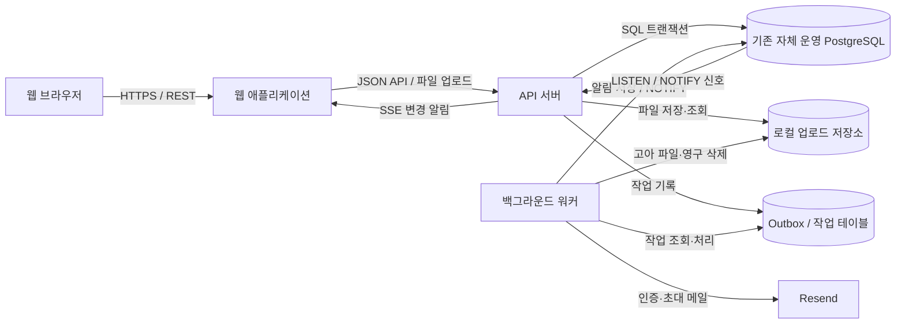

# 기술 아키텍처 명세서

| 항목 | 내용 |
| --- | --- |
| 문서 상태 | 확정 — MVP 기술 아키텍처 기준 |
| 문서 버전 | v1.6 |
| 작성일 | 2026-07-10 |
| 대상 릴리스 | Rivet MVP |
| 대상 플랫폼 | 데스크톱 웹 중심, 제한적 모바일 웹 |
| 선행 문서 | [제품 요구사항 정의서](../planning/002.%20제품%20요구사항%20정의서.md), [사용자 흐름 및 화면 명세서](../planning/003.%20사용자%20흐름%20및%20화면%20명세서.md) |

## 1. 문서 목적

이 문서는 Rivet MVP의 제품 요구사항을 구현할 전체 시스템 구조와 기술 원칙으로 전환한다. 프론트엔드와 백엔드의 책임 경계, 데이터 저장과 일관성, 인증·권한, 실시간 갱신, 알림·이메일 작업, 배포와 운영의 기본 방향을 정의한다.

이 문서에서는 제품 정책을 다시 결정하지 않는다. 제품 동작은 선행 기획 문서를 따르며, 상세 테이블 구조와 API 요청·응답은 이 문서의 범위에 포함하지 않는다.

### 1.1 범위

- MVP 시스템 구성과 배포 단위
- 프론트엔드·백엔드의 책임과 협업 계약
- 서버 모듈 경계와 데이터 저장 원칙
- 인증, 권한과 워크스페이스 격리
- 동시 수정, 실시간 갱신과 클라이언트 캐시
- 활동, 알림, 이메일과 백그라운드 작업
- 검색, 휴지통, 내보내기와 백업
- 로컬 파일 저장, 이미지 최적화와 고아 파일 정리
- 관측성, 테스트와 단계별 구현 원칙

### 1.2 제외 범위

- 테이블·컬럼·인덱스의 최종 정의
- 엔드포인트별 요청·응답 스키마
- 화면별 컴포넌트와 스타일 구현
- 클라우드 공급자별 상세 배포 절차
- Public 이후 다중 워크스페이스와 대규모 조직 확장 설계

### 1.3 결정 상태

| 상태 | 의미 |
| --- | --- |
| 확정 | 선행 제품 문서에서 이미 결정됐거나 MVP 구조상 변경하지 않는 원칙 |
| 권장 | 현재 요구사항에 가장 단순하게 맞는 기술안이며 검토 후 확정할 항목 |
| 미정 | 팀 선택 또는 운영 환경 확인이 필요한 항목 |

## 2. 아키텍처 목표

### 2.1 우선순위

1. **데이터 신뢰성:** 저장 성공으로 보인 변경은 모든 화면에서 같은 상태로 유지한다.
2. **명확한 경계:** 모든 업무 데이터 조회와 변경에서 워크스페이스 경계를 강제한다.
3. **빠른 상호작용:** 직접 변경은 낙관적으로 반영하고 정상 부하에서 주요 API p95 1초 이내를 목표로 한다.
4. **실패 복구:** 실시간 연결과 비동기 작업이 실패해도 재조회·재시도로 서버 상태에 수렴한다.
5. **낮은 운영 부담:** 1~10명 팀을 검증하는 동안 필요한 구성 요소만 운영한다.
6. **팀 간 계약:** 백엔드가 API 계약과 변경 내용을 먼저 제공하고 프론트엔드가 이를 기준으로 구현할 수 있게 한다.

### 2.2 기본 원칙

- 서버와 관계형 데이터베이스를 최종 데이터 원천으로 사용한다.
- MVP는 **모듈형 모놀리스**로 시작한다.
- 동기 요청은 HTTP API, 서버 변경 알림은 단방향 실시간 채널로 분리한다.
- 업무 데이터 변경, 활동 이벤트와 비동기 작업 발행은 가능한 한 같은 데이터베이스 트랜잭션에 묶는다.
- 데이터 무결성은 애플리케이션 검증만이 아니라 데이터베이스 제약 조건으로도 보호한다.
- 성능 문제를 측정하기 전에는 별도 검색 엔진, 분산 캐시와 메시지 브로커를 도입하지 않는다.
- 내부 모듈 경계는 유지하되 독립 배포가 필요해지기 전에는 마이크로서비스로 분리하지 않는다.

## 3. 전체 시스템 구조

### 3.1 논리 구성



### 3.2 배포 단위

| 단위 | 역할 | MVP 방향 |
| --- | --- | --- |
| 웹 애플리케이션 | 화면, 라우팅, 클라이언트 캐시와 낙관적 UI | `apps/web` 빌드 결과를 PM2로 실행하고 Nginx로 연결 |
| API 서버 | 인증, 권한, 도메인 규칙, REST API와 SSE 연결 | `apps/api`의 HTTP 진입점을 PM2로 실행하고 Nginx로 연결 |
| 백그라운드 워커 | 이메일, 알림 생성, 영구 삭제, 파일 정리와 재시도 작업 | `apps/worker`를 별도 PM2 프로세스로 실행 |
| PostgreSQL | 업무 데이터, 세션, 이벤트, 작업과 검색 원천 | 기존에 관리 중인 자체 PostgreSQL 사용 |
| 로컬 업로드 저장소 | 이슈 첨부파일, 편집기 이미지와 프로필 사진 | 환경별 `FILE_STORAGE_ROOT` 아래 저장하고 API·워커가 같은 경로 사용 |
| Resend | 이메일 인증, 초대와 비밀번호 재설정 메일 전달 | 환경별 API 키와 발신 주소 사용 |

저장소의 실행 애플리케이션은 `apps/web`, `apps/api`, `apps/worker` 세 개다. API는 HTTP 요청과 SSE 연결을 담당하고, 워커는 PostgreSQL 작업 테이블을 조회해 이메일·알림·영구 삭제·파일 정리 작업을 처리한다. API와 워커는 독립적으로 빌드·재시작할 수 있지만 같은 모노레포, Prisma 데이터 모델과 PostgreSQL을 사용하므로 별도 마이크로서비스로 취급하지 않는다.

## 4. 확정 기술 기준

아래 기술 조합을 MVP의 구현 기준으로 사용한다. 구체적인 버전은 구현 시작 시 당시의 안정 버전을 기준으로 고정한다.

| 영역 | 기술 선택 | 상태 | 선택 이유 |
| --- | --- | --- | --- |
| 런타임 | Node.js 24 LTS | 확정 | 로컬 개발·빌드와 PM2 운영 버전을 현재 장기 지원 런타임으로 통일 |
| 웹 | Next.js + TypeScript | 확정 | 데스크톱·모바일 웹, 라우팅과 프론트 생산성을 한 프로젝트에서 처리 |
| 프론트 서버 상태 | TanStack Query | 확정 | REST 조회·변경 캐시, 낙관적 갱신·롤백과 SSE 수신 후 재검증을 한 계층에서 관리 |
| 프론트 폼·검증 | React Hook Form + Zod | 확정 | 폼 상태와 화면 입력 검증을 일관되게 관리하고 API 제출 모델과 명시적으로 변환 |
| 프론트 전역 상태 | 별도 라이브러리 없음 | 확정 | 서버·폼·URL·로컬 상태의 소유권을 분리하고 실제 화면 간 공유 상태가 생길 때만 도입 검토 |
| 국제화 | next-intl, 기본 locale `ko`, `localePrefix: 'as-needed'` | 확정 | 기본 한국어 URL은 접두사 없이 유지하고 향후 다른 locale만 경로 접두사로 구분 |
| 스타일링 | Tailwind CSS | 확정 | 디자인 시스템의 의미 토큰과 반응형 규칙을 일관된 유틸리티로 적용 |
| UI 컴포넌트 | shadcn/ui | 확정 | 컴포넌트 소스를 웹 앱에서 직접 소유하고 Rivet 디자인 규칙에 맞게 조정 |
| 아이콘 | lucide-react | 확정 | 하나의 선형 아이콘 체계로 제품 전체의 의미와 시각 무게를 통일 |
| 본문 편집기 | Lexical + `@lexical/react` + `@lexical/markdown` | 확정 | WYSIWYG 편집 경험을 제공하면서 서버·API의 Markdown 문자열 계약을 유지 |
| Markdown 렌더링 | react-markdown + remark-gfm + rehype-sanitize | 확정 | 미리보기·조회 렌더러를 통일하고 허용 문법과 URL·요소를 안전한 목록으로 제한 |
| 파일 저장 | 서버 로컬 파일시스템 + PostgreSQL 메타데이터 | 확정 | 현재 단일 서버 배포에서 별도 오브젝트 스토리지 없이 이슈·프로필 파일 관리 |
| API·워커 | NestJS + TypeScript | 확정 | 프론트·백엔드가 API 타입과 언어 생태계를 공유하면서 모듈 경계를 명확히 유지 |
| API HTTP 어댑터 | Express (`@nestjs/platform-express`) | 확정 | NestJS 기본 어댑터와 Multer 기반 공식 파일 업로드 흐름을 사용해 구현 복잡도를 낮춤 |
| 백엔드 모듈 출력 | CommonJS + TypeScript NodeNext | 확정 | NestJS·PM2 실행 호환성을 유지하면서 Node.js의 명시적인 패키지 해석 규칙을 사용 |
| API·워커 컴파일러 | TypeScript Compiler (`tsc`) | 확정 | 컴파일과 타입 검사를 한 흐름으로 유지하고 Swagger 메타데이터와 빌드 설정을 단순화 |
| 백엔드 요청 검증 | NestJS DTO + class-validator + class-transformer | 확정 | 표준 ValidationPipe와 Swagger 연동을 사용하고 API 경계에서 외부 입력을 검증 |
| 환경 설정 검증 | `@nestjs/config` custom validate + class-validator/class-transformer | 확정 | 기존 검증 의존성을 재사용하고 API·워커별 필수 설정 오류를 시작 단계에서 차단 |
| 데이터베이스 | PostgreSQL | 확정 | 트랜잭션, 관계 무결성, 부분 검색과 작업 큐를 MVP 한 저장소로 처리 |
| ORM·마이그레이션 | Prisma ORM multi-file schema + Prisma Migrate | 확정 | 도메인별 모델 파일과 버전 관리되는 SQL 마이그레이션을 한 데이터베이스 계약으로 관리 |
| Prisma Client | `prisma-client` + `@prisma/adapter-pg`, Node.js, CommonJS | 확정 | Prisma 7 generator와 PostgreSQL driver adapter를 패키지 내부에서 구성해 API·워커에 공개 |
| 패키지·모노레포 | pnpm workspace + Turborepo | 확정 | pnpm으로 의존성을 관리하고 Turbo로 작업 순서와 캐시를 관리 |
| 린트·포맷 | ESLint Flat Config + Prettier | 확정 | 웹·API·워커별 정확성 규칙과 공통 코드 포맷을 한 설정 패키지에서 관리 |
| API 형식 | REST + JSON + OpenAPI | 확정 | 백엔드 선행 작업과 프론트 전달 계약을 명시적으로 관리 |
| OpenAPI 클라이언트 | Orval + Fetch + TanStack Query | 확정 | OpenAPI에서 타입·호출 함수·Query Hook과 캐시 키를 생성하고 수동 계약 중복을 방지 |
| 실시간 수신 | Server-Sent Events(SSE) + PostgreSQL LISTEN/NOTIFY | 확정 | 서버→클라이언트 변경 신호를 단순하게 전달하고 재연결 시 서버 상태를 재조회 |
| 비동기 작업 | PostgreSQL Outbox·작업 테이블 | 확정 | Redis·메시지 브로커 없이 트랜잭션과 재시도를 보장 |
| 검색 | PostgreSQL 인덱스와 부분 일치 | 확정 | MVP 검색 범위가 표시 ID와 제목으로 제한됨 |
| 세션 | 서버 관리 세션 + 보안 쿠키 | 확정 | 브라우저 제품에서 강제 로그아웃과 세션 폐기를 단순하게 처리 |
| 메일 | Resend | 확정 | 개발·운영 환경에서 같은 전달 방식을 사용하되 API 키를 분리 |
| 구조화 로그 | Pino + nestjs-pino | 확정 | API requestId와 워커 jobId를 JSON 로그에 연결하고 PM2 표준 출력 수집과 연계 |
| 배포·호스팅 | 기존 클라우드 서버 + PM2 + Nginx, 자체 PostgreSQL | 확정 | 저장소는 빌드·배포 순서만 안내하고 인프라는 프로젝트 밖에서 직접 운영 |
| 오류 추적·분석 | PostHog Cloud | 확정 | 명시적 제품 이벤트와 정제된 예외만 수집하고 자동 수집·세션 녹화는 사용하지 않음 |

### 4.1 MVP에서 도입하지 않는 구성

- 마이크로서비스와 서비스 간 RPC
- 별도 Elasticsearch·OpenSearch 검색 클러스터
- Redis 캐시와 별도 메시지 브로커
- 이벤트 소싱과 CQRS 읽기 모델
- Kubernetes와 멀티 리전 배포
- GraphQL 구독과 양방향 협업 편집 인프라
- S3 호환 오브젝트 스토리지, CDN과 별도 이미지 처리 서비스
- 외부 악성코드 검사 서비스. MVP는 초대된 활성 멤버만 업로드할 수 있고 검증된 이미지 외 파일을 강제 다운로드로 제공하며, 외부·게스트 업로드를 열기 전에 검사 도입을 재검토

다음 단계에서 실제 병목, 다중 인스턴스 전달 요구 또는 운영 지표로 필요성이 확인될 때만 추가한다.

## 5. 저장소와 팀 책임 경계

### 5.1 확정 저장소 구조

프론트와 백엔드 팀이 분리되어 있어도 MVP 코드는 `pnpm workspace`와 Turborepo 기반 모노레포 하나에서 관리한다.

```text
package.json
pnpm-workspace.yaml
pnpm-lock.yaml
turbo.json
apps/
  web/        # 프론트엔드 웹 애플리케이션
  api/        # NestJS HTTP API와 SSE
  worker/     # NestJS 백그라운드 작업 처리
packages/
  database/   # Prisma 스키마·마이그레이션·생성 클라이언트
  api-client/ # OpenAPI에서 생성한 프론트 타입·클라이언트
  config/     # 꼭 필요한 공통 린트·타입 설정
```

pnpm은 작업공간, 의존성과 루트 잠금 파일을 관리한다. Turbo는 `turbo.json`에 정의한 개발·검증·빌드 작업의 의존 순서와 로컬 캐시를 관리한다. 원격 캐시는 CI 실행 시간과 팀 병렬 작업에서 효과가 확인될 때 활성화한다.

프론트와 백엔드는 공통 도메인 코드를 직접 공유하지 않는다. 공유 계약은 OpenAPI와 생성된 API 클라이언트로 제한해 서버 내부 모델이 화면 코드에 새지 않게 한다. API와 워커는 `packages/database`의 Prisma 스키마·클라이언트만 우선 공유하고, 실제로 양쪽에서 사용하는 규칙이 생길 때만 작은 공통 패키지를 추가한다. 저장소 분리는 팀 운영상 필요가 확인될 때 검토한다.

### 5.2 팀별 책임

| 영역 | 백엔드 팀 | 프론트엔드 팀 |
| --- | --- | --- |
| 제품 규칙 | 서버에서 최종 검증 | 화면에서 사전 안내와 입력 검증 |
| 데이터 계약 | OpenAPI, 오류 코드, 예시와 변경 이력 제공 | 생성된 계약 사용, 화면 상태와 사용자 피드백 구현 |
| 인증·권한 | 세션, 역할과 워크스페이스 경계 강제 | 권한에 따른 노출과 만료·오류 흐름 처리 |
| 실시간 | 이벤트 발행, 연결 인증과 재연결 기준 제공 | 이벤트 수신 후 캐시 갱신·재조회 |
| 성능 | 쿼리·트랜잭션·작업 처리 시간 | 번들·렌더링·캐시와 낙관적 UI |
| 검증 | API·도메인·통합 테스트 | 화면·상태·브라우저 흐름 테스트 |

### 5.3 API 작업 전달 조건

백엔드 작업이 프론트 구현의 선행 조건이면 다음 결과물이 준비된 시점을 `프론트 작업 가능`으로 본다.

1. OpenAPI 계약이 최신 상태다.
2. 성공 응답과 주요 오류 응답 예시가 있다.
3. 인증·권한 조건과 워크스페이스 경계가 설명되어 있다.
4. 로컬 또는 공유 개발 환경에서 호출할 수 있다.
5. 변경 요약, 호환성 영향과 프론트 주의사항이 작업 전달에 기록되어 있다.

프론트는 백엔드 내부 DTO나 데이터베이스 구조를 추측해 구현하지 않는다. 계약이 바뀌면 기존 작업 전달을 덮어쓰지 않고 추가 전달과 계약 변경 이력을 남긴다.

### 5.4 프론트엔드 구현 기준

- Tailwind CSS는 디자인 시스템의 의미 토큰을 `apps/web/app/globals.css`의 CSS 변수에 연결해 사용한다. 컴포넌트에서 원시 색상 값을 직접 사용하지 않는다.
- shadcn/ui 컴포넌트 소스는 `apps/web/components/ui`에서 관리한다. MVP의 소비자가 `apps/web` 하나뿐이므로 `packages/ui`는 만들지 않는다.
- 도메인 컴포넌트는 웹 앱 안에서 공통 UI를 조합한다. 실제 두 번째 소비자가 생기기 전에는 공유 UI 패키지나 별도 추상화 계층을 추가하지 않는다.
- 제품 아이콘은 `lucide-react`로 통일하고 접근 가능한 한국어 이름이 없는 아이콘 단독 버튼을 만들지 않는다.
- 설명, 댓글과 작업 전달은 하나의 공통 Lexical 편집기 구성을 사용한다. 편집 화면은 WYSIWYG와 미리보기를 제공하지만 Markdown 원문 편집 모드는 제공하지 않는다.
- 편집 내용을 `@lexical/markdown`으로 Markdown 문자열로 변환해 API에 전송한다. Lexical JSON 편집 상태는 서버나 PostgreSQL에 저장하지 않는다.
- 제목, 굵게, 기울임, 취소선, 링크, 인용, 순서·비순서 목록, 인라인 코드와 코드 블록만 MVP 기본 서식으로 지원한다. 멘션과 이미지는 사용자 정의 노드와 Markdown 변환 규칙으로 처리한다.
- Lexical 공식 Playground의 이미지 구조를 참고하되 Data URL을 본문에 저장하지 않는다. 파일 선택과 Command/Ctrl+V를 처리하는 작은 이미지 플러그인이 API 업로드 결과의 파일 ID를 인증된 상대 주소로 변환한다.
- JPEG·PNG·WebP가 2MB를 넘거나 긴 변이 2,560px을 넘으면 브라우저 Canvas API로 비율을 유지해 최대 2,560px, WebP 품질 82%를 기준으로 최적화한다. 프로필 사진은 긴 변 최대 512px을 사용한다. 변환 결과가 원본보다 크면 원본을 사용하고 GIF처럼 변환 대상이 아닌 이미지는 원본을 유지한다.
- 프론트 검사는 사용자 경험 최적화일 뿐 보안 경계가 아니다. API는 최적화 후 파일도 25MB 제한과 실제 형식을 다시 검증한다.
- 미리보기와 저장 후 조회는 같은 Markdown 렌더러와 보안 허용 목록을 사용한다.

## 6. 백엔드 모듈 경계

API와 워커는 별도의 NestJS 실행 애플리케이션이지만 하나의 논리적 백엔드를 구성한다. 각 모듈의 주 실행 위치는 다음과 같다.

| 모듈 | 실행 앱 | 책임 |
| --- | --- | --- |
| 인증 | API | 회원가입, 이메일 인증, 로그인, 세션, 비밀번호 재설정 |
| 워크스페이스 | API | 워크스페이스, 멤버십, 초대와 `admin/member` 권한 |
| 팀·워크플로 | API | 팀, 팀 멤버, 상태와 시스템 범주 |
| 프로젝트 | API | 프로젝트, 역할별 팀, 리드, 일정과 진행률 조회 |
| 이슈 | API | 기능 이슈, 팀 작업, 속성, 표시 ID, 라벨과 휴지통 |
| 관계·전달 | API | 상하위 작업, 차단 관계, 순환 검증과 API 작업 전달 |
| 협업 | API | Markdown 설명·댓글·작업 전달의 저장 계약, 멘션, 구독과 활동 기록 |
| 파일 | API·워커 | API의 업로드·권한 조회·다운로드·연결, 워커의 미연결·고아 파일 정리와 영구 삭제 |
| 알림 | API·워커 | API의 조회·읽음·SSE, 워커의 이벤트 수신자 계산·알림 생성 |
| 검색·내보내기 | API·워커 | API의 ID·제목 검색, 필요 시 워커의 비동기 CSV 생성 |
| 운영 작업 | 워커 | Outbox 처리, 재시도, 이메일과 30일 영구 삭제 |

API 내부 모듈 간 변경은 공개된 애플리케이션 서비스를 사용한다. API에서 워커로 넘기는 작업은 PostgreSQL Outbox 이벤트만 사용하며 `apps/worker`가 `apps/api`의 코드를 직접 가져다 쓰지 않는다. 공통 추상화나 패키지는 실제 중복과 공유 계약이 확인될 때만 추가한다.

## 7. 데이터 아키텍처

### 7.1 저장 원칙

- PostgreSQL을 업무 데이터와 운영 상태의 최종 원천으로 사용한다.
- 파일 메타데이터와 업무 연결은 PostgreSQL을 정본으로 사용하고 바이너리는 `FILE_STORAGE_ROOT` 아래 로컬 파일시스템에 저장한다.
- Prisma 스키마를 애플리케이션 데이터 모델의 기준으로 사용하고 Prisma Migrate가 생성한 SQL 마이그레이션을 저장소에서 버전 관리한다.
- Prisma 스키마만으로 표현하기 어려운 PostgreSQL 제약, 인덱스와 데이터 변경은 생성된 마이그레이션 SQL에 명시한다.
- 모든 워크스페이스 업무 테이블은 `workspace_id`를 직접 가진다.
- 외부 노출 ID와 내부 기본 키를 분리한다.
- 생성·수정 시각은 서버가 기록하고, 충돌 감지를 위한 정수 `version`을 둔다.
- 활동 기록, 최초 작업 전달과 추가 전달은 추가 전용으로 보존한다.
- 삭제 가능한 이슈와 프로젝트는 `deleted_at`, `purge_at`을 사용해 30일 휴지통을 구현한다.
- 사용자에게 보이는 완료 여부는 상태 이름이 아니라 고정 시스템 범주로 계산한다.

### 7.2 데이터베이스에서 강제할 핵심 제약

| 규칙 | 강제 방식 |
| --- | --- |
| 한 계정은 최대 한 워크스페이스에 참여 | 멤버십의 `user_id` 유일 제약 |
| 워크스페이스 슬러그 유일 | 정규화된 슬러그 유일 제약 |
| 팀 키는 워크스페이스 안에서 유일 | `(workspace_id, team_key)` 복합 유일 제약 |
| 표시 ID 순번 중복 방지 | 워크스페이스·팀별 카운터를 원자적으로 증가 |
| 알림 중복 방지 | `(event_id, recipient_user_id)` 복합 유일 제약 |
| 같은 차단 관계 중복 방지 | `(blocking_issue_id, blocked_issue_id)` 복합 유일 제약 |
| 자기 자신 차단 금지 | 두 이슈 ID가 다르다는 검사 제약과 서버 검증 |
| 프로젝트 역할 중복 방지 | `(project_id, role)` 복합 유일 제약 |
| 파일 키·사용 중복과 크기 제한 | 저장 키·파일 연결 유일 제약, 범위·25MB·사용 위치 검사 제약 |

차단 관계의 전체 순환 여부, 담당자의 팀 소속, 프로젝트 역할과 팀 작업의 일치처럼 여러 행을 확인해야 하는 규칙은 서버 트랜잭션에서 검증한다. 핵심 제약의 정확한 SQL 표현은 데이터 모델 명세서에서 확정한다.

### 7.3 표시 ID 발급

- 기능 이슈는 워크스페이스별 카운터를 원자적으로 증가시켜 `F-{순번}`을 발급한다.
- 팀 작업은 팀별 카운터를 원자적으로 증가시켜 `{TEAM_KEY}-{순번}`을 발급한다.
- 카운터 증가와 이슈 생성은 하나의 트랜잭션에서 처리한다.
- 삭제된 번호는 재사용하지 않는다.
- 표시 ID는 사용자 탐색용이며 내부 관계에는 불변 기본 키를 사용한다.

## 8. API 설계 원칙

### 8.1 계약

- 외부 제품 계약은 버전이 있는 REST JSON API로 제공한다.
- OpenAPI 문서를 백엔드 구현과 함께 갱신하고 프론트 타입·클라이언트를 생성한다.
- 요청 DTO, 응답 DTO와 데이터베이스 모델을 분리한다.
- 날짜와 시각은 API에서 표준 시간대가 포함된 형식으로 전달하고 화면에서 한국 시간대에 맞게 표시한다.
- 목록 API는 페이지 단위로 조회하고 전체 데이터를 한 번에 반환하지 않는다.
- 검색, 직접 링크, 내보내기를 포함한 모든 요청에 동일한 워크스페이스 권한을 적용한다.
- 파일 업로드는 `multipart/form-data`를 사용하며 메타데이터 응답은 다른 REST 리소스와 같은 JSON 계약을 사용한다.
- 업로드 직후 아직 이슈나 프로필에 연결되지 않은 파일은 업로더만 조회할 수 있고, 본문·이슈·프로필 저장 요청에서 파일 ID를 전달해 연결한다.

### 8.2 공통 오류 형식

오류 응답은 최소한 다음 정보를 일관되게 제공한다.

| 필드 | 용도 |
| --- | --- |
| `code` | 프론트가 분기할 안정적인 오류 코드 |
| `message` | 사용자에게 그대로 노출하지 않는 기본 설명 |
| `fieldErrors` | 입력 필드별 오류 목록 |
| `requestId` | 로그와 오류 추적 연결 식별자 |
| `currentVersion` | 충돌 시 서버 최신 버전 |

다른 워크스페이스 리소스는 존재 여부를 노출하지 않도록 찾을 수 없음과 같은 응답으로 처리한다. 상세 상태 코드와 오류 코드는 API 명세서에서 확정한다.

### 8.3 동시 수정

- 수정 요청은 클라이언트가 마지막으로 본 `version`을 함께 보낸다.
- 서버 버전과 다르면 저장하지 않고 충돌 응답과 최신 버전을 반환한다.
- 성공한 수정은 같은 트랜잭션에서 `version`을 증가시킨다.
- 프론트는 낙관적 값을 되돌린 뒤 최신 데이터를 보여 주고 사용자가 다시 적용하게 한다.
- Markdown 본문의 자동 병합과 마지막 쓰기 우선 덮어쓰기는 사용하지 않는다.

## 9. 인증과 보안

### 9.1 인증

- 공백이 아닌 1~50자의 표시 이름, 이메일과 비밀번호로 가입하며 표시 이름 중복은 허용하고 OAuth는 제공하지 않는다.
- 이메일 인증을 완료하기 전에는 업무 데이터에 접근할 수 없다.
- 브라우저에는 서버가 관리하는 세션 식별자를 `HttpOnly`, `Secure`, 적절한 `SameSite` 속성의 쿠키로 전달한다.
- 멤버에게 할당된 미완료 팀 작업이 있으면 재할당 또는 담당 해제 전까지 비활성화를 거부한다. 조건을 충족하면 멤버십 비활성화와 관련 세션 폐기를 같은 트랜잭션에서 처리한다.
- 비밀번호는 검증된 메모리 하드 해시 방식으로 저장하며 원문과 복호화 가능한 값은 저장하지 않는다.
- 이메일 인증, 초대와 비밀번호 재설정 토큰은 충분한 무작위 값을 사용하고 서버에는 해시만 저장한다.
- 일회용 토큰은 목적, 대상, 만료 시각과 사용 시각을 기록하고 재사용을 막는다.
- 로그인 세션은 마지막 사용 후 7일이 지나면 만료하고, 계속 사용하더라도 생성 후 30일이 지나면 다시 로그인하게 한다.
- 이메일 인증 토큰은 24시간, 멤버 초대 토큰은 7일, 비밀번호 재설정 토큰은 30분 동안 유효하다.
- 같은 사용자가 같은 목적의 토큰을 재발급하면 이전 미사용 토큰을 무효화하고, 토큰을 사용하면 즉시 다시 사용할 수 없게 한다.
- 비밀번호를 변경하거나 재설정하면 현재 세션을 포함한 해당 사용자의 기존 로그인 세션을 모두 종료한다.

### 9.2 권한과 데이터 격리

1. 인증 미들웨어가 사용자와 활성 세션을 확인한다.
2. 워크스페이스 컨텍스트가 사용자의 단일 활성 멤버십을 확인한다.
3. 권한 가드가 `admin/member` 동작 범위를 확인한다.
4. 저장소 쿼리는 리소스 ID만이 아니라 `workspace_id`를 함께 조건으로 사용한다.
5. 생성·변경 시 참조 대상도 같은 워크스페이스인지 검증한다.

프론트에서 메뉴를 숨기는 것은 사용성 처리일 뿐 보안 경계가 아니다. 서버는 직접 URL, 검색, 실시간 이벤트, 알림과 CSV 내보내기에도 같은 규칙을 적용한다.

파일 조회는 공개 정적 URL을 사용하지 않는다. API는 미연결 파일이면 업로더 본인, 프로필 사진이면 활성 사용자 표시 범위, 이슈 파일이면 대상 이슈에 접근 가능한 활성 워크스페이스 멤버인지 확인한 뒤 스트리밍한다.

### 9.3 입력과 출력

- Lexical 편집 내용은 Markdown 문자열로 변환해 저장하고 렌더링 시 허용 목록 기반으로 안전하게 변환한다.
- 스크립트, 위험한 HTML, `javascript:` 링크와 임의 임베드를 허용하지 않는다.
- 이메일, 슬러그, 팀 키, URL과 날짜는 서버에서 다시 검증한다.
- 파일 하나는 최종 바이트 기준 최대 25MB다. 원본 파일명은 표시용 메타데이터로만 저장하고 경로에는 UUID 기반 `storage_key`를 사용한다.
- 브라우저가 보낸 확장자와 MIME만 신뢰하지 않고 실제 파일 시그니처와 크기를 검사한다. JPEG·PNG·WebP·GIF만 편집기에서 인라인 표시하고 SVG를 포함한 나머지 파일은 `Content-Disposition: attachment`와 `X-Content-Type-Options: nosniff`로 제공한다.
- 원격 이미지 URL을 서버가 대신 가져오지 않아 SSRF 경로를 만들지 않는다.
- 인증 정보, 토큰, 비밀번호와 업무 본문을 로그·분석 이벤트에 기록하지 않는다.
- 상태 변경 요청에는 CSRF 방어와 출처 검증을 적용한다.
- 인증·초대·재설정 요청에는 사용자와 네트워크 단위의 속도 제한을 적용한다.

## 10. 실시간 갱신과 클라이언트 상태

### 10.1 갱신 방식

- 조회와 변경은 REST API로 처리한다.
- 서버에서 발생한 변경 알림은 인증된 SSE 연결로 전달한다.
- API와 워커는 데이터 변경 트랜잭션에서 `NOTIFY`를 실행하고, PostgreSQL은 커밋 후 각 API 프로세스의 `LISTEN` 연결에 신호를 전달한다.
- `NOTIFY`와 SSE 이벤트에는 이벤트 ID, 리소스 유형·ID, 워크스페이스 ID, 변경 종류와 최신 버전만 포함하고 업무 본문은 넣지 않는다.
- 각 API 프로세스는 신호를 받아 자신에게 연결된 SSE 클라이언트에 전달한다.
- 프론트는 이벤트를 받으면 현재 캐시를 갱신하거나 관련 API를 다시 조회한다.
- 자신의 변경 이벤트도 최종 서버 상태 확인에 사용할 수 있으며 화면 중복 처리는 이벤트 ID로 막는다.

### 10.2 연결 복구

- 브라우저는 사용자당 하나의 실시간 연결을 유지한다.
- 연결이 끊기면 화면에 최신 상태가 아닐 수 있음을 표시하고 자동 재연결한다.
- 재연결 후에는 누락 이벤트를 완전 재생하려 하지 않고 현재 화면과 읽지 않은 알림 수를 다시 조회한다.
- SSE가 일시적으로 불가능해도 저장과 조회는 REST API로 계속 동작한다.
- `LISTEN/NOTIFY`는 영속 메시지 저장소로 사용하지 않고 현재 변경을 알리는 신호로만 사용한다. 재처리 원천은 Outbox와 업무 테이블이다.
- MVP에서는 API와 워커를 각각 PM2 단일 프로세스로 실행한다. 이후 API 프로세스를 늘리면 모든 프로세스가 같은 PostgreSQL 채널을 `LISTEN`한다.
- Redis Pub/Sub과 별도 메시지 브로커는 사용하지 않는다.

### 10.3 프론트 캐시

- REST 서버 상태는 TanStack Query로 관리한다.
- 서버 데이터 캐시와 폼·오버레이 같은 화면 로컬 상태를 분리한다.
- 이슈·프로젝트처럼 여러 화면에서 쓰는 리소스는 일관된 캐시 키를 사용한다.
- 낙관적 변경 전 이전 값을 보관하고 실패 시 되돌린다.
- 충돌, 재연결, 화면 재진입과 포커스 복귀 시 필요한 데이터를 서버에서 재검증한다.
- 장기 오프라인 큐와 여러 기기 초안 동기화는 구현하지 않는다.
- Lexical 편집기에서 작성 중인 긴 내용은 현재 브라우저 세션 범위에서만 임시 보존한다.

## 11. 이벤트, 알림과 백그라운드 작업

### 11.1 트랜잭션 Outbox

업무 데이터만 저장되고 알림·활동이 유실되는 문제를 막기 위해 다음 순서를 사용한다.

1. API 요청이 업무 데이터를 변경한다.
2. 같은 데이터베이스 트랜잭션에서 활동 기록과 Outbox 이벤트를 저장한다.
3. 커밋 후 워커가 처리되지 않은 이벤트를 가져간다.
4. 워커가 수신자 규칙을 계산하고 알림 또는 이메일 작업을 생성한다.
5. 성공 시 처리 시각을 기록하고, 실패 시 횟수와 다음 재시도 시각을 갱신한다.

### 11.2 멱등성과 재시도

- 모든 이벤트는 불변 이벤트 ID를 가진다.
- 알림은 `(event_id, recipient_user_id)` 유일 제약으로 중복을 막는다.
- 행위자와 수신자가 같으면 알림을 만들지 않는다.
- 멘션, 구독, 담당과 작업 전달 규칙이 겹쳐도 수신자별 한 건으로 합친다.
- 워커는 처리 중 잠금을 사용해 여러 프로세스가 같은 작업을 동시에 실행하지 않게 한다.
- 일시 실패는 제한된 지수형 재시도로 처리하고, 반복 실패는 운영자가 확인할 수 있게 남긴다.

### 11.3 이메일과 인앱 알림 구분

- 이메일은 계정 인증, 초대와 비밀번호 재설정에만 사용한다.
- 업무 할당, 멘션, 댓글과 작업 전달은 MVP에서 인앱 알림만 생성한다.
- 개발과 운영 환경 모두 Resend API를 사용하며 환경마다 별도의 API 키와 발신 주소를 사용한다.
- 개발 환경은 설정된 수신자 허용 목록 밖으로 발송하지 못하게 서버에서 차단해 실제 사용자 오발송을 막는다.
- Outbox 작업 ID를 Resend 멱등 키로 사용하고 응답으로 받은 메일 ID를 발송 기록에 저장한다.
- Resend API 키는 환경별 비밀 저장소에서 주입하고 로그, 오류 추적과 분석 이벤트에 기록하지 않는다.
- 이메일 전송 성공 여부와 토큰 사용 여부를 분리해 기록한다.
- 메일 서비스 장애가 업무 데이터 변경을 되돌리게 하지 않는다.

## 12. 핵심 트랜잭션 경계

| 동작 | 하나의 트랜잭션에 포함할 항목 |
| --- | --- |
| 워크스페이스 생성 | 워크스페이스, 관리자 멤버십 |
| 기본 팀 생성 | 팀, 생성자의 팀 멤버십, 기본 워크플로 상태 |
| 멤버 비활성화 | 미완료 담당 작업 부재 확인, 멤버십 상태·시각, 관련 세션 폐기 |
| 이슈 생성 | 표시 ID 카운터 증가, 이슈, 라벨 연결, 활동, Outbox |
| 이슈 생성·본문 저장 | 이슈 또는 본문, 업로드 파일의 소유·워크스페이스 검증, 파일 연결과 `unlinked_at = NULL`, 활동 |
| 프로필 사진 변경 | 새 파일 소유 검증, 사용자 사진 참조와 `unlinked_at` 변경. 이전 파일은 연결 해제 시각 기록 |
| 프로젝트 역할 변경 | 역할별 팀 변경, 연결 작업 검증, 활동, Outbox |
| 차단 관계 생성 | 동일 워크스페이스·순환 검증, 관계, 활동, Outbox |
| 백엔드 작업 완료 | 유효한 작업 전달, 상태 변경, 활동, Outbox |
| 댓글·멘션 작성 | 댓글, 멘션 대상, 구독 갱신, 활동, Outbox |
| 휴지통 이동·복구 | 삭제 상태, 관련 노출 상태, 활동, Outbox |

메일 발송과 인앱 알림 수신자 생성처럼 재시도 가능한 외부·후속 작업은 주 트랜잭션 안에서 직접 실행하지 않는다.

파일시스템 쓰기와 PostgreSQL 트랜잭션은 원자적으로 묶을 수 없으므로 다음 순서를 사용한다.

1. API가 업로드 스트림을 `FILE_STORAGE_ROOT/tmp`에 기록하면서 25MB를 초과하면 즉시 중단한다.
2. 실제 형식과 크기를 검증하고 UUID 기반 최종 `storage_key`를 만든다.
3. 파일 메타데이터 행을 저장한 뒤 임시 파일을 같은 파일시스템의 최종 경로로 원자 이동한다.
4. 메타데이터 저장 또는 이동이 실패하면 가능한 쪽을 즉시 되돌린다.
5. 프로세스 중단으로 남은 불일치는 정기 정합성 작업이 처리한다.

## 13. 검색과 목록 조회

- MVP 검색 대상은 표시 ID와 제목으로 제한한다.
- 정확한 표시 ID 일치를 먼저 조회하고 제목 부분 일치를 뒤에 배치한다.
- 모든 검색 조건에 `workspace_id`와 휴지통 제외 조건을 포함한다.
- 제목 검색은 정규화된 대소문자 비구분 인덱스를 사용하고 실제 쿼리 계획을 확인한다.
- 두 글자 이상 입력과 결과 개수 제한을 서버에서도 적용한다.
- 목록은 안정적인 정렬 기준과 커서를 사용해 점진적으로 불러온다.
- 설명·댓글 전체 검색과 별도 검색 엔진은 MVP 이후로 미룬다.

## 14. 휴지통, 내보내기와 백업

### 14.1 휴지통

- 삭제 시 실제 행을 지우지 않고 `deleted_at`과 `purge_at`을 기록한다.
- 일반 목록, 검색과 직접 조회는 삭제된 데이터를 제외한다.
- 관리자는 30일 안에 원래 연결을 유지한 채 복구할 수 있다.
- 워커는 `purge_at`이 지난 데이터를 참조 순서에 맞게 영구 삭제한다.
- 영구 삭제 실패는 재시도하고 운영 경고를 남긴다.

### 14.2 CSV 내보내기

- 관리자 권한과 워크스페이스 경계를 서버에서 확인한다.
- 작은 데이터는 요청 중 스트리밍하고, 처리 시간이 길어지면 비동기 작업으로 전환한다.
- 파일에는 선행 PRD에서 정한 이슈·프로젝트·작업 전달 필드를 포함한다.
- 첨부파일은 이름·형식·크기와 참조만 CSV에 포함하고 바이너리는 묶지 않는다.
- 내보내기 생성과 다운로드 시각을 감사 가능한 운영 기록으로 남긴다.
- MVP에서는 CSV 가져오기를 제공하지 않는다.

### 14.3 백업과 복구

- 기존 자체 PostgreSQL의 백업과 시점 복구 정책을 사용하고 애플리케이션 저장소에서 데이터베이스 인프라를 생성하거나 관리하지 않는다.
- `FILE_STORAGE_ROOT`도 데이터베이스와 같은 복구 지점에 맞춰 백업하며 파일 메타데이터와 바이너리의 대응을 복구 검증에 포함한다.
- 운영 출시 전 실제 복구 연습으로 복구 절차와 소요 시간을 검증한다.
- 애플리케이션 배포와 데이터베이스 마이그레이션의 실행 순서와 되돌리기 기준을 문서화한다.
- 30일 휴지통은 사용자 기능이며 데이터베이스 백업을 대신하지 않는다.

### 14.4 로컬 파일 수명주기와 고아 파일 정리

- 최종 파일은 사용자 입력과 무관한 상대 `storage_key`로 저장하고 절대 경로는 데이터베이스에 넣지 않는다.
- 업로드 직후 파일은 미연결 상태이며 업로더만 미리 볼 수 있다. 이슈 일반 첨부, 설명·댓글·작업 전달 이미지 또는 프로필 사진에 연결되면 해당 리소스 권한을 따른다.
- 본문에서 이미지를 제거하거나 일반 첨부를 삭제하거나 프로필 사진을 교체·삭제하면 연결만 해제한다. 24시간 유예 뒤에도 다른 연결이 없을 때 실제 파일과 메타데이터를 제거한다.
- 휴지통의 이슈 파일은 30일 동안 함께 보존하고 이슈 복구 시 그대로 복원한다. 이슈 영구 삭제 작업이 연결을 해제하면 파일 정리 대상이 된다.
- 워커는 하루 한 번 PostgreSQL advisory lock을 얻고 다음 정합성 작업을 멱등하게 실행한다.
  - 생성 후 24시간이 지나도 어떠한 업무 리소스에도 연결되지 않은 파일 메타데이터와 실제 파일 제거
  - `tmp`에서 1시간 넘게 남은 임시 파일 제거
  - 최종 저장소에는 있지만 메타데이터가 없고 24시간이 지난 파일 제거
  - 메타데이터에는 있고 실제 파일은 없는 항목 탐지
- 연결된 파일의 실제 바이너리가 없으면 참조를 자동 삭제하지 않는다. 화면에는 불러올 수 없음 상태를 표시하고 구조화 로그·운영 경고를 남겨 복구 여부를 판단하게 한다.
- 정리 중 실제 파일이 이미 없어도 성공으로 간주한 뒤 미연결 메타데이터를 제거해 재실행에 안전하게 한다.

## 15. 관측성과 제품 분석

### 15.1 운영 관측

- 모든 HTTP 요청과 백그라운드 작업에 추적 가능한 `requestId` 또는 `jobId`를 부여한다.
- 구조화 로그에는 환경, 경로, 상태 코드, 처리 시간과 내부 식별자만 남긴다.
- 주요 지표는 API 지연, 오류율, SSE 연결 수·재연결, 작업 대기·실패, 이메일 실패, 파일 업로드 실패·정리 수·연결 파일 누락과 데이터베이스 연결 상태다.
- 처리되지 않은 예외와 반복 실패 작업은 PostHog 오류 추적으로 전송하고 운영자가 확인할 수 있게 한다.
- PostHog 예외에는 오류 이름, 정제된 스택, 릴리스, 환경, `requestId` 또는 `jobId`만 허용한다.
- 자체 서버의 구조화 운영 로그는 30일 후 삭제되도록 로그 순환을 설정한다.
- 업무 제목, 설명, 댓글, 작업 전달, 원본 파일명, 이메일, 토큰과 요청·응답 본문은 로그와 오류 추적에 포함하지 않는다.

### 15.2 제품 이벤트

- PostHog Cloud는 운영 환경에서만 활성화하고 PRD의 명시적 최소 이벤트만 수집한다.
- 자동 이벤트 수집과 세션 녹화를 끄고 사용자·워크스페이스는 내부 식별자로만 구분한다.
- 이벤트 속성에 업무 본문, 이메일과 토큰을 넣지 않는다.
- PostHog로 전송한 기능 이벤트와 정제된 예외 메타데이터는 1년 보관하고, 자체 서버의 구조화 운영 로그는 30일 보관한다.
- PostHog 호출은 하나의 얇은 분석 모듈에 모아 공급자 코드가 도메인 로직에 퍼지지 않게 한다.

## 16. 환경과 배포 원칙

### 16.1 환경

| 환경 | 목적 | 데이터 원칙 |
| --- | --- | --- |
| 로컬 | 개별 개발과 자동 테스트 | 합성 데이터만 사용 |
| 개발 | 프론트·백엔드 통합과 API 전달 확인 | 테스트 계정과 공유 개발 데이터 |
| 운영 | 비공개 MVP 베타 | 실제 사용자 데이터, 접근 최소화 |

환경별 서버, 도메인과 데이터베이스의 실제 구성은 운영자가 관리한다. 저장소는 환경별로 필요한 설정 키와 검증 절차만 문서화한다.

각 환경은 서로 다른 `FILE_STORAGE_ROOT`를 사용한다. 로컬·테스트는 임시 디렉터리, 개발·운영은 PM2의 API와 워커가 함께 읽고 쓸 수 있는 영속 디렉터리를 사용한다.

### 16.2 배포

- 저장소에서는 클라우드 서버, PostgreSQL, PM2, Nginx, 도메인과 TLS를 자동 생성하거나 변경하지 않고 배포 가이드만 제공한다.
- 모노레포를 빌드한 뒤 `apps/web`, `apps/api`, `apps/worker`를 각각 PM2 프로세스로 실행한다.
- MVP의 `apps/api`와 `apps/worker`는 각각 인스턴스 하나로 실행한다.
- API와 워커는 `packages/database`의 동일한 Prisma 클라이언트와 마이그레이션을 사용한다.
- 데이터베이스 마이그레이션은 기존·신규 애플리케이션 버전과 잠시 공존 가능한 순서로 적용한다.
- 운영 배포에서는 Prisma 마이그레이션을 확인·적용한 뒤 API·워커·웹 프로세스를 순서대로 다시 시작한다.
- API 계약의 호환되지 않는 변경은 프론트 배포 전에 바로 제거하지 않고 전환 기간을 둔다.
- Nginx는 하나의 외부 출처에서 `/`를 웹 PM2 프로세스, `/api/v1`과 인증된 파일 경로를 API PM2 프로세스로 전달한다. SSE 경로에서는 응답 버퍼링을 끄고 충분한 읽기 제한 시간을 설정하며 운영 브라우저 CORS는 활성화하지 않는다.
- Nginx 업로드 요청 제한은 multipart 오버헤드를 고려해 30MB로 두되 API는 최종 파일 25MB를 다시 강제한다.
- 배포 사용자는 `FILE_STORAGE_ROOT`에 필요한 최소 읽기·쓰기 권한만 가지며 업로드 디렉터리를 웹 정적 경로로 직접 공개하지 않는다.
- 배포 후 로그인, 이슈 생성·수정, 알림 작업과 실시간 재연결을 최소 점검한다.
- 비밀 값은 저장소와 빌드 로그에 넣지 않고 환경별 비밀 저장소에서 주입한다.

## 17. 테스트 기준

| 계층 | 필수 검증 |
| --- | --- |
| 도메인 단위 | 상태 범주, 프로젝트 역할, 차단 순환, 전달 필수 조건, 알림 수신자 중복 제거 |
| 데이터베이스 통합 | 표시 ID 동시 생성, 유일 제약, 파일 연결 무결성, 트랜잭션 롤백, 휴지통과 복구 |
| API 통합 | 인증, `admin/member`, 워크스페이스·파일 누출 방지, 25MB 제한, 충돌 응답과 페이지네이션 |
| 워커 통합 | Outbox 재시도, 같은 이벤트 재처리, 이메일 실패, 영구 삭제와 고아 파일 정리 멱등성 |
| 프론트 상태 | 이미지 리사이징·압축, 업로드 부분 실패·재시도, 낙관적 변경·되돌리기, 충돌, SSE 재연결과 캐시 재검증 |
| 핵심 흐름 | 가입·인증, 프로필 사진, 초대, 프로젝트·이슈 생성, 파일 첨부·붙여넣기, 백엔드 전달, 알림 확인 |

워크스페이스 경계 누출, 표시 ID 중복, 저장 성공 후 데이터 유실과 알림 폭주는 출시 차단 결함으로 다룬다. 상세 테스트 도구와 CI 단계는 테스트 전략 문서에서 확정한다.

## 18. 단계별 구현 순서

### 18.1 기반

- 저장소와 개발 환경
- 웹·API·워커 기본 배포
- PostgreSQL 연결과 마이그레이션
- 공통 오류, 인증 세션과 워크스페이스 컨텍스트
- OpenAPI 생성과 프론트 클라이언트 연결

### 18.2 핵심 업무

- 워크스페이스, 멤버, 팀과 워크플로
- 프로젝트와 역할별 팀
- 기능 이슈, 팀 작업, 표시 ID와 목록
- 속성 변경, 충돌 감지와 활동 기록

### 18.3 협업과 전달

- Lexical WYSIWYG 편집, Markdown 저장·미리보기, 댓글, 멘션과 구독
- 로컬 파일 업로드, 이슈 첨부, 편집기 이미지와 프로필 사진
- 차단 관계, 순환 검증과 API 작업 전달
- Outbox, 인앱 알림과 SSE 갱신
- 검색과 내 이슈

### 18.4 출시 안전장치

- 휴지통, 영구 삭제, 고아 파일 정리와 CSV 내보내기
- 오류 추적, 운영 지표와 제품 이벤트
- 백업 복구 연습, 브라우저 검증과 출시 차단 테스트

각 기능은 백엔드 계약과 개발 환경 호출 가능 상태를 먼저 만들고, 작업 전달을 마친 뒤 프론트 구현을 시작하는 순서로 진행한다. 기능과 무관한 공통 UI 기반 작업만 별도 일정으로 진행한다.

## 19. 확장 조건

| 현재 단순화 | 확장 검토 조건 |
| --- | --- |
| 모듈형 모놀리스 | 한 모듈의 독립 배포·장애 격리가 실제로 필요해짐 |
| PostgreSQL 작업 테이블 | 작업량 때문에 API·DB 지연이 발생하거나 소비자 확장이 필요해짐 |
| SSE | 양방향 실시간 기능이나 대규모 연결 분산이 필요해짐 |
| PostgreSQL 검색 | 제목 검색 품질·속도 목표를 인덱스로 달성하지 못함 |
| 단일 리전 | 측정된 가용성·지연 요구가 단일 리전 한계를 넘음 |
| 한 계정 한 워크스페이스 | Public 이후 다중 워크스페이스 요구를 제품에서 승인함 |
| 단일 서버 로컬 파일 저장 | API·워커가 다른 서버로 분리되거나 수평 확장·CDN·대용량 저장 요구가 생김 |

미래 확장을 이유로 현재 구조에 사용하지 않는 추상화나 인프라를 미리 추가하지 않는다.
