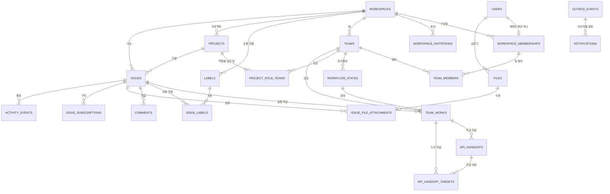

# 도메인 및 데이터 모델 명세서

| 항목 | 내용 |
| --- | --- |
| 문서 상태 | 확정 — MVP 도메인·데이터 모델 기준 |
| 문서 버전 | v2.0 |
| 작성일 | 2026-07-13 |
| 대상 릴리스 | Rivet MVP |
| 선행 문서 | [제품 요구사항 정의서](../planning/002.%20제품%20요구사항%20정의서.md), [사용자 흐름 및 화면 명세서](../planning/003.%20사용자%20흐름%20및%20화면%20명세서.md), [이슈 중심 작업 흐름 개편 명세서](../planning/006.%20이슈%20중심%20작업%20흐름%20개편%20명세서.md), [전역 이슈 목록 및 작업 배정 흐름 명세서](../planning/007.%20전역%20이슈%20목록%20및%20작업%20배정%20흐름%20명세서.md), [기술 아키텍처 명세서](./001.%20기술%20아키텍처%20명세서.md) |

## 1. 문서 목적

이 문서는 Rivet MVP의 제품 정책을 PostgreSQL과 Prisma로 구현할 수 있는 도메인 모델로 구체화한다. 엔터티, 관계, 고정 값, 저장 값과 계산 값, 데이터베이스 제약, 트랜잭션 경계, 삭제·보존 정책과 핵심 인덱스를 정의한다.

이 문서의 모델은 API 응답 구조가 아니며 데이터베이스 모델을 외부 계약에 그대로 노출하지 않는다. 엔드포인트별 요청·응답 구조는 이 문서의 범위에 포함하지 않는다.

### 1.1 범위

- 사용자, 인증, 인증 속도 제한, 워크스페이스와 멤버십
- 팀, 팀 멤버, 워크플로 상태와 라벨
- 프로젝트와 역할별 담당 팀
- 이슈 콘텐츠, 팀 실행 레코드, 전달 기반 준비 상태와 표시 ID
- 댓글, 멘션, 구독, 활동과 API 작업 전달
- 공통 파일 메타데이터, 이슈 첨부파일과 프로필 사진
- Outbox, 알림, 이메일 발송 기록과 내보내기 기록
- 동시 수정, 휴지통, 영구 삭제와 데이터 보존
- 데이터베이스 제약, 인덱스와 검증 기준

### 1.2 제외 범위

- 엔드포인트별 요청·응답 DTO와 오류 코드
- Prisma 스키마 파일과 마이그레이션 SQL 원문
- 화면 로컬 상태와 Lexical JSON 편집 상태
- PostHog가 외부에서 보관하는 제품 이벤트 원본
- Public 이후 다중 워크스페이스, 저장된 보기, 사이클과 외부 연동 모델

### 1.3 결정 상태

| 상태 | 의미 |
| --- | --- |
| 확정 | 선행 문서의 제품·기술 결정을 그대로 구체화한 항목 |
| 권장 | MVP 구현안으로 채택을 제안하며 검토 후 확정할 항목 |
| 미정 | 제품 선택이 필요한 항목 |

## 2. 모델링 원칙

### 2.1 공통 규칙

- 테이블과 컬럼의 실제 PostgreSQL 이름은 영문 `snake_case` 복수형을 사용한다.
- 내부 기본 키는 애플리케이션에서 생성한 UUID를 사용한다. 사용자가 보는 표시 ID와 관계용 내부 ID를 분리한다.
- 시각은 `timestamptz`로 UTC 저장하고, 날짜만 의미가 있는 프로젝트 시작일·목표일은 `date`로 저장한다.
- 모든 워크스페이스 업무 테이블은 조회 경계를 명시하기 위해 `workspace_id`를 직접 가진다. 사용자 프로필 범위 파일과 워크스페이스 생성 전에도 사용하는 인증 속도 제한 버킷만 예외다.
- 워크스페이스 하위 참조는 가능한 범위에서 `(workspace_id, id)` 복합 외래 키로 같은 워크스페이스임을 강제한다.
- 사용자 입력 문자열은 앞뒤 공백을 정리한 뒤 빈 값과 길이를 서버에서 검증한다. 대소문자를 구분하지 않는 고유 값은 정규화 컬럼 또는 함수 인덱스로 보호한다.
- 사용자가 직접 수정하는 주요 리소스는 `version` 정수를 가지며 성공한 수정마다 1씩 증가한다.
- 생성·수정 시각은 서버가 기록한다. 클라이언트가 전달한 시각을 원본으로 사용하지 않는다.
- 제품 정책으로 닫힌 값은 Prisma enum과 PostgreSQL enum으로 관리하고, 내부 이벤트 이름처럼 자주 늘어날 수 있는 값은 제한된 문자열 상수로 관리한다.
- 데이터베이스 제약으로 표현 가능한 불변 조건은 데이터베이스에서 막고, 여러 행의 현재 상태를 확인해야 하는 규칙은 서버 트랜잭션에서 잠금 후 검증한다.

### 2.2 저장하지 않는 계산 값

| 계산 값 | 계산 원천 |
| --- | --- |
| 이슈의 `차단됨` | 연결된 선행 팀 작업 중 `Completed`, `Canceled`가 아닌 작업의 존재 여부 |
| 이슈 진행률 | 취소된 팀 작업을 제외한 완료 작업 수 ÷ 대상 작업 수 |
| 프로젝트 진행률 | 취소된 연결 팀 작업을 제외한 완료 작업 수 ÷ 대상 작업 수 |
| 읽지 않은 알림 수 | 현재 사용자의 `notifications.read_at IS NULL` 개수 |
| 초대 상태 | 수락·취소·만료 시각의 조합 |
| 토큰 상태 | 사용·폐기·만료 시각의 조합 |
| 프로젝트 역할 활성 여부 | `project_role_teams` 행의 존재 여부 |
| 전역 이슈 업무함 | 이슈 상태와 삭제되지 않은 팀 작업의 상태·담당자 조합 |
| 이슈 작업 요약 | 이슈의 팀 작업, 프로젝트 역할별 팀, 현재 멤버십의 활성 팀 소속과 전달 기반 준비 상태를 페이지 단위로 집계 |
| 전역 이슈 결과 수 | 현재 워크스페이스와 전체 필터를 적용한 이슈 개수 |

계산 값을 별도 컬럼으로 중복 저장하지 않는다. 조회 성능이 실제로 기준을 넘을 때만 캐시나 집계 모델을 추가한다.

### 2.3 본문 저장 원칙

- 이슈 설명, 댓글과 작업 전달의 정본은 Markdown 문자열이다.
- Lexical JSON, 렌더링된 HTML과 미리보기 결과를 데이터베이스에 저장하지 않는다.
- 멘션은 Markdown 안의 불변 멤버십 ID와 별도 `mentions` 관계를 함께 사용한다. 표시 이름이 바뀌어도 대상 식별이 유지되어야 한다.
- 활동과 Outbox payload에는 설명·댓글·작업 전달 본문을 복제하지 않는다. 필요한 리소스 ID만 기록하고 처리 시 원본을 조회한다.
- 본문 이미지는 Markdown의 같은 출처 파일 참조와 별도 파일 연결 행을 함께 저장한다. Data URL, 절대 파일 경로와 바이너리를 본문이나 데이터베이스에 넣지 않는다.

## 3. 도메인 관계 개요

인증 세션, 일회용 토큰, 인증 속도 제한 버킷, 멘션, 사용자 프로필 사진 참조, 이메일 발송 기록과 내보내기 기록은 핵심 업무 관계를 읽기 어렵게 만들지 않도록 도식에서 생략했다.

## 4. 고정 도메인 값

enum의 데이터베이스 값은 영문 대문자로 저장하고 한국어 표시는 프론트와 API 표현 계층에서 매핑한다.

| enum | 값 | 의미 |
| --- | --- | --- |
| `MembershipRole` | `ADMIN`, `MEMBER` | 워크스페이스 권한 |
| `MembershipStatus` | `ACTIVE`, `INACTIVE` | 로그인·업무 활동 가능 여부 |
| `IssueStatus` | `UNSORTED`, `TODO`, `IN_PROGRESS`, `REVIEW`, `DONE`, `PAUSED`, `CANCELED` | 이슈의 고정 상태. 앞의 네 값은 팀 작업 요약, 뒤의 세 값은 명시적 결정 |
| `StateCategory` | `BACKLOG`, `UNSTARTED`, `STARTED`, `COMPLETED`, `CANCELED` | 팀 상태의 시스템 범주 |
| `IssuePriority` | `NONE`, `LOW`, `MEDIUM`, `HIGH`, `URGENT` | 없음, 낮음, 중간, 높음, 긴급 |
| `ProjectRole` | `BACKEND`, `WEB_FRONTEND`, `APP_FRONTEND` | 프로젝트의 고정 역할 |
| `ProjectStatus` | `PLANNED`, `IN_PROGRESS`, `COMPLETED`, `CANCELED` | 계획, 진행 중, 완료, 취소 |
| `HandoffKind` | `INITIAL`, `FOLLOW_UP` | 최초 전달과 추가 전달 |
| `TokenPurpose` | `EMAIL_VERIFICATION`, `PASSWORD_RESET`, `WORKSPACE_INVITATION` | 일회용 토큰 목적 |
| `NotificationType` | `TEAM_WORK_ASSIGNED`, `MENTIONED`, `COMMENT_ADDED`, `ISSUE_COMPLETED`, `ISSUE_CANCELED`, `API_HANDOFF_CREATED`, `API_HANDOFF_FOLLOW_UP_CREATED` | MVP 인앱 알림 유형 |
| `ExportType` | `ISSUES`, `PROJECTS` | CSV 내보내기 종류 |
| `FileScope` | `USER_PROFILE`, `WORKSPACE` | 사용자 프로필 사진과 워크스페이스 업무 파일 |
| `IssueFileKind` | `ISSUE_ATTACHMENT`, `DESCRIPTION_IMAGE`, `COMMENT_IMAGE`, `HANDOFF_IMAGE` | 일반 첨부와 본문별 이미지 사용 위치 |

이슈 상태와 시스템 범주의 매핑은 다음과 같이 고정한다.

| 이슈 상태 | 시스템 범주 |
| --- | --- |
| `UNSORTED`, `PAUSED` | `BACKLOG` |
| `TODO` | `UNSTARTED` |
| `IN_PROGRESS`, `REVIEW` | `STARTED` |
| `DONE` | `COMPLETED` |
| `CANCELED` | `CANCELED` |

한국어 표시는 `UNSORTED` 접수됨, `TODO` 할 일, `IN_PROGRESS` 진행 중, `REVIEW` 완료 확인, `DONE` 완료, `PAUSED` 일시 중지, `CANCELED` 취소로 고정한다. enum과 시스템 범주 매핑은 유지하고 상태 전이 책임만 서버 계산으로 변경한다.

## 5. 계정, 인증과 워크스페이스

### 5.1 `users`

워크스페이스와 무관한 로그인 계정이다.

| 핵심 컬럼 | 규칙 |
| --- | --- |
| `id` | UUID 기본 키 |
| `email`, `normalized_email` | 원본 표시용 이메일과 소문자 정규화 이메일, `normalized_email` 전역 유일 |
| `password_hash` | 검증된 메모리 하드 해시 결과만 저장 |
| `display_name` | 필수 1~50자, 중복 허용. 할당·멘션·댓글·활동의 기본 사용자 표시 이름 |
| `avatar_file_id` | 선택 프로필 사진 파일 외래 키, 값이 있으면 사용자별 유일 |
| `email_verified_at` | `NULL`이면 업무 데이터 접근 불가 |
| `created_at`, `updated_at` | 서버 기록 |

`avatar_file_id`는 `scope = USER_PROFILE`, `workspace_id IS NULL`, `uploaded_by_user_id = users.id`인 파일만 지정할 수 있다. 이 조건은 프로필 사진 변경 트랜잭션에서 검증한다. 계정 삭제, 이메일 변경과 다중 로그인 제공자 모델은 MVP에 넣지 않는다.

### 5.2 `sessions`

| 핵심 컬럼 | 규칙 |
| --- | --- |
| `id`, `user_id` | UUID 기본 키, 사용자 외래 키 |
| `token_hash` | 쿠키에 담긴 무작위 세션 값의 해시, 유일 |
| `last_seen_at` | 유휴 만료 갱신 기준 |
| `idle_expires_at` | 마지막 사용 후 7일 |
| `absolute_expires_at` | 생성 후 30일, 갱신 불가 |
| `revoked_at`, `created_at` | 폐기와 생성 시각 |

세션 원문은 데이터베이스에 저장하지 않는다. 로그아웃, 비밀번호 변경·재설정과 멤버 비활성화는 관련 활성 세션의 `revoked_at`을 같은 트랜잭션에서 기록한다.

### 5.3 `one_time_tokens`

이메일 인증, 비밀번호 재설정과 워크스페이스 초대 링크를 같은 안전 규칙으로 관리한다.

| 핵심 컬럼 | 규칙 |
| --- | --- |
| `id`, `purpose` | UUID 기본 키, 토큰 목적 |
| `user_id`, `invitation_id` | 목적에 따라 정확히 하나의 대상 사용 |
| `token_hash` | URL 토큰 원문의 해시, 유일 |
| `expires_at`, `used_at`, `revoked_at` | 만료, 일회 사용과 재발급 폐기 판단 |
| `created_at` | 발급 시각 |

`EMAIL_VERIFICATION`, `PASSWORD_RESET`은 `user_id`를 사용하고 `WORKSPACE_INVITATION`은 `invitation_id`를 사용한다. 같은 목적과 대상에 새 토큰을 발급하면 이전 미사용 토큰을 폐기한다.

비동기 워커가 토큰 원문을 데이터베이스에 저장하지 않고 같은 발송 링크를 재생성할 수 있도록, 링크 토큰은 무작위 UUID와 서버 비밀 키의 HMAC으로 결정적으로 만든 뒤 그 전체 값의 해시만 저장한다. 워커는 Outbox의 토큰 ID로 같은 링크를 다시 만들고 Resend 멱등 키를 재사용한다. 서버 비밀 키가 바뀌면 기존 미사용 링크는 재발급한다.

### 5.4 `workspaces`

| 핵심 컬럼 | 규칙 |
| --- | --- |
| `id` | UUID 기본 키 |
| `name` | 필수, 최대 100자 |
| `slug`, `normalized_slug` | 주소용 3~50자, 정규화 값 전역 유일 |
| `next_issue_number` | 다음 이슈 번호, 기본값 1 |
| `created_by_user_id` | 최초 생성 계정 |
| `version`, `created_at`, `updated_at` | 동시 수정과 시각 |

워크스페이스 삭제와 한 계정의 추가 워크스페이스 생성은 MVP에 포함하지 않는다.

### 5.5 `workspace_memberships`

| 핵심 컬럼 | 규칙 |
| --- | --- |
| `id`, `workspace_id`, `user_id` | UUID 기본 키와 양쪽 외래 키 |
| `role` | `ADMIN` 또는 `MEMBER` |
| `status` | `ACTIVE` 또는 `INACTIVE` |
| `invited_by_membership_id` | 초대 가입이면 초대한 멤버십 |
| `joined_at`, `deactivated_at`, `updated_at` | 상태 시각 |

`user_id`에 유일 제약을 두어 활성·비활성 상태와 관계없이 계정당 멤버십을 최대 하나로 제한한다. 비활성화는 행을 삭제하지 않으며 과거 이슈, 댓글과 활동의 작성자 참조를 유지한다.

멤버에게 할당된 미완료 팀 작업이 한 건이라도 있으면 비활성화를 거부한다. 모든 대상 작업을 재할당하거나 담당 해제한 뒤 멤버십 상태·비활성화 시각과 관련 세션 폐기를 같은 트랜잭션에서 기록한다.

### 5.6 `workspace_invitations`

| 핵심 컬럼 | 규칙 |
| --- | --- |
| `id`, `workspace_id` | UUID 기본 키, 대상 워크스페이스 |
| `email`, `normalized_email` | 초대 대상 이메일 |
| `invited_by_membership_id` | 초대한 관리자 |
| `expires_at`, `accepted_at`, `canceled_at` | 상태 계산 원천 |
| `accepted_by_user_id` | 수락 계정, 수락 전 `NULL` |
| `created_at`, `updated_at` | 시각 |

같은 워크스페이스와 정규화 이메일에는 처리 중인 초대를 하나만 둔다. 대기·만료 초대의 재발송은 같은 행에서 발신자·만료 시각과 토큰을 갱신하고, 수락·취소된 이력의 재발송은 원본을 보존한 채 새 행과 토큰을 만든다. 새 토큰 발급과 동시에 이전 미사용 토큰을 폐기한다.

수락할 때 로그인 이메일 일치와 초대 유효성을 잠금 후 확인한다. 멤버십이 없으면 한 번만 생성하고, 같은 워크스페이스의 기존 활성 `MEMBER`가 종료 이력에서 재발급된 유효 링크를 확인하면 새 멤버십 없이 새 초대 행과 토큰만 수락·사용 처리한다. 다른 워크스페이스 또는 비활성 멤버십은 재사용하지 않는다.

### 5.7 `auth_rate_limit_buckets`

로그인·회원가입·인증 메일·비밀번호 재설정과 토큰 검증의 계정·네트워크별 제한을 PostgreSQL에서 원자적으로 계산하는 운영 보안 데이터다.

| 핵심 컬럼 | 규칙 |
| --- | --- |
| `id` | UUID 기본 키 |
| `scope` | 제한 대상과 요청 종류를 나타내는 서버 상수 문자열 |
| `key_hash` | 이메일·IP·토큰 ID를 범위별 HMAC-SHA-256으로 비식별화한 32바이트 값 |
| `window_started_at` | 제한 창 시작 시각 |
| `attempt_count` | 0 이상의 현재 요청 또는 실패 횟수 |
| `blocked_until` | 제한되지 않았으면 `NULL`, 제한 중이면 해제 시각 |
| `expires_at` | 제한 판정에 더 이상 필요하지 않은 시각 |
| `updated_at` | 마지막 증가·해제 시각 |

`(scope, key_hash, window_started_at)`를 유일하게 하고 원자적 upsert 또는 행 잠금으로 횟수를 증가시킨다. 이메일, IP와 토큰 ID 원문은 저장하지 않으며 워크스페이스 생성 전 요청도 다루므로 `workspace_id`를 두지 않는다. 성공한 로그인은 계정 실패 버킷을 제거하고 만료된 버킷은 워커가 정리한다.

## 6. 팀, 워크플로와 라벨

### 6.1 `teams`

| 핵심 컬럼 | 규칙 |
| --- | --- |
| `id`, `workspace_id` | UUID 기본 키와 워크스페이스 |
| `name`, `normalized_name` | 최대 100자, 활성 팀 안에서 대소문자 비구분 유일 |
| `key` | 영문 대문자 2~5자, 워크스페이스 안에서 유일 |
| `next_issue_number` | 다음 팀 작업 번호, 기본값 1 |
| `archived_at` | 보관 전 `NULL` |
| `version`, `created_at`, `updated_at` | 동시 수정과 시각 |

`next_issue_number = 1`일 때만 팀 키를 변경할 수 있다. 한 번이라도 팀 작업 번호가 발급되면 작업이 나중에 영구 삭제되어도 키를 바꾸지 않는다. 미완료 팀 작업이 있으면 팀을 보관할 수 없다.

### 6.2 `team_members`

| 핵심 컬럼 | 규칙 |
| --- | --- |
| `workspace_id`, `team_id`, `membership_id` | `(team_id, membership_id)` 복합 기본 키 |
| `joined_at` | 최초 또는 최근 참여 시각 |
| `removed_at` | 현재 팀 멤버면 `NULL` |

완료된 작업의 과거 담당자 관계를 보존하기 위해 팀에서 제거할 때 행을 지우지 않고 `removed_at`을 기록한다. 다시 추가하면 같은 행의 `removed_at`을 비운다. 새 담당자 선택은 활성 워크스페이스 멤버십이면서 `removed_at IS NULL`인 행으로 제한한다.

미완료 팀 작업의 담당자인 멤버는 해당 작업을 재할당하거나 담당 해제하기 전에는 `removed_at`을 기록할 수 없다.

### 6.3 `workflow_states`

팀 작업에만 사용하는 사용자화 가능한 상태다. 이슈는 별도 고정 enum을 사용한다.

| 핵심 컬럼 | 규칙 |
| --- | --- |
| `id`, `workspace_id`, `team_id` | UUID 기본 키, 소속 팀 |
| `name`, `normalized_name` | 팀 안에서 대소문자 비구분 유일 |
| `category` | 고정 `StateCategory` |
| `position` | 0 이상의 표시 순서, 팀 안에서 유일 |
| `is_default` | 팀 설정 화면의 대표 시작 상태. 팀마다 정확히 하나 |
| `version`, `created_at`, `updated_at` | 동시 수정과 시각 |

팀 생성 시 7개 기본 상태를 만들고 `할 일`을 대표 시작 상태로 지정한다. 사용 중인 상태는 같은 팀의 대체 상태로 모든 팀 작업을 옮긴 뒤 삭제한다. 기본 상태를 삭제하면 대체 상태에 기본 표시도 함께 이전한다. 시스템 범주는 수정할 수 없고 이름과 순서만 바꿀 수 있다.

이슈의 역할 선택·작업 시작·내가 맡기·최초 전달로 새 팀 작업을 만들 때는 해당 팀의 `UNSTARTED` 범주 중 `position`이 가장 작은 상태를 사용한다. 한 팀이 활성 프로젝트 역할에 연결돼 있는 동안에는 마지막 `UNSTARTED` 상태를 삭제할 수 없으며 시작 상태를 찾지 못하면 새 작업을 만들지 않고 전체 요청을 롤백한다. 팀 작업은 항상 이슈를 통해서만 생성하므로 팀 화면에서 사용하는 별도 생성 기본값은 없다.

### 6.4 `labels`

| 핵심 컬럼 | 규칙 |
| --- | --- |
| `id`, `workspace_id` | UUID 기본 키와 워크스페이스 |
| `name`, `normalized_name` | 최대 50자, 활성 라벨 안에서 대소문자 비구분 유일 |
| `color` | `#RRGGBB` 형식 |
| `archived_at` | 보관 전 `NULL` |
| `version`, `created_at`, `updated_at` | 동시 수정과 시각 |

보관된 라벨은 기존 이슈 연결을 유지하지만 새 연결에는 사용할 수 없다.

## 7. 프로젝트

### 7.1 `projects`

| 핵심 컬럼 | 규칙 |
| --- | --- |
| `id`, `workspace_id` | UUID 기본 키와 워크스페이스 |
| `name` | 필수, 최대 200자 |
| `description` | 선택 일반 텍스트, 최대 5,000자 |
| `status` | 기본값 `PLANNED` |
| `lead_membership_id` | 선택, 생성·변경 시 활성 멤버십 |
| `start_date`, `target_date` | 선택 `date`, 목표일은 시작일보다 빠를 수 없음 |
| `archived_at` | 보관 전 `NULL` |
| `deleted_at`, `purge_at`, `deleted_by_membership_id` | 30일 휴지통 |
| `version`, `created_at`, `updated_at` | 동시 수정과 시각 |

프로젝트 이름은 MVP에서 유일하지 않아도 된다. 프로젝트 상태와 진행률은 독립적이며 진행률로 상태를 자동 변경하지 않는다.

### 7.2 `project_role_teams`

| 핵심 컬럼 | 규칙 |
| --- | --- |
| `workspace_id`, `project_id`, `role` | `(project_id, role)` 복합 기본 키 |
| `team_id` | 해당 역할의 활성 담당 팀 |
| `created_at`, `updated_at` | 시각 |

프로젝트에는 `BACKEND`, `WEB_FRONTEND`, `APP_FRONTEND` 중 최소 한 행이 있어야 한다. 같은 팀이 여러 역할에 연결될 수 있지만 같은 프로젝트와 역할에는 한 팀만 연결된다.

역할별 팀이 실제 팀 작업에서 사용 중이면 해당 행 삭제와 `team_id` 변경을 데이터베이스 외래 키와 서버 검증으로 막는다. 역할 수 최소 1 조건은 프로젝트 생성·수정 트랜잭션에서 확인한다.

## 8. 이슈와 팀 작업

### 8.1 `issues`

이슈는 요구사항과 업무 맥락의 유일한 콘텐츠 원본이다. 팀 작업을 같은 테이블의 다른 유형으로 저장하지 않으며 `type` 구분자도 두지 않는다.

| 핵심 컬럼 | 규칙 |
| --- | --- |
| `id`, `workspace_id` | UUID 기본 키와 워크스페이스 |
| `identifier`, `sequence_number` | 불변 표시 ID와 워크스페이스 발급 순번 |
| `title` | 필수, 최대 500자 |
| `description_markdown` | 선택 Markdown, 최대 100,000자 |
| `status` | 고정 `IssueStatus`, 기본값 `UNSORTED` |
| `priority` | 고정 `IssuePriority`, 기본값 `NONE` |
| `project_id` | 필수 프로젝트 |
| `created_by_membership_id` | 생성자 |
| `deleted_at`, `purge_at`, `deleted_by_membership_id` | 30일 휴지통 |
| `version`, `created_at`, `updated_at` | 동시 수정과 정렬 시각 |

`issues`에는 팀, 프로젝트 역할, 팀 워크플로 상태, 담당자와 상위 이슈 컬럼을 두지 않는다. 이슈 제목·설명·우선순위·라벨·프로젝트·댓글·일반 첨부파일은 팀 작업에 복제하지 않는다.

### 8.2 `team_works`

팀 작업은 이슈를 실행하기 위한 최소 단위다. 독립 문서나 두 번째 이슈가 아니며 항상 정확히 하나의 이슈에 속한다.

| 핵심 컬럼 | 규칙 |
| --- | --- |
| `id`, `workspace_id`, `issue_id` | UUID 기본 키, 워크스페이스와 필수 상위 이슈 |
| `identifier`, `sequence_number` | 불변 팀 표시 ID와 팀별 발급 순번 |
| `project_role`, `team_id` | 프로젝트 역할과 해당 역할의 실제 담당 팀 |
| `workflow_state_id` | 같은 팀의 현재 워크플로 상태 |
| `assignee_membership_id` | 선택 담당자, 현재 팀의 활성 멤버만 허용 |
| `work_note_markdown` | 선택 Markdown, 최대 10,000자 |
| `created_by_membership_id` | 작업을 시작하거나 생성한 멤버십 |
| `deleted_at` | 이슈 안에서 실행 범위를 제거한 시각, 활성 작업이면 `NULL` |
| `version`, `created_at`, `updated_at` | 동시 수정과 정렬 시각 |

`work_note_markdown`은 이슈 전체 설명을 반복하지 않고 해당 팀의 구현 범위·조사 결과·주의사항만 적는다. Markdown의 제목, 목록, 인용, 링크와 코드 블록을 지원하고 멘션, 인라인 이미지와 파일 연결은 지원하지 않는다. 해당 팀의 활성 멤버만 수정한다. 팀 작업에는 제목, 설명, 우선순위, 라벨, 프로젝트, 일반 첨부파일, 독립 댓글과 독립 휴지통을 두지 않는다.

추가 불변 조건은 다음과 같다.

- `team_works.issue_id`는 필수이며 상위 이슈 없는 팀 작업을 저장할 수 없다.
- 팀 작업의 프로젝트는 `issues.project_id`로만 결정하고 중복 저장하지 않는다.
- `(issue.project_id, project_role, team_id)`는 `project_role_teams`의 실제 연결과 일치해야 한다.
- 담당자와 워크플로 상태는 팀 작업의 워크스페이스·팀과 일치해야 한다.
- 같은 이슈·프로젝트 역할에는 동시에 활성인 팀 작업을 여러 개 둘 수 있다. 재작업과 병렬 분할은 관계와 표시 ID로 구분하며 클라이언트가 별도 제목을 만들지는 않는다.
- 보관·삭제된 프로젝트, 보관된 팀과 삭제된 상태에는 새 팀 작업을 연결할 수 없다.

### 8.3 표시 ID 발급과 생성

이슈 생성은 워크스페이스의 `next_issue_number`, 팀 작업 생성은 팀의 `next_issue_number`를 원자적으로 증가시킨다. 카운터 증가와 대상 행 삽입은 같은 트랜잭션에서 실행한다.

이슈 생성 요청의 `initialRoles`가 생략되거나 비어 있으면 `UNSORTED` 이슈만 만든다. 역할을 선택하면 프로젝트 역할과 시작 상태를 잠그고 각 역할의 `team_works`를 함께 만든다. 팀 작업은 상위 이슈의 제목·설명·우선순위·라벨·프로젝트를 복제하지 않으며 역할 담당 팀의 가장 빠른 `UNSTARTED` 상태와 미할당 담당자를 사용한다. 하나 이상 만들면 이슈 상태를 같은 트랜잭션에서 `TODO`로 계산한다.

기존 이슈의 `작업 시작`은 선택 역할별 기존 미완료 팀 작업을 재사용하고 없는 역할만 생성한다. 완료·취소된 작업만 있는 역할은 새 팀 작업을 만들 수 있다. 복수 역할 중 하나라도 실패하면 카운터 증가와 모든 새 팀 작업을 롤백한다.

`roleAssignments`는 `initialRoles`와 같은 요청에서 공존할 수 없다. 담당자가 있으면 역할 팀의 활성 멤버인지 잠금 뒤 검증한다. `requireCurrentUserTeamMembership = true`는 서버가 프로젝트 역할에서 팀을 다시 결정하고 현재 멤버십을 검증하며 담당자는 비워 둔다.

- 이슈: `F-{sequence_number}`
- 팀 작업: `{team.key}-{sequence_number}`
- 이슈 순번은 워크스페이스 안에서, 팀 작업 순번은 팀 안에서 유일하다.
- 삭제·영구 삭제된 번호를 다시 사용하지 않는다.

### 8.4 `issue_labels`

`(issue_id, label_id)`를 복합 기본 키로 사용하고 `workspace_id`를 직접 둔다. 양쪽 리소스가 같은 워크스페이스인지 복합 외래 키로 확인한다. 보관된 라벨의 기존 행은 유지하지만 새 행은 만들 수 없다. 팀 작업별 라벨 연결 테이블은 만들지 않는다.

### 8.5 전달 기반 준비 상태

`team_work_relations`는 없다. 프론트 역할의 준비 상태는 저장 컬럼이 아니라 이슈의 활성 백엔드 팀 작업 존재 여부와 `api_handoff_targets`의 최초 전달 대상 여부로 계산한다. 백엔드가 없는 프론트 작업은 즉시 `READY`, 백엔드가 있고 최초 전달 대상이 아니면 `API_HANDOFF_PENDING`, 최초 전달 대상이면 `READY`다. 준비 전 프론트 작업의 `STARTED` 상태 전이는 서버가 거부한다.

### 8.6 진행률과 완료 판정

- 팀 작업 완료는 연결된 `workflow_states.category = COMPLETED`로 판단한다.
- 팀 작업 취소는 `workflow_states.category = CANCELED`로 판단한다.
- 이슈 완료·취소는 각각 `status = DONE`, `status = CANCELED`로 판단한다.
- 이슈 진행률은 삭제되지 않은 소속 팀 작업만 사용한다.
- 프로젝트 진행률은 프로젝트 이슈와 삭제되지 않은 팀 작업을 조인해 계산한다.
- 취소된 작업은 분자와 분모에서 모두 제외한다.
- 분모가 0이면 계산값은 0%지만 화면은 숫자보다 분석·작업 시작 안내를 우선한다.
- 생성 전 예상 역할은 저장된 팀 작업이 아니므로 진행률에 포함하지 않는다.
- 최초 전달에서 백엔드 완료와 대상 프론트 작업 생성·재사용을 한 트랜잭션으로 처리해 중간 100% 진행률을 외부에 노출하지 않는다.

`PAUSED`, `CANCELED`, `DONE`이 아닌 이슈의 `status`는 삭제되지 않고 `CANCELED` 범주가 아닌 팀 작업으로 다음 순서에 따라 계산해 저장한다.

1. 유효 작업이 없으면 `UNSORTED`다.
2. 유효 작업이 하나 이상이고 `STARTED`·`COMPLETED` 작업이 하나도 없으면 `TODO`다. 팀별 `BACKLOG` 상태도 이미 실행 팀이 정해진 작업이므로 이슈는 `TODO`다.
3. `STARTED` 또는 `COMPLETED` 작업이 하나 이상 있고 미완료 작업이 남아 있으면 `IN_PROGRESS`다.
4. 유효 작업이 하나 이상이고 모두 `COMPLETED`면 `REVIEW`다.

팀 작업 생성·상태 변경·삭제·복구와 재사용은 상위 이슈를 잠근 뒤 상태 계산에 필요한 팀 작업을 다시 읽는다. 이슈 상태 변경, 팀 작업 변경, 활동과 Outbox는 같은 트랜잭션에 포함한다. 계산 결과가 이전 값과 같으면 이슈 버전과 상태 활동을 추가로 증가시키지 않는다.

`PAUSED`, `CANCELED`, `DONE`에서는 자동 계산을 중지한다. `RESUME`은 `PAUSED`, `REOPEN`은 `CANCELED` 또는 `DONE`을 현재 팀 작업 기준 계산값으로 되돌린다. `COMPLETE`는 계산 결과가 `REVIEW`인 경우에만 `DONE`으로 전환한다. 새 팀 작업을 추가하거나 완료·취소된 역할 작업을 다시 시작하려면 이슈를 먼저 다시 열거나 재개해야 한다.

### 8.7 전역 이슈 업무함과 작업 요약

전역 목록은 삭제되지 않은 모든 이슈를 대상으로 하며 다음 조건을 저장하지 않고 조회 시 계산한다.

| 업무함 | 계산 조건 |
| --- | --- |
| `REVIEW_REQUIRED` | 이슈 상태가 `UNSORTED` |
| `ASSIGNMENT_REQUIRED` | 완료·취소가 아닌 팀 작업 중 담당자가 없는 작업이 하나 이상 있음 |
| `IN_PROGRESS` | 이슈 상태가 `IN_PROGRESS` |
| `COMPLETION_REQUIRED` | 이슈 상태가 `REVIEW` |
| `COMPLETED` | 이슈 상태가 `DONE` |

유효 팀 작업이 모두 취소되면 이슈는 `UNSORTED`로 계산돼 `REVIEW_REQUIRED`에 다시 포함된다. `ASSIGNMENT_REQUIRED`와 `IN_PROGRESS`는 동시에 참일 수 있다.

이슈 목록의 `workflowSummary`는 다음 계산값을 제공한다.

- 삭제되지 않은 전체 팀 작업 수, 완료 수, 취소 수와 완료·취소가 아닌 미할당 수
- 현재 미완료 역할과 전달 기반 준비 상태
- 취소 제외 대상 작업 존재 여부와 모든 대상 작업 완료 여부
- 현재 역할과 프로젝트 역할 팀을 묶은 `activeRoleTeams`
- 현재 사용자가 활성 멤버인 프로젝트 역할의 `currentUserTeamRoles`
- 현재 사용자에게 할당된 미완료 팀 작업의 ID·표시 ID·역할을 담은 `currentUserAssignedTeamWorks`

목록 항목의 `createdBy`와 페이지 응답의 `totalCount` 역시 생성자 관계와 전체 필터에서 계산한다. 이 값들을 위해 `issues`에 팀·담당자·요약 컬럼이나 별도 집계 모델을 추가하지 않는다. 목록 페이지의 이슈 ID 집합을 먼저 확정한 뒤 팀 작업·프로젝트 역할·팀 멤버십·선행 관계를 고정된 수의 일괄 쿼리로 읽어 행별 추가 조회와 N+1을 만들지 않는다.

## 9. 협업, 파일과 작업 전달

### 9.1 `comments`

| 핵심 컬럼 | 규칙 |
| --- | --- |
| `id`, `workspace_id`, `issue_id` | UUID 기본 키와 대상 이슈 |
| `team_work_id` | 선택 팀 작업 문맥. 값이 있으면 같은 이슈에 속해야 함 |
| `author_membership_id` | 작성 당시 멤버십 |
| `body_markdown` | 활성 댓글이면 필수, 최대 50,000자 |
| `version`, `edited_at` | 댓글 수정 충돌과 수정 표시 |
| `deleted_at`, `created_at`, `updated_at` | 삭제 표시와 시각 |

댓글은 항상 이슈 대화에 속한다. `team_work_id`는 특정 실행 작업에서 작성했다는 문맥만 제공하며 별도 댓글 스레드나 권한 경계를 만들지 않는다. 댓글 삭제는 30일 휴지통 대상이 아니다. 삭제 시 `deleted_at`을 기록하고 본문을 제거해 복원하지 않으며, 행과 작성자·시각은 타임라인 순서 유지를 위해 이슈 영구 삭제 전까지 남긴다.

### 9.2 `mentions`

| 핵심 컬럼 | 규칙 |
| --- | --- |
| `id`, `workspace_id`, `issue_id` | UUID 기본 키, 대상 이슈 |
| `comment_id` | `NULL`이면 이슈 설명의 멘션, 값이 있으면 댓글 멘션 |
| `mentioned_membership_id` | 저장 당시 활성 워크스페이스 멤버 |
| `created_at` | 관계 생성 시각 |

멘션 관계는 이슈 설명과 댓글에만 만든다. 설명 저장 시에는 해당 이슈의 `comment_id IS NULL` 멘션 집합을, 댓글 수정 시에는 해당 댓글의 멘션 집합을 Markdown 파싱 결과와 한 트랜잭션에서 맞춘다. 같은 본문에서 같은 멤버를 여러 번 멘션해도 관계와 알림은 한 건이다. 작업 전달 식별자나 작업 전달 멘션 관계는 추가하지 않는다.

### 9.3 `issue_subscriptions`

`(issue_id, membership_id)`를 복합 기본 키로 사용한다. 이슈 생성자, 현재 또는 과거 팀 작업 담당자와 멘션 대상은 자동 구독된다. 담당 해제나 멘션 본문 수정으로 자동 구독을 제거하지 않는다. MVP에는 수동 구독 해제 화면이 없으므로 구독 이유별 행이나 알림 환경설정 테이블을 만들지 않는다.

### 9.4 `api_handoffs`와 `api_handoff_targets`

`api_handoffs`는 전달 원문, `api_handoff_targets`는 실제 수신 팀 작업을 보관한다.

| 핵심 컬럼 | 규칙 |
| --- | --- |
| `id`, `workspace_id`, `issue_id` | UUID 기본 키, 전달이 속한 이슈 |
| `source_team_work_id` | 전달을 작성한 백엔드 역할 팀 작업 |
| `kind` | `INITIAL` 또는 `FOLLOW_UP` |
| `sequence_number` | 원본 팀 작업 안에서 1부터 증가, 유일 |
| `body_markdown` | 템플릿 기반 본문, 최대 50,000자 |
| `author_membership_id`, `created_at` | 작성자와 시각 |

`api_handoff_targets`는 `(handoff_id, team_work_id)`를 복합 기본 키로 사용한다. 원본과 대상 팀 작업은 같은 이슈에 속해야 하며 대상은 웹 또는 앱 프론트 역할이어야 한다.

작업 전달은 수정·삭제하지 않는 추가 전용 데이터다. 원본 팀 작업별 `INITIAL`은 최대 한 건이고 `FOLLOW_UP`은 최초 전달 뒤에만 추가한다. API 명세 링크와 변경 요약 등 템플릿 제목만 있고 실질 내용이 없는 본문은 유효한 전달로 인정하지 않는다. 작업 전달 본문의 멘션 참조는 저장하지 않고 `MARKDOWN_INVALID`로 거부하며, 전달별 멘션 관계나 별도 `MENTIONED` 수신자는 두지 않는다.

프로젝트에 웹 또는 앱 역할이 설정된 백엔드 역할 팀 작업을 완료할 때는 대상 프론트 작업의 현재 존재 여부와 무관하게 유효한 최초 전달을 요구한다. 완료 요청의 `destinationRoles`는 저장 컬럼이 아니라 트랜잭션 입력이며 프로젝트에 설정된 프론트 역할의 비어 있지 않은 부분집합이어야 한다. 백엔드 전용 프로젝트만 최초 전달 없이 완료할 수 있다.

최초 전달 트랜잭션은 원본 팀 작업과 이슈, 대상 프로젝트 역할을 잠그고 역할별 삭제되지 않은 팀 작업을 조회한다. 미완료 작업이 한 건 이상이면 재사용하고, 기존 작업이 없으면 역할 담당 팀의 가장 빠른 `UNSTARTED` 상태로 미할당 작업 한 건을 생성한다. 완료·취소된 작업만 있으면 새 작업을 만들고, 기존 작업의 역할·팀이 현재 설정과 다르면 자동 수정하지 않는다. 최초 전달 대상은 모두 `api_handoff_targets`에 명시하며 관계 테이블을 만들지 않는다.

전달, 대상 연결, 백엔드 상태 변경, 대상 프론트 작업 생성·재사용과 준비 상태 전환, 이슈 자동 상태, 활동과 Outbox 발행은 함께 커밋한다. 이미 처리된 동일 최초 완료 요청은 새 전달·작업·이벤트를 만들지 않고 버전 충돌을 반환하며 웹은 최신 이슈를 조회해 성공 결과를 복구한다. `FOLLOW_UP`은 최초 전달의 대상 작업에 연결하고 새 팀 작업을 자동 생성하지 않는다.

이슈 상세와 전달받은 팀 작업 문맥은 `api_handoffs`와 `api_handoff_targets`를 함께 조회한다. 활동 payload에서 관계를 추론하거나 전달 본문을 팀 작업에 복제하지 않는다. 전달 미리보기는 첫 번째 유효 본문 문장에서 계산하며 별도 컬럼에 복제하지 않는다.

### 9.5 `files`

파일 바이너리는 `FILE_STORAGE_ROOT` 아래 로컬 파일시스템에 저장하고 이 테이블에는 조회·권한·정리에 필요한 메타데이터만 저장한다.

| 핵심 컬럼 | 규칙 |
| --- | --- |
| `id`, `scope` | UUID 기본 키와 `USER_PROFILE` 또는 `WORKSPACE` 범위 |
| `workspace_id` | `WORKSPACE`면 필수, `USER_PROFILE`이면 `NULL` |
| `uploaded_by_user_id` | 업로드를 시작한 사용자 |
| `storage_key` | UUID 기반 상대 저장 키, 전역 유일. 사용자 입력과 절대 경로 금지 |
| `original_name` | 표시·다운로드용 원본 파일명, 경로 구성에는 사용하지 않음 |
| `detected_mime_type` | 서버가 실제 내용으로 판별한 형식 |
| `size_bytes` | 1 이상 26,214,400바이트 이하. 제품 표기는 파일당 25MB |
| `unlinked_at` | 생성 시 `created_at`과 같고 업무 리소스에 연결하면 `NULL`, 연결 해제 시 현재 시각 |
| `created_at` | 메타데이터 생성 시각과 저장소 단독 파일의 나이 비교 기준 |

업로드 완료 상태 컬럼은 두지 않는다. 실제 파일 쓰기에 성공한 뒤 메타데이터가 유효하며, 연결 여부의 정본은 `users.avatar_file_id`와 `issue_file_attachments.file_id`의 존재다. `unlinked_at`은 정리 유예 시각일 뿐 연결 여부를 대신하지 않는다. 업로드 직후 미연결 파일은 업로더만 조회할 수 있다.

### 9.6 `issue_file_attachments`

일반 이슈 첨부와 설명·댓글·작업 전달의 인라인 이미지를 같은 이슈 권한과 수명주기로 관리한다. 팀 작업 자체에는 파일 연결을 만들지 않는다.

| 핵심 컬럼 | 규칙 |
| --- | --- |
| `id`, `workspace_id`, `issue_id` | UUID 기본 키, 워크스페이스와 대상 이슈 |
| `file_id` | `WORKSPACE` 범위 파일 외래 키, 전체 테이블에서 유일 |
| `kind` | `ISSUE_ATTACHMENT`, `DESCRIPTION_IMAGE`, `COMMENT_IMAGE`, `HANDOFF_IMAGE` |
| `comment_id` | 댓글 이미지일 때만 필수 |
| `api_handoff_id` | 작업 전달 이미지일 때만 필수 |
| `created_by_membership_id`, `created_at` | 연결한 멤버와 업로드 순서 기준 시각 |

유형별 조건은 다음과 같다.

- `ISSUE_ATTACHMENT`, `DESCRIPTION_IMAGE`: `comment_id`, `api_handoff_id` 모두 `NULL`이다.
- `COMMENT_IMAGE`: 같은 이슈의 `comment_id`가 필수이고 `api_handoff_id`는 `NULL`이다.
- `HANDOFF_IMAGE`: 같은 이슈의 `api_handoff_id`가 필수이고 `comment_id`는 `NULL`이다.
- `file_id`는 한 연결에서만 사용한다. 같은 파일을 본문에서 여러 번 표시할 수는 있지만 다른 이슈·댓글·전달에 재사용하지 않는다.
- 일반 첨부는 `created_at, id` 순서로 표시하며 수동 정렬 컬럼을 두지 않는다.

본문 이미지는 Markdown에 `` 형식의 같은 출처 상대 참조를 저장한다. 설명·댓글·작업 전달 저장 시 Markdown에서 추출한 파일 ID 집합과 해당 본문의 연결 행을 한 트랜잭션에서 맞춘다. 외부 URL 이미지는 파일 연결을 만들지 않으며 MVP 렌더러는 원격 이미지 자동 가져오기를 지원하지 않는다.

### 9.7 `activity_events`

| 핵심 컬럼 | 규칙 |
| --- | --- |
| `id`, `workspace_id` | 불변 이벤트 UUID와 워크스페이스 |
| `issue_id`, `project_id` | 정확히 하나의 대상 리소스 |
| `team_work_id` | 이슈 활동의 선택 실행 문맥. 값이 있으면 같은 이슈에 속해야 함 |
| `actor_membership_id` | 시스템 작업이면 `NULL` 가능 |
| `event_type`, `field_name` | 제한된 서버 상수 |
| `before_data`, `after_data` | 렌더링에 필요한 최소 JSONB 스냅샷 |
| `created_at` | 사건 시각 |

활동은 추가 전용이며 원본 변경과 같은 트랜잭션에서 만든다. 전후 데이터에는 상태 ID·표시 이름, 담당 멤버십 ID·표시 이름처럼 이력을 이해하는 최소 값만 담고 Markdown 본문, 이메일과 토큰을 넣지 않는다.

댓글·작업 전달은 각 원본 행을 타임라인에 표시하고, 대응 활동 이벤트는 중복 행으로 노출하지 않는다. 활동 이벤트는 알림·실시간 처리의 원천이 아니라 사용자 변경 이력이며 Outbox와 목적을 분리한다.

## 10. Outbox, 알림과 운영 기록

### 10.1 `outbox_events`

| 핵심 컬럼 | 규칙 |
| --- | --- |
| `id`, `workspace_id` | 불변 이벤트 UUID, 인증 메일처럼 워크스페이스 전이면 `workspace_id` 선택 |
| `event_type` | 제한된 서버 문자열 상수 |
| `aggregate_type`, `aggregate_id` | 변경 원본 종류와 내부 ID |
| `actor_membership_id` | 행위자가 있으면 기록 |
| `payload` | 토큰 ID, 댓글 ID, 전달 ID 등 최소 JSONB. 업무 본문 금지 |
| `available_at` | 즉시 또는 영구 삭제 예정 시각부터 처리 |
| `attempt_count`, `next_attempt_at`, `last_error_code` | 재시도 상태 |
| `locked_at`, `locked_by` | 워커 처리 잠금 |
| `processed_at`, `canceled_at`, `created_at` | 종료와 생성 시각 |

업무 변경과 Outbox 삽입을 같은 트랜잭션에 둔다. 최초·추가 전달 이벤트에는 실제 대상 프론트 작업 ID와 사건 시점에 중복 제거한 알림 후보 멤버십 ID를 최소 payload로 저장한다. 워커는 `FOR UPDATE SKIP LOCKED`로 처리할 행을 가져가고 제한된 지수형 재시도를 사용한다. `last_error_code`에는 정제된 코드만 저장하고 요청·응답 본문과 비밀 값을 넣지 않는다.

이슈·프로젝트 휴지통 이동 시 `available_at = purge_at`인 영구 삭제 이벤트를 만든다. 복구하면 이벤트를 취소하고, 워커는 처리 직전에 대상의 현재 `deleted_at`, `purge_at`을 다시 확인한다.

### 10.2 `notifications`

| 핵심 컬럼 | 규칙 |
| --- | --- |
| `id`, `workspace_id`, `event_id` | UUID 기본 키, 원본 Outbox 이벤트 |
| `recipient_membership_id` | 수신 멤버십 |
| `type`, `actor_membership_id` | 알림 유형과 행위자 |
| `issue_id` | 이동할 이슈 |
| `team_work_id` | 필요한 경우 통합 상세에서 선택할 팀 작업 |
| `comment_id`, `handoff_id` | 필요한 경우 정확한 위치 앵커 |
| `read_at`, `created_at` | 읽음과 발생 시각 |

`(event_id, recipient_membership_id)`를 유일하게 해 멘션·구독·담당·전달 규칙이 겹치거나 Outbox가 재처리돼도 수신자별 한 건만 만든다. 최초 전달에서 재사용한 대상 작업은 현재 담당자와 자동 구독자, 새 미할당 작업은 대상 팀의 사건 당시 활성 멤버를 후보로 삼는다. 추가 전달은 최초 전달 대상 작업의 담당자와 자동 구독자만 사용한다. 행위자와 수신자가 같거나 처리 시점의 수신 멤버십이 비활성이면 생성하지 않는다.

전달 알림의 `issue_id`는 항상 전달이 속한 이슈다. 수신자의 담당·구독·활성 팀 멤버 조건과 맞는 후행 작업이 있으면 `team_work_id`를 함께 저장하고 통합 상세에서 해당 작업을 선택한다. `handoff_id`는 어느 이동 대상을 사용해도 같은 원본 전달을 가리킨다. 알림 본문 스냅샷은 저장하지 않고 유형과 현재 이슈·팀 작업 정보로 한국어 요약을 만든다.

### 10.3 `email_deliveries`

| 핵심 컬럼 | 규칙 |
| --- | --- |
| `id`, `outbox_event_id` | UUID 기본 키, 이벤트당 한 발송 시도 계열 |
| `template_type`, `recipient_email` | 인증, 초대, 재설정 템플릿과 실제 수신 주소 |
| `provider_message_id` | Resend가 반환한 메일 ID |
| `sent_at`, `failed_at`, `last_error_code` | 결과 시각과 정제된 오류 코드 |
| `created_at`, `updated_at` | 시각 |

Resend 멱등 키는 `outbox_event_id`를 사용한다. 토큰 원문, 메일 HTML과 공급자 응답 본문은 저장하지 않는다.

### 10.4 `export_audits`

CSV 파일 자체를 데이터베이스에 저장하지 않고 실행 이력만 남긴다.

| 핵심 컬럼 | 규칙 |
| --- | --- |
| `id`, `workspace_id`, `requested_by_membership_id` | 요청 식별자와 관리자 |
| `type` | 이슈 또는 프로젝트 |
| `item_count` | 성공 시 내보낸 행 수 |
| `requested_at`, `completed_at`, `failed_at`, `downloaded_at` | 감사 시각 |
| `last_error_code` | 실패 시 정제된 코드 |

MVP 데이터 규모에서는 요청 중 CSV를 스트리밍한다. 실제 처리 시간이 요청 제한을 넘을 때만 파일 저장 위치와 비동기 내보내기 작업을 추가한다.

## 11. 데이터베이스 제약과 서버 검증

### 11.1 데이터베이스에서 강제

| 규칙 | 구현 |
| --- | --- |
| 계정당 최대 한 워크스페이스 | `workspace_memberships(user_id)` 유일 제약 |
| 정규화 이메일·슬러그 유일 | `users.normalized_email`, `workspaces.normalized_slug` 유일 제약 |
| 팀 키 유일 | `teams(workspace_id, key)` 유일 제약 |
| 활성 팀·라벨 이름 유일 | `archived_at IS NULL` 부분 유일 인덱스 |
| 팀 상태 이름·순서 유일 | `(team_id, normalized_name)`, `(team_id, position)` 유일 제약 |
| 표시 ID 유일 | `issues(workspace_id, identifier)`, `team_works(workspace_id, identifier)` 유일 제약과 서버 발급기 |
| 발급 순번 유일 | `issues(workspace_id, sequence_number)`, `team_works(team_id, sequence_number)` 유일 제약 |
| 프로젝트 역할 중복 금지 | `project_role_teams(project_id, role)` 복합 기본 키 |
| 팀 작업 상위 이슈 필수 | `team_works.issue_id NOT NULL` 외래 키 |
| 프로젝트 날짜 순서 | 두 날짜가 있으면 `target_date >= start_date` 검사 제약 |
| 중복·자기 순서 관계 금지 | 팀 작업 관계 쌍 유일 제약과 두 ID가 다르다는 검사 제약 |
| 최초 전달 중복 금지 | `kind = INITIAL`인 원본 팀 작업별 부분 유일 인덱스 |
| 전달 대상 중복 금지 | `api_handoff_targets(handoff_id, team_work_id)` 복합 기본 키 |
| 파일 저장 키와 사용 중복 금지 | `files(storage_key)`, `issue_file_attachments(file_id)`, 값이 있는 `users(avatar_file_id)` 유일 제약 |
| 파일 범위·크기 | `FileScope`와 `workspace_id` 조합, `1 <= size_bytes <= 26,214,400` 검사 제약 |
| 파일 연결 유형 | `IssueFileKind`별 `comment_id`, `api_handoff_id` 필수·금지 조합 검사 제약 |
| 알림 중복 금지 | `(event_id, recipient_membership_id)` 유일 제약 |
| 인증 속도 제한 버킷 중복 금지 | `(scope, key_hash, window_started_at)` 유일 제약 |
| 휴지통 시각 일관성 | 삭제 시 `deleted_at`, `purge_at`, 삭제자가 함께 존재하는 검사 제약 |

### 11.2 서버 트랜잭션에서 강제

- 이메일 인증, 초대와 비밀번호 재설정 토큰의 대상·목적·만료·일회 사용
- 초대 이메일과 로그인 이메일 일치, 기존 멤버십 부재
- 프로젝트에 역할별 팀이 최소 하나 존재
- 프로젝트 역할과 팀 작업의 역할·팀 일치
- 팀 작업이 상위 이슈와 같은 워크스페이스에 속하는지 확인
- 팀 작업 상태가 소속 팀의 상태인지 확인
- 활성 프로젝트 역할 팀이 `UNSTARTED` 상태를 하나 이상 유지하는지 확인
- 담당자가 활성 멤버십이면서 현재 팀 멤버인지 확인
- 역할별 작업 시작의 `initialRoles`와 `roleAssignments` 상호 배타, 역할 중복 부재와 현재 프로젝트 역할 존재 확인
- `requireCurrentUserTeamMembership` 요청은 역할 팀을 클라이언트 값으로 받지 않고 현재 사용자가 서버에서 결정한 역할 팀의 활성 멤버인지 확인
- 내가 맡기의 후보 작업이 같은 이슈·역할·팀의 미할당 미완료 작업인지 확인하고 다른 담당자가 생긴 경우 변경하지 않음
- 일괄 배정의 모든 작업 ID·버전·이슈·역할·팀·현재 담당자와 후보 활성 팀 멤버를 변경 전 전부 확인
- 팀 작업 관계의 양쪽 이슈·워크스페이스 일치와 전체 순환 부재
- 프론트 역할이 있는 프로젝트의 백엔드 작업 완료 시 대상 역할이 있는 최초 전달 존재
- 최초 전달의 후행 작업 다건 재사용, 전달 대상 연결, 완료·취소 범위 충돌과 현재 프로젝트 역할·팀 일치
- 업로드 파일의 실제 크기·형식, 업로더와 파일 범위 검증
- 프로필 사진 파일의 사용자 소유·`USER_PROFILE` 범위 검증
- 이슈 파일의 `WORKSPACE` 범위, 워크스페이스·이슈·댓글·작업 전달 일치 검증과 팀 작업 직접 연결 금지
- Markdown 파일 참조와 본문별 `issue_file_attachments` 집합 일치
- 파일 연결 시 `unlinked_at = NULL`, 마지막 연결 해제 시 현재 시각 기록
- 사용 중인 프로젝트 역할·상태 변경 제한
- 미완료 담당 작업이 있는 팀 멤버 제거와 멤버 비활성화 제한
- 미완료 팀 작업이 있는 팀 보관 제한
- 삭제·복구 가능 조건과 보관된 연결 대상 처리
- 인증 속도 제한 버킷의 원자적 증가, 차단 시각과 성공 로그인 후 계정 버킷 제거

여러 행을 검사하는 트랜잭션은 영향을 받는 프로젝트, 팀, 이슈 또는 초대 행을 일정한 순서로 잠가 동시 요청 사이의 검증 우회를 막는다.

## 12. 핵심 트랜잭션

| 동작 | 같은 트랜잭션에 포함할 데이터 |
| --- | --- |
| 워크스페이스 생성 | 워크스페이스, 관리자 멤버십 |
| 기본 팀 생성 | 팀, 생성자의 팀 멤버, 7개 기본 상태 |
| 초대 재발송 | 원본 또는 새 초대 행, 이전 토큰·Outbox 폐기, 새 토큰·Outbox |
| 초대 수락 | 초대 잠금·수락, 멤버십 생성 또는 기존 같은 워크스페이스 활성 멤버십 재사용, 토큰 사용, Outbox |
| 비밀번호 변경·재설정 | 비밀번호 해시, 관련 토큰 사용·폐기, 전체 세션 폐기 |
| 멤버 비활성화 | 미완료 담당 작업 부재 확인, 멤버십 상태·시각, 전체 세션 폐기 |
| 기본 이슈 생성 | 프로젝트 역할·시작 상태 잠금, 이슈와 선택한 `initialRoles`의 역할별 카운터 증가·`UNSTARTED` 팀 작업, 이슈 자동 상태, 라벨, 구독, 활동, Outbox. 빈 선택은 팀 작업 없는 `UNSORTED` |
| 이슈 작업 시작 | 이슈·프로젝트 역할·시작 상태 잠금, `initialRoles` 또는 역할별 선택 담당자가 있는 `roleAssignments` 검증, 선택 역할의 기존 미완료 작업 재사용, 없는 역할의 카운터 증가·`UNSTARTED` 팀 작업, 이슈 자동 상태, 담당자·구독, 활동, 알림 후보·Outbox. `requireCurrentUserTeamMembership`이면 현재 역할 팀 멤버십도 잠금·재검증 |
| 내가 맡기 | 이슈·역할 팀·현재 멤버십과 후보 작업 잠금, 후보 0건이면 새 작업 생성·1건이면 재사용·여러 건이면 선택 요구, 미할당 재검증, 자신에게 할당, 구독, 활동, 자기 알림을 제외한 Outbox |
| 팀 작업 일괄 배정 | 이슈와 모든 대상 팀 작업·버전·역할 팀·후보 멤버 잠금, 전체 검증 뒤 담당자·구독·활동·알림 후보·Outbox 일괄 반영. 한 건 충돌 시 전체 롤백 |
| 이슈 생성·설명 저장 | 이슈·설명, 파일 소유·범위 검증, 일반 첨부·설명 이미지 연결과 `unlinked_at`, 멘션, 활동, Outbox |
| 이슈 속성 변경 | 예상 버전 확인, 일반 속성 또는 허용된 상태 행동, 현재 팀 작업 재계산, 활동, Outbox, 버전 증가 |
| 팀 작업 변경 | 예상 버전 확인, 워크플로 상태·담당자·`work_note_markdown`, 상위 이슈 자동 상태, 이슈 활동과 Outbox |
| 상태 삭제·대체 | 대상 팀 작업 상태 일괄 교체, 활동, 기본 상태 이전, 기존 상태 삭제, Outbox |
| 프로젝트 역할 변경 | 연결 작업 존재 확인, 역할별 팀 변경, 프로젝트 활동·버전, Outbox |
| 댓글 저장 | 이슈 댓글과 선택 팀 작업 문맥, 멘션 집합, 댓글 이미지 연결과 `unlinked_at`, 자동 구독, 활동, Outbox |
| 백엔드 작업 전달·완료 | 이슈·백엔드·대상 역할·시작 상태 잠금, 최초 전달과 대상 연결, 전달 이미지 연결과 `unlinked_at`, 상태 변경, `UNSTARTED` 대상 프론트 작업 생성 또는 재사용과 준비 상태, 이슈 진행률·자동 상태, 활동, 알림 후보 스냅샷과 Outbox |
| 추가 전달 | 추가 전용 전달, 최초 전달 대상 작업 확인, 전달 이미지 연결과 `unlinked_at`, 활동, 담당자·구독자 후보 스냅샷과 Outbox. 팀 작업 생성 없음 |
| 프로필 사진 변경·삭제 | 새 파일 소유·범위 검증, `avatar_file_id` 교체 또는 해제, 새·이전 파일의 `unlinked_at` 변경 |
| 휴지통 이동·복구 | 삭제 시각, 노출 상태, 활동, 예약 Outbox 생성·취소 |

외부 메일 발송, 알림 행 생성, SSE 전송, PostHog 전송과 실제 파일 삭제는 주 트랜잭션 안에서 실행하지 않는다. 다만 알림 후보 계산과 스냅샷 저장은 원본 업무 트랜잭션에 포함한다. 파일시스템과 데이터베이스 사이의 실패 구간은 기술 아키텍처의 임시 저장·원자 이동·정기 정합성 작업으로 보완한다.

## 13. 삭제, 보관과 보존

### 13.1 삭제와 보관 구분

| 대상 | MVP 처리 |
| --- | --- |
| 사용자·워크스페이스·멤버십 | 삭제 없음. 멤버십은 비활성화 |
| 팀 | 삭제 없음. 조건을 만족하면 보관 |
| 라벨 | 보관, 기존 이슈 연결 유지 |
| 워크플로 상태 | 대체 상태로 팀 작업 이동 후 삭제 |
| 프로젝트 | 연결 이슈가 없으면 30일 휴지통, 그렇지 않으면 보관 |
| 이슈 | 소속 팀 작업과 함께 30일 휴지통 |
| 팀 작업 | 이슈 안에서 제거 표식. 독립 휴지통 없음 |
| 댓글 | 즉시 본문 제거 후 삭제 표식 유지 |
| 파일 | 업무 연결 해제 후 24시간 유예, 연결이 없으면 실제 파일과 메타데이터 삭제 |
| 작업 전달·활동 | 수정·삭제 없음. 이슈 영구 삭제 시 함께 제거 |

프로젝트의 “연결 이슈 없음”은 휴지통에서 복구 가능한 이슈까지 포함한다. 이슈 복구에 필요한 프로젝트·팀·상태가 보관되어 있어도 관계는 유지하며, 복구 결과가 기본 목록에서 보이지 않을 수 있음을 관리자에게 안내한다.

### 13.2 이슈 휴지통

- 이슈를 휴지통으로 옮기면 소속 팀 작업도 모든 목록·검색·진행률에서 함께 제외한다.
- 팀 작업을 개별 제거할 때는 대상 전달이 있는지 확인하지 않으며, 이슈의 소유 데이터 정리 순서를 따른다.
- 삭제 시 `purge_at = deleted_at + 30일`을 기록한다.
- 일반 목록, 검색, 진행률, 작업 가능 계산과 직접 조회는 삭제된 이슈와 소속 팀 작업을 제외한다.
- 댓글, 라벨, 구독, 멘션, 작업 전달, 활동, 파일 연결과 알림 앵커는 보존 기간 동안 유지한다.
- 복구는 원래 관계를 그대로 되살리고 예약된 영구 삭제 이벤트를 취소한다.
- 영구 삭제 시 소유 관계는 정해진 순서로 제거하고 참조가 남으면 실패·재시도한다.
- 이슈 영구 삭제로 파일 연결이 제거되면 파일은 미연결 24시간 유예 뒤 정리한다. 이슈 복구 가능 기간에는 실제 파일을 삭제하지 않는다.

### 13.3 운영 데이터 보존

| 데이터 | MVP 보존 |
| --- | --- |
| 처리 완료·취소 Outbox | 종료 후 30일 |
| 이메일 발송 기록 | 마지막 결과 후 30일 |
| 만료·사용·폐기된 일회용 토큰 | 종료 후 30일 |
| 만료·폐기된 세션 | 종료 후 30일 |
| 인증 속도 제한 버킷 | `expires_at` 이후 다음 일일 정리까지 |
| 내보내기 실행 기록 | 30일 |
| 사용자 알림 | 이슈가 존재하는 동안 유지, 이슈 영구 삭제 시 제거 |
| 댓글·작업 전달·활동 | 이슈가 존재하는 동안 유지 |
| 미연결 파일 메타데이터·바이너리 | 생성 또는 마지막 연결 해제 후 24시간 |
| 로컬 임시 업로드 파일 | 생성 후 1시간 |

운영 구조화 로그 30일과 PostHog 데이터 1년 보존은 데이터베이스 밖의 운영 정책으로 관리한다.

워커는 하루 한 번 `users.avatar_file_id`와 `issue_file_attachments.file_id` 어디에도 참조되지 않고 24시간이 지난 파일을 제거한다. 저장소에만 존재하는 파일과 임시 파일도 기술 아키텍처의 정합성 정책으로 정리한다. 연결된 메타데이터의 실제 파일이 없으면 참조를 자동 제거하지 않고 운영 경고를 남긴다.

## 14. 인덱스와 조회 기준

최소 인덱스는 실제 쿼리와 `EXPLAIN ANALYZE`를 확인해 확정하되 다음 접근 경로를 기본으로 한다.

| 조회 | 권장 인덱스 |
| --- | --- |
| 정확한 표시 ID 검색 | `issues(workspace_id, identifier)`, `team_works(workspace_id, identifier)` 유일 B-tree |
| 제목 부분 검색 | `workspace_id`, 휴지통 조건과 `lower(title)` 검색. 필요 시 `pg_trgm` GIN 인덱스 |
| 팀 작업 목록 | `team_works(workspace_id, team_id, deleted_at, updated_at, id)` |
| 내 작업 | `team_works(workspace_id, assignee_membership_id, deleted_at, updated_at, id)` |
| 전역 이슈 | `issues(workspace_id, deleted_at, updated_at, id)`와 현재 페이지 이슈 ID의 팀 작업·역할·담당자 일괄 조회 |
| 프로젝트 이슈 | `issues(workspace_id, project_id, deleted_at, updated_at, id)`와 `team_works(issue_id, deleted_at)` |
| 이슈 댓글·활동 | `(workspace_id, issue_id, created_at, id)` |
| 이슈 첨부파일 | `issue_file_attachments(workspace_id, issue_id, created_at, id)` |
| 미연결 파일 정리 | `files(unlinked_at, id) WHERE unlinked_at IS NOT NULL` |
| 읽지 않은 알림 | `notifications(recipient_membership_id, read_at, created_at, id)` |
| 처리할 Outbox | `processed_at IS NULL AND canceled_at IS NULL` 부분 인덱스의 `(next_attempt_at, available_at, id)` |
| 만료 대상 세션·토큰 | 활성 행의 만료 시각 부분 인덱스 |
| 인증 속도 제한 판정·정리 | `(scope, key_hash, window_started_at)` 유일 인덱스와 `(expires_at, id)` 정리 인덱스 |

목록 페이지는 선택한 정렬 필드 뒤에 불변 `id`를 동률 해소 값으로 붙인 커서를 사용한다. 임의 페이지 번호와 큰 `OFFSET`을 기본 방식으로 사용하지 않는다.

제목 검색은 초기 데이터에서 단순 `ILIKE`와 결과 제한으로 시작할 수 있다. 실제 쿼리 계획이 목표를 넘을 때 PostgreSQL `pg_trgm` 확장을 마이그레이션으로 활성화하며 별도 검색 엔진은 도입하지 않는다.

## 15. Prisma와 마이그레이션 기준

- Prisma 모델은 이 문서의 관계와 enum을 표현하고 실제 테이블·컬럼은 `@@map`, `@map`으로 `snake_case`에 연결한다.
- 부분 유일 인덱스, 표현식 인덱스, 복잡한 `CHECK` 제약과 `pg_trgm`은 Prisma 스키마만으로 표현하지 않고 마이그레이션 SQL에 명시한다.
- 마이그레이션에는 제약 이름을 사람이 이해할 수 있게 지정해 API 오류 매핑과 운영 진단에 사용한다.
- 소프트 삭제된 행까지 고려하는 외래 키는 기본적으로 `RESTRICT`를 사용한다. 물리 삭제 시 함께 사라지는 댓글·멘션·라벨 연결 같은 소유 데이터에만 제한적으로 `CASCADE`를 사용한다.
- 파일 크기·범위·연결 유형 검사와 프로필 사진·이슈 파일 복합 참조에 필요한 제약은 마이그레이션 SQL로 명시한다.
- 인증 속도 제한 `scope`는 자주 조정될 수 있는 내부 서버 상수 문자열로 관리하고 사용자 입력 값을 저장하지 않는다.
- 로컬 파일 생성·이동·삭제는 Prisma 트랜잭션에 포함할 수 없으므로 데이터베이스 행과 파일시스템을 한 작업처럼 추상화하지 않는다. 실패 보상과 정기 정합성 검사를 명시적으로 유지한다.
- 이번 구조 개편은 실데이터가 없는 개발 단계이므로 확장 후 축소나 이중 쓰기를 적용하지 않는다. 새 마이그레이션에서 `work_note_markdown`으로 전환하고 `team_work_relations`를 제거하며 `api_handoff_targets`를 유지한다.
- 구형 `TEAM_TASK` DTO·OpenAPI 필드와 생성 API를 호환 목적으로 남기지 않는다. API, Worker, Web, OpenAPI와 생성 클라이언트를 같은 변경에서 새 구조로 전환한다.
- 기존 마이그레이션 파일은 수정하지 않고 새 마이그레이션을 추가한다. 로컬 `rivet` 테스트 데이터베이스는 필요하면 초기화한 뒤 처음부터 마이그레이션을 재적용한다.
- Prisma Client와 OpenAPI 기반 클라이언트를 다시 생성하고 생성물에 `IssueType`, `FEATURE`, `TEAM_TASK`, `parentIssueId`와 팀 작업 콘텐츠 필드가 남지 않았는지 검사한다.
- 시드 데이터는 테스트·개발용 합성 데이터만 제공한다. 운영 워크스페이스와 기본 팀·상태는 애플리케이션 트랜잭션으로 생성한다.

## 16. 데이터 모델 검증 기준

| 영역 | 반드시 검증할 사례 |
| --- | --- |
| 워크스페이스 | 같은 사용자의 동시 생성·초대 수락에도 멤버십이 하나만 생성됨 |
| 표시 ID | 같은 워크스페이스의 동시 이슈 생성과 같은 팀의 동시 팀 작업 생성에도 번호와 표시 ID가 중복되지 않음 |
| 책임 분리 | 이슈에 팀·담당자·워크플로 컬럼이 없고 팀 작업에 제목·설명·우선순위·라벨·프로젝트·파일 연결이 없으며 모든 팀 작업에 이슈가 있음 |
| 최초 작업 생성 | 생략·빈 선택은 이슈만, 단일·복수 `initialRoles`는 선택 역할 작업만 이슈와 함께 생성되고 일부 실패 시 모두 롤백됨 |
| 작업 시작 | 팀 작업 없는 이슈에서 단일·복수 역할을 시작하고 기존 미완료 역할 작업을 중복 생성하지 않으며 일부 실패 시 모두 롤백됨 |
| 이슈 자동 상태 | 작업 없음·시작 전만·일부 시작 또는 완료·전체 완료·전체 취소 조합이 각각 `UNSORTED`, `TODO`, `IN_PROGRESS`, `REVIEW`, `UNSORTED`로 저장되고 팀 작업 변경과 이슈 상태가 함께 커밋됨 |
| 이슈 상태 행동 | `PAUSED`, `CANCELED`, `DONE`에서 자동 전이가 멈추고 재개·다시 열기는 현재 팀 작업으로 재계산되며 `REVIEW`가 아닌 이슈 완료와 닫힌 이슈의 작업 시작이 거부됨 |
| 역할별 담당자 시작 | `initialRoles`와 `roleAssignments` 상호 배타, 역할 팀 활성 멤버 검증과 복수 역할 전체 커밋·롤백 |
| 전역 이슈 집계 | 다섯 업무함 조건, 진행률·현재 역할·대기 작업·현재 사용자 팀 역할과 담당 작업이 페이지 단위 고정 쿼리 수로 계산되고 행 수에 따라 쿼리 수가 증가하지 않음 |
| 내가 맡기 | 기존 미할당 작업 재사용, 작업 없음 시 생성, 다중 후보 선택 요구, 다른 담당자·팀 멤버십 충돌과 동시 요청 중 한 건만 성공 |
| 일괄 배정 | 여러 역할 작업의 이슈·버전·후보를 모두 검증하고 한 건 실패 시 담당자·활동·구독·Outbox가 전부 롤백됨 |
| 프로젝트 역할 | 역할과 담당 팀이 다른 팀 작업을 프로젝트에 연결할 수 없음 |
| 상위 이슈 | 이슈 없는 팀 작업 생성과 다른 워크스페이스 이슈 연결을 거부함 |
| 작업 전달 | 프로젝트에 프론트 역할이 있으면 전달 없는 백엔드 완료가 롤백되고 최초 전달 시 대상 프론트 작업 생성·재사용·대상 연결·준비 상태·이슈 진행률이 원자적으로 반영됨 |
| 전달 조회 | 이슈와 전달받은 프론트 작업 문맥이 같은 `ApiHandoff` 원본과 대상 관계를 조회함 |
| 전달 재시도 | 같은 완료 요청 재시도에 최초 전달·대상 프론트 작업·Outbox가 중복되지 않고 추가 전달은 팀 작업을 만들지 않음 |
| 파일 제한 | 프론트 최적화 여부와 무관하게 25MB 초과, 빈 파일과 허용되지 않은 인라인 형식이 서버에서 거부됨 |
| 파일 격리 | 미연결 파일은 업로더만, 연결 파일은 같은 워크스페이스의 이슈 접근자만 조회·다운로드함 |
| 파일 연결 | Markdown 파일 ID와 이슈 설명·댓글·전달 연결이 일치하고 다른 이슈의 파일 재사용 및 팀 작업 직접 첨부가 거부됨 |
| 고아 파일 | 미연결 24시간·임시 1시간 기준이 지켜지고 정리 재실행이 연결 파일을 삭제하지 않음 |
| 프로필 사진 | 사용자 본인의 `USER_PROFILE` 이미지만 연결되고 교체·삭제한 이전 파일은 정리 대상이 됨 |
| 인증 속도 제한 | 같은 버킷의 동시 요청에도 횟수가 유실되지 않고 재시작·다중 API 프로세스에서 같은 제한을 사용함 |
| 알림 | 새 미할당 대상 작업은 대상 팀 활성 멤버, 재사용 작업은 담당자·자동 구독자를 사용하고 같은 이벤트 재처리에도 수신자별 한 건이며 작성자 자신의 알림은 없음 |
| 동시 수정 | 오래된 `version` 요청이 최신 값을 덮지 못함 |
| 휴지통 | 30일 안 복구 시 관계가 유지되고, 기한 뒤 영구 삭제가 멱등적으로 재시도됨 |
| 격리 | 직접 ID, 검색, 관계 생성과 내보내기에서 다른 워크스페이스 참조가 거부됨 |
