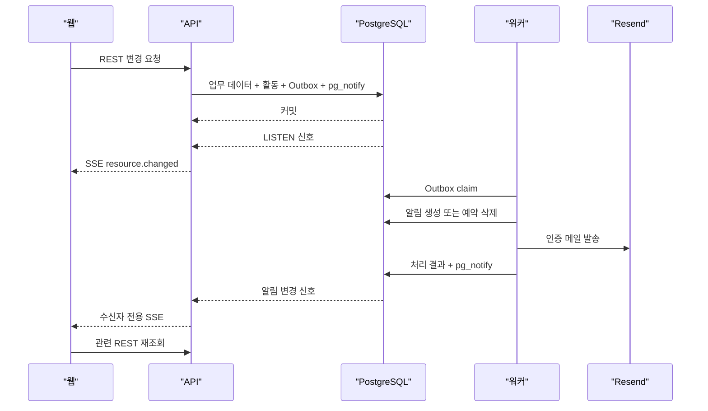

# 실시간·알림 및 비동기 작업 명세서

| 항목 | 내용 |
| --- | --- |
| 문서 상태 | 확정 — MVP 실시간·알림·비동기 작업과 Closed Alpha Web Push 구현 기준 |
| 문서 버전 | v0.17 |
| 작성일 | 2026-07-16 |
| 대상 릴리스 | Rivet MVP, Closed Alpha A3 |
| 선행 문서 | [이슈 중심 작업 흐름 개편 명세서](../planning/006.%20이슈%20중심%20작업%20흐름%20개편%20명세서.md), [전역 이슈 목록 및 작업 배정 흐름 명세서](../planning/007.%20전역%20이슈%20목록%20및%20작업%20배정%20흐름%20명세서.md), [기술 아키텍처 명세서](./001.%20기술%20아키텍처%20명세서.md), [도메인 및 데이터 모델 명세서](./002.%20도메인%20및%20데이터%20모델%20명세서.md), [API 명세서](./003.%20API%20명세서.md), [인증·권한 및 보안 명세서](./004.%20인증%C2%B7권한%20및%20보안%20명세서.md) |

## 1. 문서 목적

이 문서는 Rivet MVP의 실시간 화면 갱신, 인앱 알림, 인증 이메일, 예약 삭제와 정기 보존 작업을 구현 가능한 처리 계약으로 구체화한다. 업무 데이터가 저장됐는데 알림이나 이메일이 유실되지 않게 하고, 같은 작업이 재실행돼도 중복 결과가 생기지 않으며, 실시간 연결이 끊겨도 REST API의 현재 상태로 다시 수렴하게 하는 것이 핵심 목적이다.

MVP는 기존 PostgreSQL과 별도 `apps/worker` 프로세스만 사용한다. Redis, BullMQ, Kafka, RabbitMQ, WebSocket과 별도 스케줄러 서비스를 추가하지 않는다.

### 1.1 범위

- 트랜잭션 Outbox 이벤트 이름과 최소 payload
- 워커 조회, 잠금, 처리, 재시도와 반복 실패 상태
- 할당, 멘션, 댓글, 완료·취소와 작업 전달 알림 수신자 규칙
- 이메일 인증, 워크스페이스 초대와 비밀번호 재설정 메일
- PostgreSQL `LISTEN/NOTIFY` 내부 신호와 인증된 SSE 전달
- 세션·토큰·속도 제한 버킷·운영 기록 보존 작업
- 이슈·프로젝트 예약 영구 삭제
- 임시·미연결 파일과 로컬 저장소 정합성 작업
- 비동기 작업의 로그, 지표, 경고와 검증 기준
- Closed Alpha Web Push 구독, 전달, 서비스 워커와 비밀 관리

### 1.2 제외 범위

- 모바일 푸시, SMS와 업무 알림 이메일. 업무 이메일 알림은 Alpha, Beta와 Public에서도 도입하지 않음
- MVP 사용자별 알림 설정과 알림 묶음 요약. Closed Alpha의 브라우저별 Push 등록·해제는 17장의 제한 범위로 추가함
- WebSocket 기반 양방향 통신과 공동 편집
- 과거 실시간 이벤트 재생과 오프라인 변경 큐
- 관리자용 작업 큐 UI·재시도 API와 별도 운영 대시보드
- Redis, 외부 메시지 브로커와 분산 스케줄러
- Nginx·PM2 설정 파일과 배포 명령 원문

운영 설치, 프로세스 재시작, 백업·복구와 경고 전달 채널의 구체적인 구성은 이 문서의 범위에 포함하지 않는다.

### 1.3 결정 상태

| 상태 | 의미 |
| --- | --- |
| 확정 | 선행 문서에서 이미 결정됐거나 이 문서에서 변경하지 않는 계약 |
| 권장 | MVP 기본값으로 제안하며 검토 후 확정할 운영값 |
| 미정 | 사용자 선택이 필요한 항목 |

## 2. 목표와 처리 원칙

### 2.1 전달 보장

- 업무 변경과 Outbox 저장은 하나의 PostgreSQL 트랜잭션으로 커밋한다.
- Outbox 처리는 **최소 한 번(at-least-once)** 실행될 수 있다고 가정한다.
- 인앱 알림, 이메일 요청과 영구 삭제는 이벤트 ID·도메인 제약으로 멱등하게 만든다.
- PostgreSQL `NOTIFY`와 SSE는 현재 변경을 알리는 신호이며 전달·재생을 보장하지 않는다.
- 브라우저의 최종 데이터 원천은 항상 REST API 응답이다.
- 이메일·PostHog·파일 삭제 실패가 이미 커밋된 업무 변경을 되돌리지 않는다.

### 2.2 최소 구성

| 구성 요소 | 책임 |
| --- | --- |
| `apps/web` | SSE 연결, 중복 억제, 캐시 무효화, 재연결 후 REST 재조회, Web Push 권한·구독 UI와 서비스 워커 |
| `apps/api` | 업무 트랜잭션, Outbox 저장, `NOTIFY` 발행, SSE 인증·라우팅 |
| `apps/worker` | Outbox 소비, 알림·이메일·Web Push·영구 삭제, 정기 보존·파일 정리 |
| PostgreSQL | 업무 정본, Outbox, 잠금, 알림 정본, `LISTEN/NOTIFY`, advisory lock |
| 로컬 파일 저장소 | 업로드 파일과 임시 파일 보관 |
| Resend | 계정 관련 이메일 발송 |
| PostHog Cloud | 명시적으로 허용한 제품 이벤트와 정제된 예외 수집 |

`apps/worker`는 HTTP 요청을 받지 않는 독립 실행 프로세스다. PM2가 프로세스 생존과 재시작을 담당하고, 워커는 시작할 때 밀린 작업을 즉시 조회한다.

### 2.3 한 변경의 처리 흐름



## 3. 이벤트와 기록의 역할 분리

### 3.1 네 가지 기록

| 종류 | 목적 | 영속성 | 업무 본문 포함 |
| --- | --- | --- | --- |
| `activity_events` | 사용자가 보는 변경 이력 | 이슈·프로젝트 수명 동안 유지 | 금지, 표시용 최소 전후 값만 허용 |
| `outbox_events` | 재시도 가능한 후속 작업 | 처리 종료 후 30일 | 금지, 내부 ID·안전한 enum만 허용 |
| PostgreSQL `NOTIFY` | API 프로세스에 커밋된 변경 신호 전달 | 없음 | 금지 |
| SSE `resource.changed` | 브라우저에 캐시 갱신 필요성 전달 | 없음 | 금지 |

활동 기록은 알림·실시간 처리의 원천으로 사용하지 않는다. Outbox는 사용자 타임라인에 직접 노출하지 않으며, `NOTIFY`와 SSE가 유실돼도 업무 데이터와 Outbox는 그대로 남아야 한다.

### 3.2 이벤트 ID

- 논리적인 Outbox 이벤트마다 불변 UUID를 하나 생성해 `outbox_events.id`로 사용한다.
- 하나의 업무 트랜잭션이 이슈 변경과 작업 전달처럼 서로 다른 후속 작업을 만들면 Outbox 이벤트도 각각의 ID로 저장할 수 있다.
- 리소스 변경 신호마다 UUID `changeEventId`를 생성한다. Outbox 이벤트와 리소스 변경이 일대일이면 같은 ID를 재사용할 수 있다.
- Outbox가 필요 없는 단순 변경도 `changeEventId`를 생성해 `NOTIFY`와 SSE 중복 억제에 사용하되 별도 이벤트 테이블은 만들지 않는다.
- 워커가 새 알림을 생성하면 원본 Outbox ID와 별도로 알림별 UUID를 발급한다. 알림 SSE의 이벤트 ID는 알림 생성·수정 트랜잭션의 `changeEventId`다.
- 이벤트 ID는 정렬 기준이 아니다. 시간 정렬은 각 리소스의 `created_at`, `updated_at`과 안정적인 보조 ID를 사용한다.

### 3.3 payload 공통 규칙

모든 Outbox `payload`는 다음 규칙을 따른다.

```ts
type OutboxPayload = {
  schemaVersion: 1;
  // 이벤트별 내부 ID와 제한된 enum만 추가
};
```

- `workspace_id`, `aggregate_type`, `aggregate_id`, `actor_membership_id`, `created_at`은 컬럼 값을 사용하고 payload에 복제하지 않는다.
- 이슈 제목·설명, 댓글·전달 본문, 파일명, 이메일, IP, 토큰 원문과 전체 요청·응답을 넣지 않는다.
- 사용자·멤버·이슈·댓글·전달·토큰·초대 ID와 제한된 상태 enum은 허용한다.
- 수신자 후보 배열은 사건 발생 시점의 멤버십 ID 스냅샷이며 중복을 제거해 저장한다.
- 이벤트별 처리기는 지원하는 `schemaVersion`만 받아들이고 알 수 없는 버전은 재시도하지 않는 계약 오류로 남긴다.
- 한 이슈 저장 동작에서 할당·멘션·완료처럼 여러 알림 규칙이 겹치면 하나의 이슈 이벤트 payload로 합친다.
- 같은 aggregate와 같은 의미의 이벤트를 한 업무 트랜잭션에서 여러 건 만들지 않는다.

## 4. Outbox 이벤트 카탈로그

### 4.1 계정 이메일 이벤트

| `event_type` | aggregate | 최소 payload | 후속 작업 |
| --- | --- | --- | --- |
| `AUTH_EMAIL_VERIFICATION_REQUESTED` | `USER` | `userId`, `tokenId` | 이메일 인증 메일 |
| `WORKSPACE_INVITATION_REQUESTED` | `WORKSPACE_INVITATION` | `invitationId`, `tokenId`, `currentMemberCount` | 초대 메일, `member_invited` 분석 |
| `AUTH_PASSWORD_RESET_REQUESTED` | `USER` | `userId`, `tokenId` | 비밀번호 재설정 메일 |

메일 수신 주소는 payload에 저장하지 않고 처리 시 사용자 또는 초대 행에서 조회한다. 동일 대상에 새 토큰을 발급하면 이전 토큰과 그 미처리 이벤트를 `canceled_at`으로 종료하고 새 이벤트를 만든다.

### 4.2 이슈·협업 이벤트

| `event_type` | aggregate | 최소 payload | 후속 작업 |
| --- | --- | --- | --- |
| `ISSUE_CREATED` | `ISSUE` | `issueId`, `mentionedMembershipIds`, 분석용 제한 속성 | 초기 설명 멘션 알림, `issue_created` 분석 |
| `ISSUE_CHANGED` | `ISSUE` | `issueId`, `changedFields`, `mentionedMembershipIds`, `terminalStatus`, `subscriberMembershipIds`, 분석용 제한 속성 | 새 멘션·완료·취소 알림, 속성·완료 분석 |
| `TEAM_WORK_CREATED` | `TEAM_WORK` | `issueId`, `teamWorkId`, `assigneeMembershipId`, 분석용 제한 속성 | 할당 알림, 팀 작업 분석 |
| `TEAM_WORK_CHANGED` | `TEAM_WORK` | `issueId`, `teamWorkId`, `changedFields`, `assigneeMembershipId`, `mentionedMembershipIds`, `terminalCategory`, `subscriberMembershipIds`, 분석용 제한 속성 | 작업 메모 멘션·할당·완료 알림, 상태·담당 분석 |
| `COMMENT_CREATED` | `COMMENT` | `issueId`, `teamWorkId`, `commentId`, `mentionedMembershipIds`, `subscriberMembershipIds`, `hasMention` | 멘션·댓글 알림, `comment_created` 분석 |
| `COMMENT_MENTIONS_ADDED` | `COMMENT` | `issueId`, `commentId`, `mentionedMembershipIds` | 댓글 수정에서 새로 추가된 멘션 알림 |
| `API_HANDOFF_CREATED` | `API_HANDOFF` | `issueId`, `sourceTeamWorkId`, `handoffId`, `kind`, `targetTeamWorkIds`, `candidateRecipientMembershipIds`, `mentionedMembershipIds`, 분석용 제한 속성 | 최초·추가 전달·멘션 알림과 분석 |

`TEAM_WORK_CHANGED`와 `API_HANDOFF_CREATED`는 멘션 필드를 포함하는 schema v2를 사용한다. 워커는 기존 v1 payload를 빈 멘션 배열의 v2로 정규화한다. 수신자별 전달 알림의 팀 작업 문맥은 워커가 `targetTeamWorkIds`와 현재 대상 관계를 이용해 계산하며 본문을 payload에 넣지 않는다. 같은 이벤트를 재처리할 때는 payload 버전과 멱등 키를 바꾸지 않는다.

`changedFields`는 리소스별 허용 필드 enum의 중복 없는 배열이다. `assigneeMembershipId`는 팀 작업 담당자가 바뀐 경우에만 현재 값 또는 `null`, `terminalCategory`는 완료·취소 전이의 현재 범주다. 설명·댓글·작업 메모 수정은 기존 멘션 전체가 아니라 저장 전후 차집합인 새 멘션 ID만 이벤트에 넣는다. 작업 메모의 `mentionedMembershipIds`는 `WORK_NOTE` 변경에서만 값을 가질 수 있다.

이슈 생성은 설명 멘션을 `ISSUE_CREATED`에, 함께 생성된 각 팀 작업은 `TEAM_WORK_CREATED`에 기록한다. 이슈 수정과 팀 작업 수정도 각 리소스의 변경 이벤트를 분리한다. 같은 수신자가 한 이벤트의 여러 규칙에 걸리면 `MENTIONED → TEAM_WORK_ASSIGNED → 완료·취소·댓글·작업 전달` 순서로 한 유형만 선택한다. 담당자가 `null`이면 할당 알림을 만들지 않는다.

CSV 가져오기는 이 일반 생성 계약의 예외다. 가져온 이슈·팀 작업은 `ISSUE_IMPORTED` 활동으로 감사하되 `ISSUE_CREATED`, `TEAM_WORK_CREATED` Outbox를 만들지 않으며 담당자·멘션 알림과 생성 분석 이벤트를 발행하지 않는다. 가져오기 설명의 멘션·파일 참조 자체를 검증 오류로 막고, 관리자는 가져오기 실행 결과에서 완료를 확인한다. 이는 외부 이력 재현과 대량 알림 폭주를 피하기 위한 Alpha의 고정 정책이다.

역할별 담당자를 포함한 작업 시작, 내가 맡기와 일괄 배정은 `TEAM_WORK_CREATED`, `TEAM_WORK_CHANGED`와 `TEAM_WORK_ASSIGNED`를 사용한다. 같은 팀 작업의 한 배정 사건에서 같은 aggregate와 의미의 Outbox를 여러 건 만들지 않는다. 일괄 배정은 변경된 팀 작업별 정본 이벤트를 만들 수 있지만 같은 작업·수신자 조합을 중복 생성하지 않는다.

`subscriberMembershipIds`와 작업 전달의 `candidateRecipientMembershipIds`는 업무 변경 트랜잭션 안에서 계산한다. 워커가 나중에 현재 구독 집합을 다시 조회하지 않으므로 처리 지연 중 새로 구독한 사용자가 과거 댓글·완료 알림을 받지 않는다. 워커는 해당 후보가 처리 시점에도 같은 워크스페이스의 활성 멤버인지 다시 검증한다.

작업 전달 이벤트는 본문의 `mentionedMembershipIds`를 포함한다. 최초 전달 대상 프론트 작업은 담당자와 자동 구독자, 새 미할당 작업은 대상 팀의 사건 당시 활성 멤버를 일반 후보로 사용하고, 추가 전달은 최초 전달 대상 작업의 담당자와 자동 구독자만 사용한다. 워커는 일반 후보와 멘션 대상을 합치고 작성자·비활성 멤버를 제외한 뒤 멘션 대상에는 `MENTIONED` 유형을 우선한다.

### 4.3 프로젝트·운영 이벤트

| `event_type` | aggregate | 최소 payload | 후속 작업 |
| --- | --- | --- | --- |
| `WORKSPACE_CREATED` | `WORKSPACE` | 유입 경로 enum | `workspace_created` 분석 |
| `PROJECT_CREATED` | `PROJECT` | 역할 수, 역할별 팀 유형, 목표일 설정 여부 | `project_created` 분석 |
| `PROJECT_STATUS_CHANGED` | `PROJECT` | 변경 전후 상태, 진행률 구간 | `project_status_changed` 분석 |
| `ISSUE_PURGE_SCHEDULED` | `ISSUE` | `issueId`, `purgeAt` | 예정 시각 이후 이슈 영구 삭제 |
| `PROJECT_PURGE_SCHEDULED` | `PROJECT` | `projectId`, `purgeAt` | 예정 시각 이후 프로젝트 영구 삭제 |

영구 삭제 이벤트는 `available_at = purgeAt`으로 만든다. 복구 트랜잭션은 대응하는 미처리 이벤트를 취소하고, 워커도 처리 직전에 현재 삭제 상태와 예정 시각을 다시 확인한다.

### 4.4 제품 분석 처리

- 업무 변경에서 이미 Outbox를 만드는 이벤트는 같은 이벤트를 분석 전송에도 재사용한다.
- `search_performed`, `inbox_opened`, `notification_read`, `csv_exported`처럼 별도 Outbox가 필요 없는 사용자 행동은 성공한 요청·화면 동작 뒤 얇은 분석 모듈에서 최선 노력으로 전송한다.
- 분석 전송만을 위한 범용 Outbox나 별도 큐는 만들지 않는다.
- 분석 실패는 API 응답과 Outbox 성공 여부에 영향을 주지 않는다. 알림·이메일 같은 필수 후속 작업이 끝났으면 Outbox를 완료하고 정제된 분석 실패 지표만 증가시킨다.
- 이벤트 이름과 허용 속성은 PRD의 명시적 목록으로 제한하며 업무 본문, 이메일과 토큰을 포함하지 않는다.

## 5. Outbox 상태와 워커 실행

### 5.1 파생 상태

별도 상태 컬럼을 추가하지 않고 기존 시각과 횟수로 상태를 판정한다.

| 상태 | 조건 |
| --- | --- |
| `SCHEDULED` | 종료 시각이 없고 `available_at`이 미래 |
| `PENDING` | 종료 시각이 없고 `available_at`이 지났으며 `next_attempt_at`이 없거나 지났고 유효 잠금이 없음 |
| `PROCESSING` | 종료 시각이 없고 만료되지 않은 `locked_at`·`locked_by`가 있음 |
| `RETRY_WAIT` | 종료 시각이 없고 `next_attempt_at`이 미래 |
| `PROCESSED` | `processed_at`이 있음 |
| `CANCELED` | `canceled_at`이 있음 |
| `FAILED` | 종료 시각이 없고 최대 시도에 도달해 `next_attempt_at`이 `NULL` |

`processed_at`과 `canceled_at`은 동시에 존재할 수 없다. 종료된 이벤트와 `FAILED` 이벤트는 다시 자동 claim하지 않는다.

### 5.2 claim 조건

워커는 짧은 데이터베이스 트랜잭션에서 다음 조건의 행만 가져간다.

- `processed_at IS NULL`
- `canceled_at IS NULL`
- `attempt_count < 최대 시도 횟수`
- `available_at <= now()`
- `next_attempt_at IS NULL OR next_attempt_at <= now()`
- 잠금이 없거나 `locked_at`이 잠금 유효 시간을 지남

조회는 `next_attempt_at`, `available_at`, `id`의 안정 순서와 `FOR UPDATE SKIP LOCKED`를 사용한다. 최초 시도처럼 `next_attempt_at`이 `NULL`인 행은 처리 가능한 가장 이른 값으로 정렬한다. 선택한 행에 동일한 `locked_by`, `locked_at = now()`와 `attempt_count + 1`을 기록한 뒤 즉시 커밋하고, Resend 호출이나 파일 삭제 중에는 행 잠금을 유지하지 않는다.

```text
짧은 트랜잭션: claim 및 잠금 기록
트랜잭션 밖: 이벤트 처리 또는 외부 호출
짧은 트랜잭션: 성공·취소·재시도 결과 기록
```

### 5.3 기본 실행값

| 항목 | 확정값 | 상태 |
| --- | ---: | --- |
| 빈 큐 polling 간격 | 1초 | 확정 |
| 한 번의 claim 크기 | 50건 | 확정 |
| batch 안의 동시 처리 | 최대 5건 | 확정 |
| 잠금 유효 시간 | 5분 | 확정 |
| 처리할 행이 남았을 때 | 대기 없이 다음 batch claim | 확정 |
| MVP 워커 동시 프로세스 | 1개 | 확정 |

단일 프로세스에서도 `SKIP LOCKED`와 잠금 유효 시간을 적용해 프로세스 중단 뒤 작업을 회수할 수 있게 한다. 처리기는 최대 5건만 동시에 실행하고, 시작을 기다리는 batch 행은 처리 직전에 `locked_by`가 자신과 같은지 확인하며 잠금을 갱신한다. 조건부 갱신에 실패한 행은 처리하지 않는다. 개별 처리가 잠금 유효 시간을 넘을 수 있는 신규 작업을 추가할 때만 heartbeat 또는 작업별 긴 잠금을 도입한다.

### 5.4 처리 순서

1. 이벤트 유형과 `schemaVersion`을 검증한다.
2. aggregate와 payload가 같은 워크스페이스에 속하는지 확인한다.
3. 취소·만료·복구·이미 처리된 도메인 결과인지 확인한다.
4. 이벤트별 멱등 키 또는 데이터베이스 유일 제약을 확인한다.
5. 후속 작업을 수행한다.
6. 결과를 별도 트랜잭션으로 저장하고 잠금을 해제한다.
7. 데이터 변경이 있으면 같은 결과 트랜잭션에서 `pg_notify`를 호출한다.

이미 원하는 결과가 존재하면 성공으로 종료한다. 존재하지 않는 필수 aggregate, 다른 워크스페이스 ID와 지원하지 않는 payload 버전은 자동 재시도로 해결되지 않는 계약 오류다.

### 5.5 재시도와 오류 분류

| 분류 | 예시 | 처리 |
| --- | --- | --- |
| 일시 오류 | 네트워크 시간 초과, Resend `429`·`5xx`, 일시 DB 충돌, 파일 사용 중 | 다음 재시도 예약 |
| 취소 조건 | 토큰 만료·사용·폐기, 리소스 복구, 이미 교체된 예약 작업 | `canceled_at` 기록 |
| 멱등 성공 | 알림·메일 결과가 이미 존재, 삭제할 파일·행이 이미 없음 | `processed_at` 기록 |
| 영구 오류 | 지원하지 않는 이벤트·버전, 잘못된 payload, Resend의 재시도 불가 `4xx` | 즉시 또는 최대 시도 후 `FAILED` |
| 설정 오류 | API 키·발신 주소·저장소 경로 누락 | `FAILED` 처리와 운영 경고 |

재시도는 최초 시도를 포함해 최대 7회다. 실패 후 `30초 → 2분 → 10분 → 30분 → 2시간 → 6시간` 간격을 적용하고 각 간격에 최대 ±20% 무작위 지연을 더한다. 매 시도 전에 토큰·리소스의 현재 유효성을 다시 확인한다.

재시도로 해결되지 않는 영구·설정 오류는 `attempt_count`를 최대 시도 값으로 올리고 `next_attempt_at = NULL`로 기록해 즉시 `FAILED` 상태로 만든다.

### 5.6 반복 실패와 수동 복구

- 최대 시도에 도달하면 `next_attempt_at = NULL`, 잠금 해제와 정제된 `last_error_code`를 기록한다.
- `FAILED` 이벤트는 자동 삭제하지 않고 운영자가 원인과 aggregate 상태를 확인할 때까지 보존한다.
- MVP에는 작업 큐 관리 API와 화면을 만들지 않는다.
- 수동 재시도는 운영자 승인 후에만 수행하며, 원인 해결 뒤 횟수·다음 시각·잠금을 원자적으로 초기화한다.
- payload를 직접 수정해 재시도하지 않는다. 잘못 발행된 이벤트는 취소하고 올바른 새 이벤트를 만든다.

### 5.7 시작과 종료

- 워커 시작 즉시 만료된 잠금과 처리 가능한 이벤트를 조회한다.
- 종료 신호를 받으면 새 claim을 중단하고 현재 batch의 짧은 처리만 마친 뒤 종료한다.
- 외부 호출이 종료 제한을 넘으면 프로세스가 종료돼도 잠금 유효 시간 뒤 다른 실행이 회수한다.
- 시스템 시각은 UTC로 저장·비교하고 화면에서만 한국 시간으로 표시한다.

## 6. 인앱 알림

### 6.1 알림 유형

| `NotificationType` | 한국어 표시 | 원본 이벤트 |
| --- | --- | --- |
| `TEAM_WORK_ASSIGNED` | 팀 작업이 할당됨 | `TEAM_WORK_CREATED`, `TEAM_WORK_CHANGED` |
| `MENTIONED` | 설명 또는 댓글에서 멘션됨 | `ISSUE_CREATED`, `ISSUE_CHANGED`, `COMMENT_CREATED`, `COMMENT_MENTIONS_ADDED` |
| `COMMENT_ADDED` | 구독 이슈에 댓글이 추가됨 | `COMMENT_CREATED` |
| `ISSUE_COMPLETED` | 구독 이슈가 완료됨 | `ISSUE_CHANGED` |
| `ISSUE_CANCELED` | 구독 이슈가 취소됨 | `ISSUE_CHANGED` |
| `API_HANDOFF_CREATED` | API 작업 전달이 추가됨 | `API_HANDOFF_CREATED`의 `INITIAL` |
| `API_HANDOFF_FOLLOW_UP_CREATED` | API 추가 전달이 추가됨 | `API_HANDOFF_CREATED`의 `FOLLOW_UP` |

알림 요약은 저장하지 않고 유형, 현재 행위자와 현재 이슈 표시 ID·제목으로 한국어 문구를 만든다. 이슈 제목이 바뀌면 알림함에도 현재 제목이 표시된다.

### 6.2 공통 수신 제외

후보 수신자 집합에 다음 필터를 순서대로 적용한다.

1. 중복 멤버십 ID 제거
2. `actor_membership_id`와 같은 수신자 제거
3. 이벤트 `workspace_id`와 다른 멤버십 제거
4. 처리 시점에 비활성인 멤버십 제거
5. 삭제됐거나 영구 삭제된 이슈의 후보 제거
6. `(event_id, recipient_membership_id)` 유일 제약으로 최종 중복 방지

행위자가 없는 시스템 이벤트는 자기 알림 제외를 적용하지 않는다. 비활성 멤버를 다시 활성화하는 기능은 MVP에 없으므로 제외된 알림을 나중에 소급 생성하지 않는다.

### 6.3 이벤트별 수신자

| 이벤트 | 후보 수신자 | 최종 유형 |
| --- | --- | --- |
| 이슈 생성·수정 | 새 담당자, 새 설명 멘션, 완료·취소 시 사건 시점 구독자 스냅샷 | 멘션, 할당, 완료·취소 우선순위에 따라 수신자별 한 유형 |
| 댓글 생성 | 멘션 후보 + 사건 시점 구독자 스냅샷 | 멘션 후보는 `MENTIONED`, 나머지는 `COMMENT_ADDED` |
| 댓글 수정 새 멘션 | 새 `mentionedMembershipIds` | `MENTIONED` |
| 작업 메모 수정 | 새 `mentionedMembershipIds` + 할당·완료 시 기존 후보 | 멘션 대상은 `MENTIONED`, 나머지는 사건별 유형 |
| 최초 전달 | 본문 멘션 + 대상 프론트 작업의 담당자·자동 구독자 + 새 미할당 작업의 대상 팀 활성 멤버 스냅샷 | 멘션 대상은 `MENTIONED`, 나머지는 `API_HANDOFF_CREATED` |
| 추가 전달 | 본문 멘션 + 최초 전달 대상 프론트 작업의 담당자·자동 구독자 스냅샷 | 멘션 대상은 `MENTIONED`, 나머지는 `API_HANDOFF_FOLLOW_UP_CREATED` |

같은 사용자가 한 사건의 멘션과 구독·할당·전달 후보에 함께 해당하면 `MENTIONED` 하나만 만든다. 최초 전달은 트랜잭션에서 실제 생성 또는 재사용한 후행 웹·앱 팀 작업만 일반 전달 대상으로 한다. 최초 전달에서 새 미할당 작업을 만들면 담당자·구독자가 없어도 팀 활성 멤버가 후보가 된다. 추가 전달은 같은 이슈에 이미 존재하는 미완료 웹·앱 작업만 일반 전달 대상으로 하며 프로젝트 역할의 팀 전체로 넓히지 않는다. 명시적인 본문 멘션 대상은 이 일반 후보 제한과 별개로 활성 워크스페이스 멤버면 수신자가 된다.

작업 시작·내가 맡기·일괄 배정의 새 담당자는 `TEAM_WORK_ASSIGNED` 후보가 된다. `actor_membership_id`와 새 담당자가 같으면 공통 수신 제외 규칙으로 알림을 만들지 않으며 담당자 없는 우리 팀 시작은 할당 알림을 만들지 않는다.

### 6.4 작업 전달 후보 계산

`API_HANDOFF_CREATED` 트랜잭션은 다음 순서로 후보를 계산한다.

1. 전달 대상 백엔드 팀 작업이 프로젝트의 백엔드 역할인지 확인한다.
2. 최초 전달이면 `destinationRoles`별 기존 미완료 작업을 재사용하고, 기존 작업이 없으면 미할당 작업을 생성한다. 모든 대상은 `api_handoff_targets`에 저장하고 작업 순서 관계는 만들지 않는다.
3. 재사용 작업은 현재 담당자와 `issue_subscriptions` 멤버십을 합친다.
4. 새 미할당 작업은 해당 역할 팀의 사건 당시 활성 `team_members` 멤버십을 합친다.
5. 추가 전달이면 새 작업을 만들지 않고 최초 전달 대상 작업에서 담당자와 자동 구독자만 합친다.
6. 본문 멘션 대상은 활성 워크스페이스 멤버인지 검증해 전달별 멘션 관계와 자동 구독을 저장한다.
7. 작성자를 제외하고 후행 팀 작업 ID, 일반 후보 멤버십 ID와 멘션 멤버십 ID를 각각 중복 제거해 payload에 저장한다.

작업 전달, 백엔드 완료, 대상 프론트 작업과 준비 상태, 활동, 후보 스냅샷과 Outbox는 같은 트랜잭션에서 커밋한다. 커밋 뒤 대상 작업 담당자나 팀 멤버 구성이 바뀌어도 사건 당시 후보를 바꾸지 않는다. 다만 워커 처리 전에 멤버가 비활성화되면 알림을 생성하지 않는다.

### 6.5 앵커와 이동

| 알림 유형 | `issue_id` | `team_work_id` | `comment_id` | `handoff_id` |
| --- | --- | --- | --- | --- |
| 팀 작업 할당 | 필수 | 해당 팀 작업 | `NULL` | `NULL` |
| 이슈 완료·취소 | 필수 | `NULL` | `NULL` | `NULL` |
| 설명 멘션 | 필수 | `NULL` | `NULL` | `NULL` |
| 작업 메모 멘션 | 필수 | 해당 팀 작업 | `NULL` | `NULL` |
| 댓글 멘션·새 댓글 | 필수 | 댓글 문맥 또는 `NULL` | 해당 댓글 | `NULL` |
| 작업 전달 멘션 | 필수 | 수신자와 연결된 후행 작업 또는 `NULL` | `NULL` | 해당 전달 |
| 최초·추가 작업 전달 | 필수 | 수신자와 연결된 후행 작업 또는 `NULL` | `NULL` | 해당 전달 |

작업 전달 알림의 `issue_id`는 항상 `ApiHandoff`가 속한 이슈다. 워커는 삭제되지 않은 `downstreamTeamWorkIds` 중 다음 우선순위로 `team_work_id` 한 건을 선택한다.

1. 수신자가 현재 담당자인 후행 작업
2. 수신자가 자동 구독자인 후행 작업
3. 수신자가 대상 팀의 활성 멤버인 후행 작업

같은 우선순위 후보가 여러 건이면 프로젝트 역할, 표시 식별자와 ID 순으로 안정 정렬한다. 일치하는 후행 작업이 없으면 `team_work_id = NULL`로 저장한다. `handoff_id`는 항상 같은 원본 전달을 유지한다.

웹은 `/issues/{issueIdentifier}?tab=work&work={teamWorkIdentifier}&handoff={handoffId}`로 이슈 통합 상세를 열고 해당 전달을 확장한다. 통합 화면은 `api_handoffs` 원본과 대상 관계를 함께 조회하며 알림, 활동 또는 팀 작업별 전달 사본을 만들지 않는다.

댓글 항목도 기존 앵커 규칙을 유지한다. 댓글이 삭제됐으면 이슈 상세의 타임라인 위치를 표시하고, 이슈가 영구 삭제됐거나 접근할 수 없으면 안전한 기본 화면으로 이동한다.

### 6.6 생성 트랜잭션과 읽지 않은 개수

- 한 Outbox 이벤트의 모든 알림은 하나의 짧은 트랜잭션에서 `ON CONFLICT DO NOTHING`으로 생성한다.
- 전달 알림의 수신자별 `team_work_id` 선택도 이 트랜잭션 안에서 수행한다. 같은 이벤트를 재처리하면 `(event_id, recipient_membership_id)` 유일 제약으로 기존 알림과 이동 대상을 유지하고 새 알림을 만들지 않는다.
- 실제 새로 생성된 알림에 대해서만 수신자 전용 `NOTIFY`를 발행한다.
- 읽음·읽지 않음 변경도 저장과 수신자 전용 `NOTIFY`를 같은 트랜잭션으로 처리한다.
- 모두 읽음은 변경된 알림별 신호를 발행한다. MVP 규모에서는 별도 알림함 aggregate 이벤트를 만들지 않는다.
- SSE를 받은 프론트는 알림 목록과 `/notifications/unread-count`를 함께 무효화한다.
- 읽지 않은 개수는 별도 카운터에 저장하지 않고 `notifications.read_at IS NULL` 조건으로 계산한다.

## 7. 이메일 작업

### 7.1 지원 템플릿

| 템플릿 | 대상 | 링크 유효 기간 |
| --- | --- | ---: |
| 이메일 인증 | 신규 미인증 사용자 | 24시간 |
| 워크스페이스 초대 | 초대 이메일 | 7일 |
| 비밀번호 재설정 | 인증된 사용자 | 30분 |

업무 할당, 멘션, 댓글, 완료·취소와 작업 전달은 인앱 알림만 사용한다.

### 7.2 발송 전 검증

워커는 매 시도마다 다음을 확인한다.

- 이벤트와 토큰 목적이 일치한다.
- 토큰이 미사용·미폐기 상태이고 만료되지 않았다.
- 사용자 또는 초대가 이벤트 대상과 일치한다.
- 이메일 인증은 아직 인증되지 않은 사용자다.
- 비밀번호 재설정은 활성 계정이다.
- 초대는 아직 수락·취소·만료되지 않았다.
- 개발 환경이면 수신 주소가 발송 허용 목록에 포함된다.

조건이 더 이상 유효하지 않으면 메일을 보내지 않고 이벤트를 취소한다. 개발 환경 허용 목록 밖의 주소는 성공으로 위장하지 않고 `DEV_RECIPIENT_BLOCKED`로 취소해 테스트 누락을 확인할 수 있게 한다.

### 7.3 링크 생성과 데이터 최소화

- 워커는 `tokenId`, 목적과 `ONE_TIME_TOKEN_HMAC_KEY`로 링크 토큰을 다시 만든다.
- 링크는 선행 보안 명세대로 URL fragment의 `#token=`에 넣는다.
- `email_deliveries.recipient_email`에는 실제 발송 주소를 저장하지만 로그와 오류 추적에는 기록하지 않는다.
- 메일 HTML, 토큰 원문과 Resend 응답 본문은 저장하지 않는다.
- 발신 주소와 제품 기본 URL은 환경 설정에서 가져오고 payload에 넣지 않는다.

### 7.4 Resend 멱등성과 결과

- Resend 멱등 키는 Outbox 이벤트 ID를 문자열로 사용한다.
- `email_deliveries.outbox_event_id`는 이벤트당 한 행만 허용한다.
- 성공하면 Resend 메일 ID와 `sent_at`을 저장하고 Outbox를 처리 완료한다.
- 응답을 받지 못한 시간 초과는 같은 멱등 키로 재시도한다.
- `429`, 네트워크 오류와 `5xx`는 일시 오류로 분류한다.
- 인증·발신 도메인·요청 형식 오류 같은 재시도 불가 `4xx`는 정제된 코드로 `FAILED` 처리한다.
- 공급자 오류 메시지와 응답 본문을 데이터베이스·로그·PostHog에 저장하지 않는다.

### 7.5 오류 코드

| 내부 코드 | 의미 |
| --- | --- |
| `EMAIL_PROVIDER_RATE_LIMITED` | Resend 요청 제한 |
| `EMAIL_PROVIDER_UNAVAILABLE` | 네트워크·시간 초과·`5xx` |
| `EMAIL_PROVIDER_REJECTED` | 재시도 불가 `4xx` |
| `EMAIL_CONFIGURATION_INVALID` | API 키·발신 주소·기본 URL 오류 |
| `EMAIL_TOKEN_INACTIVE` | 토큰 만료·사용·폐기 |
| `DEV_RECIPIENT_BLOCKED` | 개발 환경 허용 목록 밖 수신자 |

`last_error_code`에는 위처럼 정제된 값만 기록한다.

## 8. PostgreSQL `LISTEN/NOTIFY`

### 8.1 채널과 내부 payload

MVP는 버전이 포함된 단일 채널 `rivet_resource_changed_v1`을 사용한다.

```ts
type ResourceChangedSignal = {
  eventId: string;
  workspaceId: string;
  resourceType:
    | "ISSUE"
    | "PROJECT"
    | "COMMENT"
    | "HANDOFF"
    | "NOTIFICATION"
    | "MEMBER"
    | "TEAM"
    | "WORKFLOW_STATE"
    | "LABEL"
    | "FILE";
  resourceId: string;
  changeType: "CREATED" | "UPDATED" | "DELETED" | "RESTORED";
  version: number | null;
  recipientMembershipId?: string;
};
```

`recipientMembershipId`는 알림 목록·읽지 않은 개수처럼 개인 범위 변경을 API 프로세스가 라우팅할 때만 사용한다. 이 필드는 브라우저 SSE `data`에는 포함하지 않는다.

### 8.2 발행 규칙

- `pg_notify`는 업무 또는 워커 결과를 저장하는 같은 트랜잭션에서 호출한다.
- PostgreSQL은 커밋 뒤 신호를 전달하므로 롤백된 변경은 브라우저에 전달되지 않는다.
- 한 트랜잭션에서 같은 `eventId`, `resourceType`, `resourceId`, `changeType` 신호를 중복 발행하지 않는다.
- 한 변경이 여러 화면에 영향을 줘도 변경된 정본 리소스만 알리고 프론트 캐시 의존 관계로 파생 목록을 무효화한다.
- payload에는 본문, 이메일, 원본 파일명, 토큰과 전체 리소스 스냅샷을 넣지 않는다.
- `NOTIFY` 실패가 발생하면 변경 트랜잭션도 실패시켜 저장과 신호의 커밋 경계를 맞춘다. 커밋 뒤 네트워크 전달 유실은 재연결 REST 조회로 복구한다.

### 8.3 API listener

- 각 API 프로세스는 업무 쿼리용 풀과 분리된 전용 PostgreSQL 연결 하나로 `LISTEN`한다.
- 연결이 끊기면 지수형 지연으로 다시 연결하고 채널을 다시 구독한다.
- listener가 끊긴 동안에는 기존 SSE 연결을 종료해 브라우저가 재연결과 REST 재조회를 수행하게 한다.
- listener를 복구하기 전의 새 SSE 연결 요청은 스트림을 열지 않고 `503`으로 응답한다.
- API 프로세스가 여러 개가 되면 모든 프로세스가 같은 채널을 구독하고 자신에게 연결된 클라이언트에만 전달한다.
- `NOTIFY`를 작업 큐, 감사 로그 또는 영속 이벤트 저장소로 사용하지 않는다.

## 9. SSE 연결

### 9.1 연결 인증

- `GET /api/v1/events`는 같은 출처의 세션 쿠키로 인증한다.
- 읽기 전용 `GET`이므로 CSRF 토큰은 요구하지 않는다. 세션·활성 멤버십과 현재 워크스페이스를 검증하고 `Origin` 헤더가 있으면 같은 출처인지 확인한다.
- 인증 실패는 SSE 스트림을 열지 않고 일반 `401` 또는 안전한 `404`로 응답한다.
- 연결 중에는 최대 5분마다 세션과 활성 멤버십을 다시 확인하며 만료, 로그아웃 또는 멤버 비활성화가 확인되면 스트림을 종료한다. SSE heartbeat 자체는 세션 `last_seen_at`을 연장하지 않는다.
- 한 탭의 애플리케이션 인스턴스는 사용자당 SSE 연결 하나만 유지한다. MVP에서 여러 탭의 연결을 하나로 합치는 별도 리더 선출 기능은 만들지 않는다.

### 9.2 응답 헤더

```text
Content-Type: text/event-stream; charset=utf-8
Cache-Control: no-cache, no-transform
Connection: keep-alive
X-Accel-Buffering: no
```

Nginx도 해당 경로의 응답 버퍼링과 압축을 끄고 일반 API보다 긴 읽기 제한을 적용한다.

### 9.3 이벤트 형식

```text
retry: 3000

event: resource.changed
id: 7dd63904-4ca3-4e38-aa87-5398f021bb62
data: {"resourceType":"ISSUE","resourceId":"...","changeType":"UPDATED","version":8}
```

브라우저에 전달하는 `data`는 API 명세의 `resource.changed` 계약을 그대로 사용한다. `workspaceId`와 `recipientMembershipId`는 서버 라우팅에만 사용하고 브라우저에 보내지 않는다.

### 9.4 라우팅

- 일반 리소스 변경은 같은 워크스페이스의 활성 SSE 연결에 전달한다.
- `NOTIFICATION` 신호는 `recipientMembershipId`와 현재 연결 멤버십이 같은 경우에만 전달한다.
- 다른 워크스페이스 신호와 다른 사용자의 개인 알림 신호는 조용히 버린다.
- 송신 대기 버퍼가 계속 쌓이는 느린 연결은 종료하고 클라이언트 재연결에 맡긴다.
- 전송 실패를 이유로 `NOTIFY`나 Outbox를 다시 실행하지 않는다.

### 9.5 heartbeat와 재연결

- 서버는 20초마다 `: heartbeat` 주석을 보내 유휴 프록시 종료와 끊어진 연결을 감지한다.
- 첫 연결에서 `retry: 3000`을 보내 브라우저 기본 재연결 간격을 3초로 안내한다.
- 클라이언트는 연결 오류를 표시하되 REST 조회·저장은 계속 허용한다.
- `Last-Event-ID`는 같은 연결 주변의 중복 억제 참고값으로만 사용하고 누락 이벤트 재생에는 사용하지 않는다.
- 연결 재개 시 현재 화면 데이터, 보이는 목록과 읽지 않은 알림 개수를 다시 조회한다.
- 탭이 다시 포커스를 얻었을 때도 오래된 캐시를 재검증한다.

### 9.6 프론트 캐시 반응

| `resourceType` | 최소 반응 |
| --- | --- |
| `ISSUE` | 이슈 상세·전역 이슈·팀 목록·보드·내 작업·프로젝트 진행률 무효화 |
| `PROJECT` | 프로젝트 목록·상세와 전역 이슈의 역할 팀·가능 행동 무효화 |
| `COMMENT`, `HANDOFF` | 대상 이슈 타임라인 무효화 |
| `NOTIFICATION` | 알림 목록과 읽지 않은 개수 무효화 |
| `MEMBER`, `TEAM`, `WORKFLOW_STATE`, `LABEL` | 해당 선택지와 설정 목록 무효화 |
| `FILE` | 연결된 파일 메타데이터 또는 프로필 무효화 |

프론트는 SSE 메시지의 `lastEventId`를 짧은 메모리 집합에 보관해 같은 연결에서 받은 중복 신호를 무시한다. 영속 중복 저장소나 이벤트 순서 재조정 로직은 만들지 않는다.

전역 이슈는 재조회 뒤 현재 빠른 필터와 세부 필터에서 제외된 행만 제거한다. 사용자가 고른 필터·정렬, 현재 페이지와 스크롤을 불필요하게 초기화하지 않고 오래된 응답은 무시한다.

## 10. 예약·정기 작업

### 10.1 실행 방식

- 영구 삭제는 Outbox의 `available_at`으로 예약하고 polling 워커가 예정 시각 이후 처리한다.
- 보존·파일 정리는 매일 1회 실행하는 하나의 maintenance loop로 묶는다.
- 실행 시각은 매일 `18:00 UTC`, 한국 시간 `03:00`이다.
- 워커 시작 시 정기 작업을 한 번 시도하고, 이후 매일 예정 시각에 실행한다. 모든 단계가 멱등적이므로 재시작으로 하루에 여러 번 시도돼도 안전해야 한다.
- 정기 작업은 PostgreSQL advisory lock `rivet:daily-maintenance:v1`을 얻은 프로세스 하나만 수행한다.
- 각 정리 단계는 별도 짧은 트랜잭션과 제한된 batch로 실행해 한 단계 실패가 나머지 정리를 막지 않게 한다.

정기 작업 라이브러리나 별도 스케줄러는 추가하지 않는다. 워커의 표준 타이머와 PostgreSQL 잠금으로 충분하며 PM2 재시작 뒤에도 데이터베이스 시각을 기준으로 누락 실행을 보완한다.

### 10.2 이슈 영구 삭제

`ISSUE_PURGE_SCHEDULED` 처리기는 다음을 수행한다.

1. 이슈 행을 잠그고 현재 `deleted_at`, `purge_at`과 이벤트 예정 시각을 다시 확인한다.
2. 복구됐거나 예정 시각 전이면 이벤트를 취소한다.
3. 이슈가 이미 없으면 멱등 성공으로 종료한다.
4. 알림, 멘션, 구독, 라벨 연결, 차단 관계와 파일 연결 등 소유 관계를 정해진 순서로 제거한다.
5. 파일 연결 제거 시 해당 파일의 `unlinked_at`을 현재 시각으로 기록한다.
6. 댓글, 작업 전달, 활동과 이슈 행을 영구 삭제한다.
7. 참조가 남아 있으면 전체 삭제를 롤백하고 일시 오류로 재시도한다.

이슈 파일은 영구 삭제 트랜잭션에서 바로 지우지 않고 24시간 미연결 유예 뒤 파일 정리 작업이 제거한다.

### 10.3 프로젝트 영구 삭제

`PROJECT_PURGE_SCHEDULED` 처리기는 다음을 수행한다.

1. 프로젝트 행과 현재 삭제 상태·예정 시각을 확인한다.
2. 프로젝트를 참조하는 복구 가능한 이슈까지 다시 확인한다.
3. 참조 이슈가 생겼으면 영구 삭제하지 않고 `PROJECT_PURGE_BLOCKED`로 실패시킨다.
4. 역할별 팀 관계, 활동과 프로젝트 행을 하나의 트랜잭션에서 제거한다.
5. 이미 없거나 복구된 프로젝트는 각각 멱등 성공 또는 취소로 종료한다.

### 10.4 보존 데이터 정리

| 대상 | 정리 기준 |
| --- | --- |
| 처리 완료·취소 Outbox | 종료 후 30일 |
| 이메일 발송 기록 | 마지막 결과 후 30일 |
| 사용·만료·폐기 일회용 토큰 | 종료 후 30일 |
| 만료·폐기 세션 | 종료 후 30일 |
| 인증 속도 제한 버킷 | `expires_at < now()` |
| CSV 내보내기 감사 기록 | 종료 후 30일 |
| 실패 Outbox | 자동 정리하지 않음 |

세션과 토큰은 요청 시점에도 만료를 검증하므로 정기 작업이 늦어져도 인증에 사용할 수 없다. 정리는 오래된 행부터 batch로 지우고 각 batch 뒤 커밋한다.

### 10.5 파일 정리

파일 정리는 다음 순서로 실행한다.

1. `FILE_STORAGE_ROOT/tmp`에서 수정 시각이 1시간 넘은 임시 파일을 제거한다.
2. `unlinked_at`이 24시간 넘었고 사용자 프로필·이슈 파일 연결이 없는 파일 행을 조회한다.
3. 처리 직전 연결 부재를 다시 확인하고 실제 파일을 제거한 뒤 메타데이터를 삭제한다.
4. 최종 저장소를 순회해 메타데이터가 없고 파일 시각이 24시간 넘은 바이너리를 제거한다.
5. 파일 메타데이터는 있지만 바이너리가 없는 연결 파일을 탐지해 경고한다.

실제 파일이 이미 없으면 미연결 파일 삭제는 성공으로 본다. 연결된 파일의 바이너리가 없으면 참조나 메타데이터를 자동 삭제하지 않고 `FILE_BINARY_MISSING` 경고를 남긴다. 저장소 경로는 UUID `storage_key`로만 구성하며 심볼릭 링크를 따라 저장소 루트 밖으로 이동하지 않는다.

## 11. 관측성과 운영 경고

### 11.1 구조화 로그

모든 Outbox 실행과 정기 작업은 `jobId`를 사용한다. 허용 필드는 다음으로 제한한다.

- 환경, 릴리스, `jobId`, 이벤트 유형과 내부 이벤트 ID
- 내부 workspace·aggregate ID
- 시도 횟수, 대기 시간, 처리 시간과 결과 상태
- 정제된 오류 코드와 예외 이름
- batch 조회·처리·성공·실패·삭제 건수

업무 제목·본문, 댓글·전달, 이메일, IP, 원본 파일명, 토큰, 쿠키, 비밀 키와 공급자 응답 본문은 기록하지 않는다.

### 11.2 최소 지표

| 지표 | 의미 |
| --- | --- |
| `outbox_pending_count` | 처리 가능한 대기 이벤트 수 |
| `outbox_oldest_pending_seconds` | 가장 오래 기다린 이벤트 시간 |
| `outbox_processed_total` | 유형·결과별 처리 수 |
| `outbox_failed_count` | 최종 실패 이벤트 수 |
| `email_delivery_total` | 템플릿·결과별 이메일 수 |
| `notification_created_total` | 유형별 새 알림 수 |
| `sse_connections` | 현재 연결 수 |
| `sse_reconnect_total` | 재연결 수 |
| `postgres_listener_connected` | API listener 연결 상태 |
| `maintenance_last_success_at` | 마지막 정기 작업 성공 시각 |
| `orphan_files_deleted_total` | 정리한 임시·미연결·저장소 단독 파일 수 |
| `linked_file_missing_count` | 메타데이터만 남은 연결 파일 수 |

### 11.3 경고 조건

- 새 `FAILED` Outbox 발생
- 처리 가능한 가장 오래된 이벤트가 5분 넘게 대기
- PostgreSQL listener가 30초 넘게 재연결되지 않음
- 정기 maintenance가 26시간 안에 성공하지 않음
- 연결된 파일 바이너리 누락 탐지
- 이메일 설정 오류 또는 연속적인 공급자 실패
- 예약 영구 삭제가 최대 시도에 도달함

## 12. 실패 시 사용자 동작

| 실패 | 사용자에게 보이는 동작 | 복구 |
| --- | --- | --- |
| SSE 끊김 | 최신 상태가 아닐 수 있음을 표시 | 자동 재연결 후 REST 재조회 |
| `NOTIFY` listener 끊김 | SSE 연결 종료 | listener·SSE 재연결과 REST 재조회 |
| 알림 생성 지연 | 업무 저장은 성공, 알림이 늦게 나타남 | Outbox 재시도 |
| 인증 메일 지연 | 공통 접수 화면 유지 | 재시도 또는 제한 안에서 재발송 요청 |
| Resend 영구 실패 | 계정 링크 메일 미도착 | 운영 원인 수정 후 승인된 재시도 |
| 영구 삭제 지연 | 휴지통에 예정일 지난 항목이 남을 수 있음 | Outbox 재시도와 운영 경고 |
| 미연결 파일 정리 실패 | 사용자 업무에는 영향 없음 | 다음 일일 작업에서 재시도 |
| 연결 파일 누락 | 파일 불러올 수 없음 상태 | 자동 참조 삭제 없이 운영 복구 판단 |

## 13. 보안과 데이터 격리

- Outbox 처리도 일반 API와 같은 `workspace_id` 경계를 적용한다.
- 이벤트 payload의 모든 멤버십·이슈·댓글·전달 ID가 이벤트 workspace에 속하는지 확인한다.
- SSE는 연결 세션의 현재 활성 멤버십으로만 라우팅하고 클라이언트가 workspace ID를 선택하지 않는다.
- 개인 알림 신호는 해당 `recipientMembershipId` 연결에만 전달한다.
- 다른 workspace ID, 존재하지 않는 ID와 권한 없는 리소스는 운영 로그에서도 원문 업무 정보를 노출하지 않는다.
- 이메일 토큰은 워커 메모리에서 링크를 만드는 동안만 존재하며 로그·payload·메일 발송 기록에 저장하지 않는다.
- 정기 파일 순회는 설정된 저장소 루트 안의 UUID 경로만 처리하고 사용자 원본 파일명을 경로로 사용하지 않는다.

## 14. 검증 기준

### 14.1 Outbox와 멱등성

- 업무 트랜잭션 롤백 시 Outbox와 `NOTIFY`도 남지 않는다.
- 워커가 결과 저장 직전 종료돼 같은 이벤트를 다시 처리해도 알림·메일·삭제가 중복되지 않는다.
- 같은 최초 완료 요청을 다시 실행해도 전달·후행 작업·관계·Outbox가 늘어나지 않고, 같은 전달 Outbox 재처리에도 수신자별 알림이 한 건이다.
- 기존 `TEAM_WORK_CHANGED`와 `API_HANDOFF_CREATED` payload v1은 빈 멘션 배열의 v2로 정규화하고, 새 v2 이벤트와 `(event_id, recipient_membership_id)` 멱등 키를 유지한다.
- 잠긴 워커가 종료되면 잠금 유효 시간 뒤 다른 실행이 이벤트를 회수한다.
- 예약 이벤트는 `available_at` 전에 실행되지 않는다.
- 지원하지 않는 payload 버전과 다른 워크스페이스 참조가 영구 오류로 격리된다.
- 최대 시도 이벤트가 계속 자동 조회되지 않는다.

### 14.2 알림

- 할당, 멘션, 구독 댓글, 완료·취소와 최초·추가 전달 수신자가 규칙대로 생성된다.
- 행위자 자신과 비활성 멤버에게 알림이 생기지 않는다.
- 같은 댓글 이벤트에서 멘션과 구독이 겹치면 멘션 알림 한 건만 생긴다.
- 댓글·설명 수정은 새로 추가된 멘션에만 알림을 만든다.
- 최초 전달에서 재사용한 후행 작업은 사건 당시 담당자·자동 구독자, 새 미할당 후행 작업은 대상 팀 활성 멤버에게 전달된다.
- 추가 전달은 기존 후행 작업의 담당자·자동 구독자에게만 전달되고 새 팀 작업이나 역할 팀 전체 수신자를 만들지 않는다.
- 전달 알림은 이슈를 공통 이동 대상으로 사용하고 수신자별 담당 후행 작업, 구독 후행 작업, 활성 팀 멤버인 후행 작업 순으로 `team_work_id`를 선택하며 후보가 없으면 이슈만 연다.
- 모든 이동 대상은 같은 `handoff_id`를 사용하고 통합 이슈 상세는 원본 `ApiHandoff`의 최초·추가 전달을 함께 조회한다.
- 같은 Outbox 이벤트 재처리에도 `(event_id, recipient_membership_id)`가 중복되지 않는다.
- 읽음·읽지 않음과 모두 읽음 뒤 목록과 전역 배지 수가 일치한다.
- 역할별 작업 시작과 일괄 배정의 새 담당자에게 `TEAM_WORK_ASSIGNED`가 팀 작업별 한 건만 생성되고, 내가 맡기처럼 행위자와 담당자가 같은 경우에는 생성되지 않는다.

### 14.3 이메일

- 이메일 처리기는 회원가입·초대·이메일 인증·비밀번호 재설정 같은 계정 흐름만 소비하며 제품 알림 이벤트를 이메일 payload로 변환하지 않는다.
- 같은 Outbox 이벤트 재시도가 같은 Resend 멱등 키를 사용한다.
- 만료·사용·폐기된 토큰과 수락된 초대는 메일을 보내지 않는다.
- 개발 환경 허용 목록 밖 주소로 실제 발송되지 않는다.
- 비밀번호 재설정 토큰 만료 전에 빠른 재시도가 수행된다.
- 로그와 데이터베이스에 토큰 원문·메일 HTML·공급자 응답 본문이 남지 않는다.

### 14.4 실시간

- 다른 워크스페이스와 다른 사용자의 개인 알림 신호가 SSE로 전달되지 않는다.
- SSE 데이터에 업무 본문, 이메일, workspace·recipient 라우팅 ID가 포함되지 않는다.
- 동일 이벤트 중복 수신이 화면 중복 변경을 만들지 않는다.
- 이슈·팀 작업·프로젝트 역할 변경 뒤 전역 이슈를 다시 조회해 현재 조건에서 빠진 행만 제거하고 필터·정렬·페이지·스크롤 상태를 유지한다.
- listener·SSE 연결을 강제로 끊은 뒤 재연결 REST 조회로 최신 상태에 수렴한다.
- `Last-Event-ID`가 있어도 서버가 과거 재생을 약속하지 않는다.
- 느린 클라이언트를 종료해도 API 프로세스 메모리가 계속 증가하지 않는다.

### 14.5 예약·정리 작업

- 30일 안 복구한 이슈·프로젝트는 영구 삭제되지 않는다.
- 영구 삭제를 재실행해도 이미 제거된 관계·파일 때문에 실패하지 않는다.
- 미연결 24시간 전 파일과 임시 1시간 전 파일은 삭제되지 않는다.
- 연결 파일은 `unlinked_at` 값만으로 삭제하지 않고 실제 참조를 다시 확인한다.
- 연결 파일 바이너리 누락 시 참조를 지우지 않고 경고한다.
- advisory lock을 얻지 못한 두 번째 정기 작업은 조용히 종료한다.
- 정기 작업이 하루 누락된 뒤 워커를 시작하면 따라잡아 실행한다.

## 15. 구현 순서

1. Outbox 이벤트 상수, payload 검증과 저장 helper
2. 워커 claim·잠금 회수·결과 기록과 작은 통합 테스트
3. 계정 이메일 처리와 Resend 멱등성
4. 알림 후보 스냅샷, 수신자 필터와 알림 생성
5. PostgreSQL `LISTEN/NOTIFY`와 API listener
6. 인증된 SSE 연결, 프론트 캐시 무효화와 재연결 복구
7. 이슈·프로젝트 예약 영구 삭제
8. 세션·토큰·속도 제한·운영 기록 보존과 파일 정리
9. 구조화 지표, 경고와 장애 복구 검증

각 단계는 처리기를 재실행하는 멱등성 검증과 다른 워크스페이스 ID 거부 검증을 포함한다.

## 16. MVP에서 도입하지 않는 구성

- BullMQ와 Redis
- Kafka, RabbitMQ와 외부 메시지 브로커
- WebSocket 서버
- Outbox CDC와 별도 이벤트 스트리밍 플랫폼
- 업무 이메일 알림·소화 메일·모바일 푸시
- 실시간 이벤트 저장·순서 보장·재생 API
- 관리자 작업 큐 화면과 자동 무한 재시도
- 분석 이벤트만을 위한 영속 큐

다음 조건이 실제 지표로 확인될 때만 확장을 검토한다.

| 현재 구성 | 확장 검토 조건 |
| --- | --- |
| PostgreSQL polling Outbox | 작업량 때문에 API·DB 지연이 발생하거나 여러 종류 소비자의 독립 확장이 필요함 |
| PostgreSQL `LISTEN/NOTIFY` | API 인스턴스·연결 수 증가로 전달 지연이나 운영 한계가 측정됨 |
| SSE | 양방향 통신 또는 대규모 연결 분산이 필요함 |
| 단일 worker | 작업 대기 시간이 목표를 지속적으로 넘고 처리기 병렬화가 안전함 |
| 로컬 파일 정리 | API·워커가 다른 서버로 분리되거나 객체 저장소로 이전함 |

## 17. Closed Alpha Web Push

### 17.1 정본과 처리 흐름

인앱 `Notification`은 수신자, 사건 유형, 읽음 상태와 이동 앵커의 유일한 정본이다. Web Push는 이 행이 생성된 뒤 같은 Outbox 처리에서 실행하는 부가 전달 채널이며 별도 수신자 계산, 알림 행이나 읽음 상태를 만들지 않는다.

1. 기존 이벤트 처리기가 인앱 `Notification`을 멱등하게 생성한다.
2. Web Push 처리기는 같은 이벤트로 생성됐거나 이미 존재하는 알림을 조회한다.
3. 알림의 `recipient_membership_id`와 같은 활성 멤버십의 활성 브라우저 구독만 선택한다.
4. `(notification_id, subscription_id)` 전달 행을 만든 뒤 선점한 행만 공급자에 발송한다.
5. 외부 공급자 실패는 Push 전달 상태와 Outbox 재시도에만 반영하고 `Notification.read_at`과 인앱 생성 결과를 바꾸지 않는다.

테스트 발송은 `WEB_PUSH_TEST_REQUESTED` payload v1의 `subscriptionId`만 받아 같은 worker와 전달 ledger를 사용한다. 테스트는 인앱 알림을 만들지 않으며 `(outbox_event_id, subscription_id)`로 중복을 막는다.

### 17.2 데이터 모델과 제약

`WebPushSubscription`은 workspace, membership, nullable 등록 세션, 브라우저 종류, endpoint hash, endpoint, `p256dh`, `auth`, 브라우저 만료 시각, `ACTIVE | INACTIVE | EXPIRED`, 최근 성공·실패 시각과 정제 오류 코드를 저장한다. 세션 FK는 `ON DELETE SET NULL`이며 보존 작업이 세션을 삭제하기 전에 구독을 만료·정리하므로, 삭제된 세션의 원인 기록은 남기되 FK가 세션 보존 정책을 막지 않는다. 같은 membership의 endpoint hash는 하나이며 활성 endpoint hash는 전체에서 하나만 허용해 동일 브라우저 endpoint가 다른 계정이나 세션에 동시에 귀속되지 않게 한다.

`WebPushDelivery`는 정확히 하나의 `notification_id` 또는 테스트 `outbox_event_id`와 하나의 subscription을 참조한다. 상태는 `PENDING | SENDING | SENT | FAILED`이며 notification 조합과 테스트 Outbox 조합에 각각 유일 제약을 둔다. 비활성 구독은 endpoint와 key material을 `NULL`로 제거하고 hash만 재등록 멱등성에 사용한다.

### 17.3 API와 권한

인증된 현재 membership에 다음 API를 제공한다.

| 메서드 | 경로 | 계약 |
| --- | --- | --- |
| `GET` | `/notifications/push/config` | 기능 활성 여부와 VAPID public key 조회 |
| `GET` | `/notifications/push/subscriptions` | 현재 membership의 브라우저별 상태 목록 조회 |
| `POST` | `/notifications/push/subscriptions` | 현재 세션에 endpoint와 브라우저 key material 등록 또는 재등록 |
| `DELETE` | `/notifications/push/subscriptions/{subscriptionId}` | 소유 구독 비활성화와 material 제거 |
| `POST` | `/notifications/push/subscriptions/{subscriptionId}/test` | 소유 활성 구독의 테스트 Outbox 접수 |

다른 membership이나 workspace의 ID는 존재를 노출하지 않는다. 목록과 오류 응답에는 endpoint, endpoint hash, `p256dh`, `auth`, 공급자 응답 본문·헤더와 오류 코드를 포함하지 않는다.

활성 endpoint가 다른 membership에 귀속돼 있으면 등록 요청은 `409 WEB_PUSH_SUBSCRIPTION_IN_USE`로 거절하고 기존 구독을 변경하지 않는다. 동시 등록의 활성 endpoint 유일 제약 경합도 같은 충돌로 정규화한다. 사용자의 명시적인 연결 동작에서 이 오류를 받은 웹은 현재 브라우저 구독을 `unsubscribe()`하고 같은 VAPID public key로 새 endpoint를 만든 뒤 한 번 다시 등록하며, 성공하면 전용 복구 문구를 표시한다. 테스트 발송은 Outbox를 만들기 전에 현재 membership 기준 10분당 10회, 대상 구독 기준 5분당 3회의 서버 측 제한을 모두 적용하며 초과 시 `429`를 반환한다.

### 17.4 전달 payload와 딥 링크

공급자에 보내는 암호화 payload v1은 `notificationId`, `type`, `targetPath`만 포함한다. 테스트는 `testEventId`, `WEB_PUSH_TEST`, `/inbox`만 포함한다. 이슈 제목·설명·댓글·전달 본문, 파일명·경로, 이메일, 멤버·사용자 식별자, endpoint와 key material은 포함하지 않는다. 서비스 워커가 사건 유형별 일반 문구를 로컬에서 선택하므로 잠금 화면에도 업무 본문이 노출되지 않는다.

`targetPath`는 인앱 알림의 앵커를 그대로 사용한다.

- 할당: `/issues/{issueIdentifier}?tab=work&work={teamWorkIdentifier}`
- 설명 멘션·완료·취소: `/issues/{issueIdentifier}?tab=work`
- 댓글 멘션·구독 댓글: `/issues/{issueIdentifier}?tab=work[&work={teamWorkIdentifier}]#comment-{commentId}`
- 작업 전달: `/issues/{issueIdentifier}?tab=work[&work={teamWorkIdentifier}]&handoff={handoffId}#handoff-{handoffId}`

서비스 워커는 같은 origin의 상대 경로와 UUID source만 허용한다. 클릭 시 정확히 열린 창을 먼저 포커스하고, 없으면 기존 창을 이동한 뒤 포커스하며, 앱 창이 없을 때만 새 창을 연다.

### 17.5 실패, 만료와 재등록

브라우저 `expirationTime`이 지난 구독, 만료·폐기·삭제된 세션의 구독, 공급자 `404`·`410`은 `EXPIRED`로, 그 밖의 재시도 불가 `4xx`는 `INACTIVE`로 바꾸고 material을 제거한다. 보존 작업은 만료·폐기 세션의 활성 구독을 먼저 정리하고, worker는 전달 대상 조회와 delivery 선점 뒤 세션 유효성을 다시 확인한다. 구독 행 잠금 경합이나 정리 단계 실패로 활성 구독이 남아 있으면 세션 삭제를 다음 보존 주기로 미뤄 `ACTIVE`이면서 `session_id`가 없는 구독을 만들지 않는다. `408`·`425`·`429`·`5xx`와 허용 목록에 든 네트워크 오류만 delivery를 `PENDING`으로 되돌리고 Outbox의 기존 재시도 정책을 적용한다. 타입 오류 같은 비-HTTP 내부 오류는 재시도로 폭주시키지 않고 해당 delivery를 `FAILED`로 종료한다. 한 delivery의 영구 실패도 같은 이벤트의 다음 delivery 처리를 막지 않으며, worker는 모든 개별 결과를 처리한 뒤 이벤트의 재시도·처리 중·영구 실패 결과를 집계한다. 만료·영구 실패는 다른 브라우저 구독과 인앱 알림을 변경하지 않는다.

`SENDING`은 Outbox 잠금 회수 시간과 같은 5분 lease로 취급한다. 5분을 넘긴 행만 `PENDING`으로 회수하고 아직 유효한 `SENDING`이 남으면 Outbox 이벤트를 완료하지 않는다. 공급자 호출과 자체 데이터베이스 기록 오류는 별도로 분류한다. 공급자가 성공을 응답하면 delivery의 `SENT` 기록을 먼저 저장하고 구독의 최근 성공 메타데이터는 best effort로 갱신한다. 성공 응답 뒤 `SENT` 기록 자체가 실패하면 delivery를 가능한 범위에서 `FAILED`로 남기고 영구 오류로 종료하며, 같은 조합을 `PENDING`으로 되돌려 재전송하지 않는다. 프로세스가 공급자 응답과 상태 기록 사이에서 종료되는 본질적인 모호성은 서비스 워커의 notification ID `tag`로 중복 표시를 억제한다.

권한이 이미 허용됐고 현재 membership이 해당 브라우저에서 명시적으로 켠 기록이 있을 때만 로그아웃 뒤 같은 membership의 새 세션에 기존 브라우저 구독을 자동 재등록할 수 있다. 구독이 사라졌거나 서비스 워커가 `pushsubscriptionchange`를 알리면 화면에 만료와 재등록 동작을 표시한다. 다른 membership으로 로그인한 경우 로컬 동의 키가 다르므로 자동 귀속하지 않는다.

### 17.6 권한, 세션과 서비스 워커

- `Notification.requestPermission()`은 알림함 본문의 상태 안내 또는 알림함에서 연 개인 `알림 설정`의 사용자가 `알림 켜기`를 누른 호출 스택에서만 실행한다.
- 지원, 기본, 허용, 거절과 만료를 별도 상태로 표시하고 거절·미지원·운영 미설정의 해결 방법을 구분한다.
- 로그아웃·개별 세션 폐기는 그 세션의 활성 구독을 비활성화한다. 멤버 비활성화는 기존 정책대로 대상 사용자의 모든 세션을 폐기하고 그 세션들에 연결된 활성 구독도 함께 비활성화한다. 정리 주기 전에 시간이 지나 만료된 세션도 전달 대상에서 제외하며, 보존 기한에 도달하면 구독을 만료·정리한 뒤 세션을 삭제하고 구독의 session FK를 끊는다. 활성 구독을 정리하지 못한 세션은 삭제하지 않고 다음 보존 주기에서 다시 처리한다.
- 서비스 워커는 `updateViaCache: none`으로 등록해 background 갱신하고 install에서 waiting 없이 전환하며 activate에서 기존 클라이언트를 인수한다.
- Push 등록·갱신 실패, 권한 거절과 미지원은 앱 로딩, 인앱 알림 생성·조회·읽음 처리를 막지 않는다.

지원 범위는 최신 Chrome·Edge·Firefox와 macOS Safari다. iOS·iPadOS는 홈 화면에 추가한 앱에서만 Web Push를 지원한다. Android Chromium은 제한적 모바일 웹 범위에서 capability와 서비스 워커 등록을 검증하되 네이티브 푸시는 만들지 않는다.

### 17.7 비밀과 운영 환경

API는 `WEB_PUSH_VAPID_PUBLIC_KEY`만 받아 구독 설정 API로 노출한다. worker는 같은 public key와 `WEB_PUSH_VAPID_PRIVATE_KEY`, `WEB_PUSH_VAPID_SUBJECT`를 사용자 관리 환경에서 주입받는다. 운영에서는 세 값이 모두 있어야 시작하며 private key는 저장소, 데이터베이스, migration, 빌드 산출물과 클라이언트에 저장하지 않는다.

API·worker 로그 redaction은 `endpoint`, `auth`, `p256dh`, VAPID public/private key와 Push payload를 포함한다. 공급자 오류 객체, 응답 본문·헤더와 endpoint는 로그·PostHog·Sentry로 넘기지 않고 정제 상태 코드만 데이터베이스에 저장한다. VAPID 키 쌍은 운영자가 외부에서 한 번 생성해 API와 worker에 일치시킨다. key 교체는 기존 구독과 호환되지 않으므로 운영 승인, 기존 구독 비활성화와 사용자 재등록 안내를 함께 수행한다.

운영은 세 값이 없으면 worker 시작을 실패시킨다. 비운영 환경에서 설정이 빠져 전달을 건너뛰는 경우에도 worker는 민감 정보 없이 `WEB_PUSH_NOT_CONFIGURED` 구조화 경고를 프로세스당 한 번 남겨 조용한 무전송을 피한다.

### 17.8 검증 기준

- notification·subscription 중복, 다중 브라우저, 다른 membership·workspace 격리와 테스트 Outbox 멱등성을 실제 PostgreSQL에서 확인한다.
- 공급자 성공, `404`·`410`, 영구 `4xx`, `408`·`425`·`429`·`5xx`와 네트워크 재시도를 검증한다.
- 할당·멘션·댓글·완료·취소·최초/추가 전달의 notification ID와 인앱 딥 링크가 payload에 그대로 사용되는지 확인한다.
- endpoint, key material, VAPID private key, 업무 본문·파일명·이메일이 API 응답, Push payload, 로그·분석·오류 수집에 없는지 확인한다.
- 로그아웃, 다른 계정 로그인, 멤버 비활성화, 구독 만료·재등록과 서비스 워커 갱신을 검증한다. 실제 PostgreSQL에서는 Push 구독이 붙은 만료 세션을 보존 작업이 삭제하고 구독 material과 session FK를 정리하는지 확인한다. 활성 구독 행이 잠긴 경합에서는 세션을 보존하고 다음 실행에서 정리를 완료하는지도 확인한다.
- 서비스 워커의 사건 문구 표가 OpenAPI `NotificationType` 전체를 덮는지 고정하고 worker와 web의 할당·멘션·댓글·전달 경로 표를 같은 사례로 검증한다.
- 자동 Chromium E2E는 CDP `ServiceWorker.deliverPushMessage`로 앱 문서가 없는 background 수신·표시를 검증하고 합성 `NotificationEvent`로 클릭 라우팅을 검증한다. 이는 실제 서비스 워커 실행을 검증하지만 VAPID 서명·외부 Push 공급자 왕복이나 물리적 사용자 클릭을 대체하지 않는다. 실제 공급자 왕복은 지원 브라우저의 운영 수신 테스트로 별도 확인한다. Firefox·WebKit에서는 capability와 권한 상태 격리를 확인한다.

Slack은 반복 요구가 확인될 때 팀·프로젝트 공용 알림부터 별도 명세로 확정한다. Slack 개인 DM, 업무 이메일 알림과 모바일 네이티브 푸시는 도입하지 않는다.
