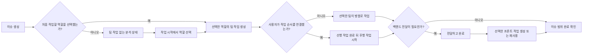

# 이슈 중심 작업 흐름 개편 명세서

| 항목 | 내용 |
| --- | --- |
| 문서 상태 | 확정 — 브라우저 검수 반영 |
| 문서 버전 | v1.3 |
| 작성일 | 2026-07-12 |
| 대상 릴리스 | MVP 보완 |
| 대상 플랫폼 | 데스크톱 웹 중심, 제한적 모바일 웹 |
| 선행 문서 | [제품 요구사항 정의서](./002.%20제품%20요구사항%20정의서.md), [사용자 흐름 및 화면 명세서](./003.%20사용자%20흐름%20및%20화면%20명세서.md), [와이어프레임 명세서](./004.%20와이어프레임%20명세서.md) |

## 1. 문서 목적

이 문서는 브라우저 검수에서 확인된 이슈 생성과 팀 간 전달 흐름의 사용성 문제를 바로잡는다. 사용자가 업무를 등록할 때 내부 유형을 먼저 선택하게 하지 않고 모든 제품·기능 단위 업무를 하나의 `이슈`로 시작하게 하며, 이슈마다 실제로 먼저 작업할 팀을 선택할 수 있게 한다. 상세 화면은 기존 데이터와 동작을 유지하면서 작업 내용, 관계와 변경 기록을 `업무`, `연결`, `활동`으로 분리한다.

기존 문서의 `기능 이슈`와 `팀 작업` 데이터 구분은 유지한다. 다만 사용자에게 내부 구조를 생성 시점부터 노출하지 않고, 이슈의 범위와 팀의 실행 책임을 화면 맥락에 맞게 점진적으로 보여 준다. 이 문서와 기존 기획·기술 문서의 이슈 생성, 하위 작업 생성 또는 작업 전달 흐름이 충돌하면 이 문서의 규칙을 우선한다.

### 1.1 해결할 문제

- 전역 이슈 만들기에서 `기능 이슈`와 `팀 작업`을 먼저 선택해야 해 처음 사용하는 사람이 두 유형의 차이를 알아야 한다.
- 프로젝트에 백엔드 역할이 있으면 실제 작업 범위와 무관하게 모든 새 이슈가 백엔드 작업으로 시작한다.
- 작업 범위가 정해지지 않은 이슈를 팀 작업 없이 정상적으로 만들고 분석할 수 없다.
- 후행 작업이 없으면 백엔드 작업 전달의 목적과 다음 행동이 드러나지 않는다.
- 작업 전달을 상위 이슈와 전달받은 프론트 작업에서 바로 확인할 수 없다.
- 사용자 화면의 `차단 관계` 표현과 빈 카드가 실제 작업 순서와 대기 이유를 이해하기 어렵게 한다.
- 기능 이슈 상세의 `하위 팀 작업 0/0`은 현재 단계와 다음 행동을 설명하지 못한다.
- 내부 분류인 `기능 이슈`가 화면의 주 용어로 노출되어 사용자의 업무 개념보다 데이터 구조가 먼저 보인다.

### 1.2 범위

- 사용자 노출 용어와 이슈 생성 진입점
- 이슈별 최초 작업 역할 선택과 팀 작업 생성
- 팀 작업 없는 분석 상태와 역할별 작업 시작
- 백엔드 작업 완료·전달 시 후행 웹·앱 작업 자동 생성
- 기존 후행 작업 재사용과 중복 방지
- 상위 이슈와 전달받은 프론트 작업의 전달 조회
- 기능 이슈 및 팀 작업 상세의 작업 흐름·작업 순서 표현
- 이슈 및 팀 작업 상세의 `업무`, `연결`, `활동` 정보 구조
- 댓글과 시스템 활동의 화면 표시 분리
- 진행률, 활동, 알림과 실패 처리
- 기존 데이터와 수동 팀 작업의 호환성

### 1.3 제외 범위

- `FEATURE`, `TEAM_TASK`를 없애거나 `issues` 테이블을 분리하는 데이터 모델 재설계
- 프로젝트 역할을 백엔드, 웹 프론트와 앱 프론트 외 유형으로 확장하는 기능
- 팀 작업 담당자 자동 배정과 팀별 라운드 로빈
- 사용자 정의 전달 단계, 승인 단계 또는 자동화 빌더
- 기능 이슈 상태를 하위 작업 진행률에 따라 자동 변경하는 기능
- 기존 팀별 워크플로 상태와 `BLOCKS` 관계의 내부 의미 변경

## 2. 제품 원칙과 용어

### 2.1 모든 업무의 기본 시작점은 이슈다

전역 생성과 프로젝트의 기본 생성 동작은 모두 `이슈 만들기`다. 사용자는 제목, 프로젝트, 설명과 필요한 공통 속성을 입력하며 `기능 이슈` 또는 `팀 작업` 유형을 선택하지 않는다.

서버는 이 흐름으로 생성한 이슈를 내부적으로 `FEATURE`로 저장한다. `FEATURE`는 여러 팀이 함께 완성할 업무 범위이며, 화면에서는 특별히 구분해야 하는 설정·관리 문맥이 아니면 `이슈`라고 표시한다.

### 2.2 팀 작업은 실행 단계에서 나타난다

`TEAM_TASK`는 특정 팀이 실제로 처리할 실행 항목이다. 프로젝트 역할은 이슈에서 선택할 수 있는 팀의 범위만 정하고, 실제 최초 작업은 이슈 생성 또는 `작업 시작`에서 사용자가 선택한 역할에 따라 서버가 생성한다. 사용자는 이슈 상세의 `작업 흐름`에서 병렬 작업, 순서 관계, 전달과 다음 행동을 확인한다.

팀 작업은 다음 위치에서만 명시적으로 노출한다.

- 이슈 상세와 프로젝트 상세의 작업 흐름
- 팀 이슈 목록과 팀 상태 보드
- 내 작업
- 팀 작업 상세
- 예외적인 수동 팀 작업 생성 화면

### 2.3 사용자 용어와 내부 값

| 사용자 노출 용어 | 내부 값 | 사용 기준 |
| --- | --- | --- |
| 이슈 | `FEATURE` | 제품·기능 단위 업무의 기본 시작점 |
| 팀 작업 | `TEAM_TASK` | 특정 팀에 귀속된 실제 실행 항목 |
| 작업 흐름 | 부모 이슈와 하위 팀 작업 | 분석 상태, 병렬·순차 작업, 전달과 진행률을 표시 |
| 작업 전달 | `ApiHandoff` | 백엔드 결과와 프론트 구현에 필요한 계약을 기록 |
| 추가 전달 | `ApiHandoff`의 `FOLLOW_UP` | 최초 전달 뒤 변경 내용을 추가 전용으로 기록 |
| 작업 순서 | `issue_block_relations`의 `BLOCKS` | 먼저 완료할 작업과 그다음 시작할 작업을 표시 |

전역 생성 화면, 일반 이슈 상세 헤더와 프로젝트의 기본 목록에는 `기능 이슈` 배지를 표시하지 않는다. 관리자용 데이터 확인, 오류 진단과 API 문서에서는 내부 유형명을 사용할 수 있다.

## 3. 전체 작업 흐름



프로젝트 역할은 선택 가능한 역할의 범위일 뿐 최초 작업 순서를 자동 결정하지 않는다. 이슈 생성과 `작업 시작`에서 선택한 역할만 실제 팀 작업으로 만들며, 동시에 선택한 역할끼리는 `BLOCKS` 관계를 자동 생성하지 않고 병렬 작업으로 본다. 백엔드만 먼저 시작한 이슈는 기존처럼 최초 작업 전달에서 선택한 웹·앱 작업을 생성하거나 재사용한다.

## 4. 이슈 생성

### 4.1 전역 이슈 만들기

전역 생성 창은 유형 선택기를 제거하고 다음 필드를 제공한다.

| 필드 | 필수 | 동작 |
| --- | :---: | --- |
| 제목 | 필수 | 창을 열면 바로 포커스 |
| 프로젝트 | 필수 | 활성 프로젝트만 표시 |
| 처음 작업할 팀 | 선택 | 선택한 프로젝트에 설정된 역할만 표시하며 복수 선택 가능 |
| 상태 | 필수 | 이슈 고정 상태의 미분류를 기본값으로 사용 |
| 우선순위 | 선택 | 기본값 없음 |
| 라벨 | 선택 | 활성 라벨 여러 개 선택 |
| 설명 | 선택 | Lexical WYSIWYG 편집과 Markdown 미리보기 |
| 첨부파일 | 선택 | 여러 파일, 파일당 최대 25MB와 업로드 상태 표시 |

생성 버튼은 `이슈 만들기`로 표시한다. `처음 작업할 팀 (선택)`은 백엔드, 웹 프론트와 앱 프론트 역할을 선택하는 입력이며 실제 팀 ID와 팀별 기본 상태는 서버가 프로젝트 설정에서 결정한다. 담당자, 상위 이슈와 팀별 워크플로 상태는 입력받지 않는다.

선택 영역 아래에는 `아직 작업 범위가 정해지지 않았다면 선택하지 않아도 됩니다.`를 표시한다. 프로젝트를 바꾸면 새 프로젝트에 없는 선택은 즉시 제거하며, 선택 상태는 텍스트와 `aria-pressed` 또는 동등한 접근성 속성으로 함께 전달한다.

### 4.2 프로젝트 화면의 이슈 만들기

프로젝트 상세에서 이슈 만들기를 열면 현재 프로젝트를 고정값으로 사용한다. 나머지 입력과 저장 규칙은 전역 이슈 만들기와 같다.

### 4.3 최초 팀 작업 선택과 생성

이슈와 최초 팀 작업은 하나의 트랜잭션에서 생성한다.

| 이슈별 시작 역할 선택 | 이슈 생성 결과 |
| --- | --- |
| 선택 없음 | 이슈만 생성 |
| 백엔드 | 이슈 + 백엔드 팀 작업 1건 |
| 웹 프론트 | 이슈 + 웹 팀 작업 1건 |
| 앱 프론트 | 이슈 + 앱 팀 작업 1건 |
| 둘 이상의 역할 | 이슈 + 선택한 역할별 팀 작업 각 1건 |

`initialRoles`는 선택한 프로젝트 역할의 부분집합이어야 하며 빈 배열과 생략을 허용한다. 같은 역할은 한 번만 받을 수 있다. 선택하지 않은 프로젝트 역할은 생성 결과와 진행률 분모에 포함하지 않는다.

여러 역할을 동시에 선택하면 생성한 팀 작업 사이에 차단 관계를 만들지 않는다. 이 작업들은 기본적으로 병렬로 시작할 수 있으며 사용자가 `작업 순서`를 추가한 경우에만 선행·후행 관계를 적용한다.

자동 생성 팀 작업은 다음 값을 사용한다.

- 제목: 상위 이슈 제목
- 프로젝트와 역할: 상위 이슈의 프로젝트와 해당 역할
- 팀: 프로젝트 역할에 연결된 팀
- 상태: 해당 팀의 기본 미분류 상태
- 담당자: 없음
- 우선순위: 상위 이슈의 우선순위
- 라벨: 자동 복사하지 않음
- 설명: 비워 두고 상위 이슈의 설명을 맥락으로 표시
- 상위 이슈: 새로 생성한 이슈

이슈 또는 선택한 최초 팀 작업 중 하나라도 생성하지 못하면 전체 요청을 롤백한다. 성공 응답은 이슈와 생성된 팀 작업을 함께 반환한다.

### 4.4 생성 후 이동

생성 성공 후 이슈 상세의 기본 `업무` 탭으로 이동한다. 역할을 선택했다면 현재 작업 요약에서 생성된 팀 작업을 보여 주고, 선택하지 않았다면 분석 상태와 `작업 시작` 동작을 보여 준다. 전체 작업 흐름은 `연결` 탭에서 확인한다. 팀 작업을 별도로 만들었다는 성공 알림을 연속으로 표시하지 않고 `이슈를 만들었습니다` 한 건만 표시한다.

## 5. 작업 흐름과 수동 작업

### 5.1 작업 흐름 표시

기존 `하위 팀 작업` 영역의 이름을 `작업 흐름`으로 변경한다. `업무` 탭의 현재 작업 요약은 진행률, 진행 중인 작업, 완료 수와 대기 원인만 표시하고 전체 작업 흐름은 `연결` 탭에 둔다. 전체 흐름은 단순한 하위 목록 대신 다음 정보를 표시한다.

- 현재 진행 팀과 역할
- 현재 팀 작업 상태와 담당자
- 완료된 이전 단계
- 병렬로 진행할 수 있는 현재 작업
- 순서 관계가 있을 때 먼저 완료돼야 하는 작업과 다음 작업
- 백엔드 전달 뒤 생성될 수 있는 웹·앱 역할
- 최초·추가 작업 전달의 요약과 원문
- 전체 팀 작업 진행률

프로젝트 상세에서는 이슈 아래의 팀 작업 계층을 유지하되, 생성되지 않은 후행 역할을 빈 팀 작업 행으로 만들지 않는다. 백엔드만 진행 중일 때에만 현재 단계 아래에 `전달 후 생성: 웹 프론트`, `전달 후 생성: 앱 프론트`처럼 예상 단계를 읽기 전용으로 표시한다.

`현재 단계`를 하나라고 가정하지 않는다. 순서 관계가 없는 미완료 작업이 여러 개면 `현재 작업` 아래에 나란히 표시한다. 세로 연결선과 단계형 표현은 실제 `BLOCKS` 관계 또는 백엔드 전달 연결이 있을 때만 사용하며 병렬 작업을 선후 단계처럼 보이게 하지 않는다.

### 5.2 빈 상태

팀을 선택하지 않고 만든 이슈는 분석과 범위 정리를 진행하는 정상 상태다. 별도의 이슈 유형을 추가하지 않고 상위 이슈의 설명, 댓글과 첨부파일을 사용한다. 팀 작업이 하나도 없으면 `0/0 완료 · 0%`를 단독으로 표시하지 않고 다음 내용을 제공한다.

- 제목: `아직 시작된 팀 작업이 없습니다`
- 설명: `분석이 끝났다면 작업을 시작할 팀을 선택해 주세요.`
- 주요 동작: `작업 시작`

`작업 시작`은 프로젝트에 설정된 역할을 복수 선택하는 창을 연다. 한 개 이상의 역할을 선택해야 저장할 수 있으며 선택한 역할의 미완료 하위 작업이 이미 있으면 재사용하고 중복 생성하지 않는다. 같은 역할에 완료·취소된 작업만 있으면 새 작업을 생성할 수 있다. 생성·재사용 판단, 역할별 카운터와 새 작업 삽입은 서버 트랜잭션에서 처리하며 일부 작업만 남기는 부분 성공을 허용하지 않는다.

### 5.3 수동 팀 작업 생성

수동 생성은 기본 흐름이 아닌 보조 동작으로 유지한다.

- 팀 화면의 `팀 작업 만들기`: 프로젝트와 무관한 운영, 조사와 유지보수 작업 생성
- 이슈 상세의 더보기 메뉴 `팀 작업 추가`: 자동 흐름 외 추가 작업이 필요한 경우 사용
- 프로젝트 상세의 `단독 팀 작업 만들기`: 상위 이슈가 없는 프로젝트 작업 생성

전역 이슈 만들기에는 팀 작업 전환이나 팀 작업 생성 동작을 제공하지 않는다. 수동으로 이슈 아래 팀 작업을 추가할 때는 프로젝트 역할과 팀 일치 규칙을 그대로 적용한다.

## 6. 백엔드 작업 전달과 후행 작업 생성

### 6.1 전달 조건

백엔드 역할이 있는 프로젝트 이슈는 백엔드 팀 작업을 완료할 때 다음 규칙을 적용한다.

- 프로젝트에 웹 또는 앱 역할이 있으면 유효한 최초 작업 전달을 반드시 작성한다.
- 프로젝트가 백엔드 역할만 사용하면 작업 전달 없이 완료할 수 있다.
- 최초 전달 전에는 `완료` 대신 `전달하고 완료`를 주요 동작으로 표시한다.
- 최초 전달 뒤 변경은 기존 전달을 수정하지 않고 추가 전달로 기록한다.

전달 필요 여부는 이미 생성된 후행 작업의 존재가 아니라 프로젝트에 설정된 프론트 역할로 판단한다.

### 6.2 전달 대상 역할

전달 창은 프로젝트에 설정된 웹·앱 역할만 대상으로 보여 준다.

- 프론트 역할이 하나면 해당 역할을 자동 선택하고 변경할 수 없게 한다.
- 웹과 앱 역할이 모두 있으면 둘 다 기본 선택한다.
- 웹과 앱이 모두 있는 경우 사용자는 이번 이슈에 필요하지 않은 역할을 선택 해제할 수 있다.
- 최소 한 역할은 선택해야 최초 전달을 완료할 수 있다.

선택하지 않은 역할은 이번 최초 전달에서 팀 작업을 생성하지 않는다. 이후 해당 역할 작업이 필요해지면 이슈 상세에서 수동으로 팀 작업을 추가한 뒤 추가 전달을 작성한다. 추가 전달만으로 새 팀 작업을 자동 생성하지 않는다.

### 6.3 원자적 처리

`전달하고 완료`는 다음 변경을 하나의 트랜잭션에서 처리한다.

1. 백엔드 팀 작업과 상위 이슈를 잠그고 최신 버전을 확인한다.
2. 유효한 최초 작업 전달을 추가 전용 데이터로 저장한다.
3. 백엔드 팀 작업을 완료 상태로 변경한다.
4. 선택한 각 프론트 역할의 기존 하위 팀 작업을 조회한다.
5. 역할별 기존 작업이 없으면 해당 팀의 기본 상태로 팀 작업을 생성한다.
6. 이번 전달에서 새로 생성한 후행 작업에만 백엔드 작업과의 차단 관계를 생성한다. 기존 작업은 사용자가 만든 관계를 그대로 유지한다.
7. 활동과 Outbox 이벤트를 기록한다.
8. 대상 팀 알림 후보를 사건 시점 기준으로 저장한다.
9. 모든 변경을 커밋한 뒤 화면 갱신 신호를 보낸다.

중간 단계가 실패하면 전달, 완료, 후행 작업, 관계와 알림 이벤트를 모두 롤백한다. 사용자가 같은 요청을 다시 실행할 수 있도록 작성한 전달 본문과 역할 선택은 화면에 유지한다.

### 6.4 기존 후행 작업 재사용

같은 상위 이슈와 프로젝트 역할에 삭제되지 않은 팀 작업이 이미 있으면 새 작업을 만들지 않는다.

- 기존 작업이 한 건이면 그 작업을 후행 작업으로 사용한다.
- 기존 작업이 여러 건이면 미완료 작업을 모두 후행 작업으로 사용한다.
- 완료·취소된 기존 작업만 있으면 새 작업을 만들지 않고 사용자에게 현재 역할의 작업 범위를 확인하도록 충돌 오류를 반환한다.
- 기존 후행 작업은 생성 시점부터 병렬로 진행했을 수 있으므로 백엔드 작업과의 차단 관계를 자동 추가하지 않는다. 이미 사용자가 설정한 관계는 유지한다.
- 이미 최초 전달이 처리된 요청을 다시 받으면 새 변경을 만들지 않는다. 웹은 최신 상태를 조회해 기존 전달과 후행 작업을 성공 결과로 표시한다.

기존 작업을 재사용하더라도 팀, 역할과 프로젝트가 현재 프로젝트 설정과 일치하는지 확인한다. 불일치하면 자동 수정하지 않고 요청을 중단한다.

### 6.5 작업 순서 표현

내부 `BLOCKS` 관계, 유일 제약과 순환 검증은 유지한다. 사용자 화면에서는 기본 용어를 `작업 순서`로 사용하고 관계 방향을 다음처럼 설명한다.

- 현재 작업의 미완료 선행 작업: `먼저 완료돼야 하는 작업`
- 현재 작업 뒤에 이어지는 작업: `이 작업 이후에 시작할 작업`
- 완료된 선행 작업: `완료된 선행 작업`
- 선행 작업이 모두 끝난 상태: `작업 가능`

대기 배지는 가능한 경우 `백엔드 작업 완료 대기`, `{표시 ID} 완료 후 시작 가능`처럼 원인을 직접 표시한다. `차단됨`이라는 추상적인 상태만 단독으로 표시하지 않는다.

자동 생성된 후행 작업은 같은 트랜잭션에서 완료된 백엔드 작업과 연결된다. 관계 행은 이력으로 유지하되 백엔드 작업이 완료됐으므로 화면에는 `선행 작업 완료`와 `작업 가능`으로 표시한다. 이슈 생성 시 여러 역할을 동시에 선택한 작업 사이에는 이 관계를 만들지 않는다.

### 6.6 전달 완료 응답과 화면 이동

성공 응답은 다음 내용을 포함한다.

- 완료된 백엔드 팀 작업
- 생성한 최초 작업 전달
- 생성 또는 재사용한 후행 팀 작업 목록
- 생성 또는 유지한 차단 관계
- 갱신된 상위 이슈 진행률

성공 후 상위 이슈 상세의 `연결` 탭에 있는 작업 흐름으로 이동한다. 화면은 새 후행 작업을 즉시 표시하고 `웹 프론트 팀에 전달했습니다` 또는 `웹·앱 프론트 팀에 전달했습니다`처럼 결과를 한 번만 안내한다.

### 6.7 전달 조회 위치

하나의 `ApiHandoff` 원본을 다음 화면에서 관계 기반으로 함께 조회한다. 화면별 전달 사본이나 별도 전달 테이블을 만들지 않는다.

- 백엔드 작업 상세: `업무`에는 최초 전달 전 주요 동작과 전달 후 최근 요약, `연결`에는 최초 전달과 추가 전달 전체 이력을 표시하고 추가 전용 정책을 유지한다.
- 상위 이슈 상세: `연결`의 작업 흐름에서 원본 백엔드 작업과 전달받은 후행 작업 사이에 전달 유형, 작성자, 작성 시각, 변경 요약, 전체 내용 펼치기와 양쪽 작업 링크를 표시한다.
- 전달받은 프론트 작업 상세: `업무` 상단에 원본 백엔드 작업, 최초 전달 작성자·시각·변경 요약·전체 내용과 추가 전달 알림을 표시하고 `연결`에서 전체 전달 관계와 이력을 제공한다.

상위 이슈의 활동 한 줄은 변경 이력으로 유지할 수 있지만 전달 원문을 확인하는 유일한 위치로 사용하지 않는다. 최초·추가 전달이 생기면 상위 이슈와 관련 프론트 작업 상세의 같은 `ApiHandoff` 조회 결과에 함께 반영한다.

## 7. 진행률과 상태

### 7.1 진행률 계산

이슈 진행률은 실제 생성된 삭제되지 않은 직계 하위 팀 작업만 계산한다.

- 분모: 취소되지 않은 팀 작업 수
- 분자: 완료된 팀 작업 수
- 취소된 팀 작업: 분자와 분모에서 제외
- 팀 작업이 없는 이슈: 계산값은 0%지만 숫자를 강조하지 않고 분석·작업 시작 안내를 우선 표시

백엔드 완료와 후행 작업 생성은 한 트랜잭션에서 처리하므로 전달 직전에 100%가 표시됐다가 후행 작업 생성 후 낮아지는 중간 상태를 노출하지 않는다.

예시는 다음과 같다.

| 작업 흐름 | 전달 직후 진행률 |
| --- | ---: |
| 백엔드 → 웹 | 1/2, 50% |
| 백엔드 → 앱 | 1/2, 50% |
| 백엔드 → 웹 + 앱 | 1/3, 33% |
| 웹만 또는 앱만 | 0/1, 0% |
| 웹 + 앱 병렬 시작 | 0/2, 0% |

생성되지 않은 프로젝트 역할은 분모에 포함하지 않는다. 병렬 작업과 순차 작업은 모두 실제 생성된 작업 중 완료된 작업 수로 같은 방식으로 계산한다.

### 7.2 이슈 상태

이슈의 고정 상태는 팀 작업 진행률과 별개로 사용자가 변경한다. 팀 작업 생성, 전달 또는 전체 팀 작업 완료만으로 이슈 상태를 자동 변경하지 않는다.

모든 대상 팀 작업이 완료됐지만 이슈 상태가 완료가 아니면 작업 흐름 상단에 `모든 팀 작업이 완료되었습니다` 안내와 `이슈 완료` 동작을 제공한다.

## 8. 알림과 활동 기록

### 8.1 알림 수신자

최초 전달 알림은 생성 또는 재사용한 실제 후행 작업을 기준으로 계산한다.

- 기존 후행 작업: 현재 담당자와 자동 구독자
- 새 후행 작업에 담당자가 있는 경우: 담당자와 자동 구독자
- 새 후행 작업이 미할당인 경우: 대상 팀의 모든 활성 멤버
- 작성자 본인: 다른 조건에 해당해도 제외
- 여러 규칙에 해당하는 사용자: 수신자별 한 건

자동 생성 팀 작업은 기본적으로 담당자가 없으므로 대상 팀의 모든 활성 멤버에게 인앱 알림을 보내 전달 사실이 사라지지 않게 한다. MVP에서는 팀별 알림 담당자나 당번 설정을 추가하지 않는다.

추가 전달은 이미 존재하는 대상 후행 작업의 담당자와 자동 구독자에게만 알린다. 새 팀 작업을 만들거나 프로젝트 역할 전체에 알리지 않는다.

최초 전달 알림을 선택하면 다음 우선순위로 이동한다.

1. 수신자와 연결된 전달받은 프론트 작업의 `업무` 탭 `전달받은 내용`
2. 상위 이슈 `연결` 탭 작업 흐름의 해당 전달
3. 위 위치를 사용할 수 없을 때 원본 백엔드 작업 `연결` 탭의 전달

알림은 기존 `handoffId`, 원본 작업, 상위 이슈와 후행 작업 관계로 앵커를 계산한다. 이동만을 위해 전달 본문을 알림이나 별도 데이터에 복사하지 않는다.

### 8.2 댓글과 활동 표시

댓글은 `업무` 탭에서 실제 댓글만 작성 시각 순으로 표시하고 작성기를 목록 바로 아래에 둔다. 시스템 활동과 전달 원문 카드를 댓글 사이에 넣지 않는다.

`활동` 탭에는 생성, 상태·담당자·우선순위·라벨 변경, 작업 시작, 작업 순서 추가·삭제, 전달과 휴지통 변경 같은 시스템 이력만 표시한다. 댓글과 댓글 작성기는 표시하지 않는다.

같은 트랜잭션에서 발생한 변경은 다음 의미를 대표 활동 하나로 묶어 표시할 수 있다.

1. 백엔드 작업을 완료함
2. 작업 전달을 작성함
3. 웹·앱 팀 작업을 생성하거나 기존 작업에 연결함
4. 선행 작업 완료로 후행 작업이 작업 가능해짐

각 변경을 별개의 반복 카드로 늘어놓지 않고 `백엔드 작업을 웹 프론트에 전달했습니다` 같은 활동 안에서 생성된 후행 작업 링크와 `전달 내용 보기`를 함께 보여 준다. 기존 append-only 활동은 삭제하거나 합치지 않고 화면 표시에서만 묶는다. 활동은 이력 요약이며 전달 원문은 `업무` 또는 `연결` 탭의 같은 `ApiHandoff`를 연다.

## 9. 화면 명세

### 9.1 전역 생성 창

- 제목: `이슈 만들기`
- 유형 선택기: 제거
- 첫 포커스: 제목
- 프로젝트: 필수
- 처음 작업할 팀: 프로젝트 역할의 부분집합을 복수 선택하며 선택하지 않음 허용
- 주요 버튼: `이슈 만들기`
- 보조 안내: `아직 작업 범위가 정해지지 않았다면 선택하지 않아도 됩니다.`

### 9.2 이슈 상세

- 헤더의 `기능 이슈` 배지를 제거한다.
- 표시 ID와 제목 아래에 `업무`, `연결`, `활동` 탭을 두고 기본 선택은 `업무`로 한다.
- 우측 `속성` 패널의 상태, 담당자, 우선순위, 팀, 프로젝트·역할과 라벨은 유지한다.
- 속성 아래 `정보` 그룹에 만든 사람, 만든 날짜와 마지막 수정 시각을 표시하고 본문의 `개요`는 제거한다.
- 속성 행은 같은 label/value grid를 사용한다. 상태·담당자·우선순위는 목록과 같은 아이콘·이름을 쓰는 Comfortable 인라인 트리거로 표시하고 프로젝트·팀·역할과 정보 값은 입력 테두리·chevron 없는 읽기 전용 표현을 사용한다.
- 라벨은 쉼표 문자열이 아니라 색점 칩과 `+N`, 불투명 편집 팝오버로 표시한다. `속성`과 `정보` 사이에만 구분선을 한 번 둔다.
- `?tab=work`, `?tab=relations`, `?tab=activity`로 직접 진입하며 잘못된 값은 `업무`로 복구한다.
- 탭 전환은 속성 값, 이전 목록의 필터와 스크롤 복원을 바꾸지 않는다.

일반 이슈의 `업무` 탭은 현재 작업 요약, 설명, 첨부파일, 댓글과 댓글 작성기 순서다. 현재 작업 요약에는 실제 진행률, 진행 중인 팀 작업, 완료 수와 대기 원인만 표시한다. 작업이 없으면 분석 안내와 `작업 시작`을 제공하고 전체 작업 흐름은 `연결에서 전체 보기`로 연다.

일반 이슈의 `연결` 탭은 전체 작업 흐름, 완료·현재 작업, 실제 작업 순서, 전달 카드, 전달 후 생성된 작업과 추가 전달 이력을 표시한다. 순서 관계가 없는 미완료 작업은 같은 위계에 두고 실제 관계나 전달이 있을 때만 연결선을 사용한다. 수동 `팀 작업 추가`는 더보기 메뉴에 유지한다.

`활동` 탭은 시스템 이력만 압축 행으로 표시하며 댓글과 전달 원문 카드를 반복하지 않는다.

### 9.3 백엔드 팀 작업 상세

- 제목 주변에 상위 이슈 breadcrumb를 표시하고 `연결` 탭에도 상위 이슈를 제공한다.
- `업무` 상단에 현재 행동 또는 구체적인 대기 원인과 `연결에서 작업 순서 보기`를 표시한다.
- 프로젝트에 프론트 역할이 있고 최초 전달 전이면 완료 상태 선택 시 전달 창을 연다.
- 주요 동작은 `전달하고 완료`다.
- 전달 창에서 변경 내용과 대상 역할을 함께 확인한다.
- 최초 전달 후 `업무`에는 최근 전달 요약과 `추가 전달 작성`을 표시한다.
- `연결`에는 프로젝트·역할, 작업 순서, 전달한 후행 작업과 전체 전달 이력을 표시한다.

### 9.4 전달받은 프론트 팀 작업 상세

- `업무`에서 `전달받은 내용`을 설명보다 먼저 두고 원본 백엔드 작업, 최초 전달 작성자·시각, 변경 요약과 전체 본문을 표시한다.
- 추가 전달 알림과 `전체 전달 이력 보기`를 제공한다.
- `연결`에는 상위 이슈, 프로젝트·역할, 작업 순서, 전달한 백엔드 작업과 전체 전달 이력을 표시한다.
- 해당 프론트 작업으로 전달된 내용이 없으면 이 영역을 빈 카드로 표시하지 않는다.

### 9.5 프로젝트 상세

- 주요 동작은 `이슈 만들기`다.
- `기능 이슈 만들기`와 기본 위치의 `단독 팀 작업 만들기`를 제거한다.
- 이슈 행에는 현재 역할, 현재 팀 작업 상태와 진행률을 표시한다.
- 이슈와 팀 작업 행의 상태·담당자·우선순위·라벨과 진행률은 전역 이슈·내 작업 목록과 같은 Compact 아이콘·이름·칩 표현을 사용한다.
- 백엔드만 먼저 시작했고 최초 전달 전인 이슈에서만 생성 전 프론트 역할을 예상 단계로 표시하되 팀 작업 수와 진행률에는 포함하지 않는다.
- 단독 팀 작업 만들기는 보조 메뉴에서 제공한다.

### 9.6 작업 순서

관계 추가 UI의 제목과 주요 동작은 `작업 순서`, `작업 순서 추가`를 사용한다. 관계 방향은 `이 작업 전에 완료`와 `이 작업 다음에 시작` 중 하나를 선택하고 대상 팀 작업을 고른다. 서버 요청으로 변환할 때만 기존 `blockingIssueId`, `blockedIssueId`를 사용한다.

관계가 하나도 없으면 세 개의 빈 카드를 만들지 않고 다음 하나의 빈 상태만 표시한다.

- 제목: `작업 순서`
- 설명: `연결된 선행·후행 작업이 없습니다.`
- 동작: `작업 순서 추가`

관계가 있을 때만 `먼저 완료돼야 하는 작업`, `이 작업 이후에 시작할 작업`, `완료된 선행 작업`으로 분류한다. 선행 작업이 모두 끝나면 `작업 가능`을 표시한다. 관계 변경은 기존 데스크톱 전용 정책을 유지한다.

### 9.7 팀 목록과 내 작업

팀 목록과 내 작업은 실제 `TEAM_TASK`를 보여 주는 현재 구조를 유지한다. 자동 생성된 팀 작업은 일반 팀 작업과 동일하게 목록, 보드, 필터, 담당자와 상태 변경을 지원한다.

내 작업은 제목과 결과 수를 같은 행에 두고 긴 설명과 큰 상단 여백을 제거한다. 내 작업·팀 목록·보드의 필터·정렬과 상태·담당자·우선순위·라벨은 전역 이슈 목록과 같은 Compact 표면, 아이콘·이름과 메뉴 순서를 사용한다. 목록 행은 표시 ID·제목 아래 프로젝트·상위 이슈·라벨을 묶고 행 링크와 내부 편집 동작을 분리한다.

## 10. API 계약 변경

### 10.1 이슈 생성

`POST /issues`의 `FEATURE` 생성은 선택한 시작 역할을 `initialRoles`로 받는다. 웹의 전역 생성은 항상 `FEATURE`를 요청한다. `TEAM_TASK` 생성 계약은 팀 화면과 예외적인 수동 생성에서 계속 사용한다.

```json
{
  "type": "FEATURE",
  "title": "이메일 가입 흐름",
  "projectId": "프로젝트 UUID",
  "featureStatus": "UNSORTED",
  "initialRoles": ["BACKEND", "WEB_FRONTEND"]
}
```

`initialRoles`는 중복 없는 프로젝트 역할 부분집합이며 생략하거나 빈 배열을 보낼 수 있다. 서버는 역할별 실제 팀과 기본 상태를 프로젝트·팀 설정에서 결정한다. `TEAM_TASK` 요청에는 `initialRoles`를 받을 수 없다.

성공 응답은 다음 구조를 제공한다.

```ts
type CreateIssueResponse = {
  issue: IssueDetail;
  createdTeamTasks: IssueSummary[];
};
```

서버는 클라이언트가 보낸 팀 ID로 최초 작업을 결정하지 않고 프로젝트의 현재 역할별 팀을 조회한다.

### 10.2 작업 시작

`POST /issues/{issueId}/start`는 하나 이상의 `initialRoles`를 받는다. 상위 `FEATURE`, 프로젝트와 역할 설정을 잠그고 선택 역할별 기존 미완료 작업을 재사용한 뒤 없는 역할의 작업만 생성한다. 응답은 기존 생성 응답 구조를 유지한다.

```json
{
  "initialRoles": ["WEB_FRONTEND", "APP_FRONTEND"]
}
```

### 10.3 전달하고 완료

기존 완료 요청의 `handoff`에 대상 역할을 추가한다.

```json
{
  "version": 4,
  "workflowStateId": "완료 상태 ID",
  "handoff": {
    "bodyMarkdown": "## 변경 요약\n...",
    "destinationRoles": ["WEB_FRONTEND", "APP_FRONTEND"]
  }
}
```

`destinationRoles`는 프로젝트에 설정된 프론트 역할의 부분집합이어야 한다. 프론트 역할이 있는 최초 전달에서는 한 개 이상이어야 하며 `FOLLOW_UP` 생성에는 받지 않는다.

성공 응답은 완료된 이슈 외에 `handoff`, `downstreamTeamTasks`, `blockRelations`와 갱신된 상위 이슈 요약을 포함한다.

### 10.4 상세 조회

상위 이슈 상세 응답에는 작업 흐름에서 사용할 `handoffFlows`와 하위 작업 사이의 `workflowRelations`를 추가한다. 전달 흐름 항목은 `ApiHandoff` ID·유형·순서·본문·작성자·작성 시각, 원본 백엔드 작업과 전달받은 후행 작업 링크를 포함한다. 작업 순서 항목은 기존 관계 ID, 선행·후행 작업 ID와 선행 완료 여부를 포함한다.

프론트 팀 작업 상세 응답에는 해당 작업이 전달 대상으로 연결된 최초 전달과 이후 추가 전달 목록을 추가한다. 기존 상세 필드는 유지하고 새 필드는 빈 배열을 허용하는 추가 계약으로 제공한다. 같은 `ApiHandoff` 원본을 관계로 조회하며 본문 사본을 저장하지 않는다.

상세 탭 분리는 기존 상세, 하위 작업 목록과 타임라인 응답을 화면에서 재배치한다. 탭마다 같은 데이터를 저장하거나 새 응답 필드를 추가하지 않으며 댓글과 활동은 기존 안정 커서를 유지한 타임라인 항목을 유형별로 나눠 표시한다.

댓글과 활동은 같은 안정 커서 타임라인 조회를 React Query 캐시에서 공유하므로 탭 전환만으로 같은 요청을 반복하지 않는다. 연결 탭은 기존 상세 응답을 재사용하고 작업 순서 추가 폼을 열기 전에는 대상 후보 목록을 조회하지 않는다. SSE로 관련 쿼리를 갱신해도 URL의 `tab` 값과 현재 탭은 유지한다.

### 10.5 오류 코드

| 오류 코드 | 상태 | 조건 | 화면 처리 |
| --- | ---: | --- | --- |
| `INITIAL_ROLE_REQUIRED` | 422 | 작업 시작 요청에 역할이 없음 | 선택값을 유지하고 역할 영역에 오류 표시 |
| `INITIAL_ROLE_NOT_AVAILABLE` | 422 | 생성·작업 시작 역할이 프로젝트 설정에 없음 | 프로젝트 역할을 다시 조회하되 선택값과 포커스를 유지하고 역할 영역에 오류 표시 |
| `PROJECT_FRONTEND_ROLE_REQUIRED` | 422 | 선택한 전달 역할이 프로젝트에 없음 | 역할 선택을 최신 프로젝트 기준으로 갱신 |
| `HANDOFF_DESTINATION_REQUIRED` | 422 | 프론트 역할이 있는데 대상 역할이 비어 있음 | 전달 본문을 유지하고 역할 영역에 오류 표시 |
| `DOWNSTREAM_TASK_SCOPE_CONFLICT` | 409 | 기존 후행 작업의 팀·역할·프로젝트가 현재 설정과 불일치 | 자동 수정 없이 영향 작업 링크 표시 |
| `DOWNSTREAM_TASK_ALREADY_CLOSED` | 409 | 대상 역할에 완료·취소된 기존 작업만 있음 | 기존 작업과 새 작업 필요 여부를 사용자가 확인 |
| `ISSUE_VERSION_CONFLICT` | 409 | 오래된 백엔드 작업 버전으로 완료 시도 | 전달 본문과 역할 선택을 유지하고 최신 상태 재조회 |

오류가 발생하면 같은 변경 요청을 자동 반복하지 않는다. 최신값 조회와 사용자의 명시적인 재실행만 제공한다.

## 11. 데이터와 동시성 규칙

### 11.1 기존 모델 유지

다음 데이터 구조를 그대로 사용한다.

- `issues.type = FEATURE | TEAM_TASK`
- `issues.parent_issue_id`
- `issues.project_role`, `team_id`, `workflow_state_id`
- `issue_block_relations`
- `api_handoffs`
- 활동, 구독, 알림과 Outbox

최초 팀 작업과 후행 팀 작업의 자동 생성 여부를 구분하기 위한 새 유형이나 별도 작업 테이블은 추가하지 않는다. 생성 원인은 활동 기록으로 추적한다.

### 11.2 중복 방지

- 웹은 이슈 생성 요청 중 버튼을 비활성화해 같은 화면의 중복 제출을 막는다. MVP에는 범용 멱등 키 저장소를 추가하지 않는다.
- 생성과 작업 시작 요청의 역할 배열은 중복을 거부하고 프로젝트 역할 잠금 뒤 선택한 역할만 처리한다.
- 작업 시작은 역할별 기존 미완료 작업을 잠금 범위 안에서 다시 확인해 동시 요청이 같은 역할 작업을 중복 생성하지 않게 한다.
- 백엔드 팀 작업별 `INITIAL` 전달은 최대 한 건이다.
- 전달 트랜잭션은 상위 이슈와 대상 역할의 기존 하위 작업을 잠근 뒤 생성 여부를 결정한다.
- 같은 백엔드 작업과 후행 작업 사이 차단 관계는 최대 한 건이다.
- 동일 Outbox 이벤트의 재처리는 알림을 중복 생성하지 않는다.

데이터베이스 제약만으로 표현하기 어려운 기존 작업 다건 재사용 판단은 서버 트랜잭션에서 처리하고 통합 테스트로 보장한다.

### 11.3 기존 데이터 호환

- 기존 기능 이슈는 일반 `이슈`로 표시한다.
- 기존 자동 생성된 백엔드·웹·앱 작업은 삭제하거나 역할을 바꾸지 않는다.
- 팀 작업이 없는 기존 이슈와 새 이슈는 같은 정상 분석 상태와 `작업 시작`을 사용한다.
- 기존 하위 팀 작업, 차단 관계와 작업 전달은 그대로 유지한다.
- 기존에 후행 작업을 미리 만든 이슈는 최초 전달 시 해당 작업을 재사용한다.
- 역할별 하위 작업이 여러 개인 기존 이슈는 미완료 작업을 모두 후행 작업으로 연결한다.
- 기존 단독 팀 작업은 팀 목록과 프로젝트의 단독 작업 영역에서 계속 사용한다.
- 기존 표시 ID `F-{순번}`과 `{TEAM_KEY}-{순번}`은 변경하지 않는다.

## 12. 접근성·모바일·문구 기준

- `업무`, `연결`, `활동`은 `tablist`, `tab`, `tabpanel` 관계와 `aria-selected`를 제공하고 좌우 방향키 이동을 지원한다.
- 모바일에서도 세 탭을 가로 스크롤 없이 사용할 수 있고 200% 확대에서 본문과 속성 영역이 가로로 잘리지 않는다.
- 탭 전환 뒤 패널 제목 또는 첫 의미 있는 요소로 읽기 맥락을 제공하되 URL 직접 진입에서는 포커스를 강제로 이동하지 않는다.
- 전달 앵커는 해당 `업무` 또는 `연결` 탭을 열고 전달 본문을 펼치며 같은 ID를 여러 탭에 중복하지 않는다.
- 작업 흐름 단계는 색상만으로 상태를 구분하지 않고 역할명, 상태 텍스트와 아이콘을 함께 사용한다.
- 같은 상태·우선순위는 목록·보드·프로젝트 행·상세와 메뉴에서 같은 아이콘과 전체 한국어 이름을 사용한다.
- Compact와 Comfortable 속성 트리거는 2px focus-visible 링, 불투명 팝오버, Escape 종료와 호출부 포커스 복귀를 공유한다. 저장 중에는 현재 값을 유지하고 재실행만 막으며 실패 시 이전 값과 가까운 다시 시도를 제공한다.
- 시작 역할 선택은 키보드로 각 항목을 전환할 수 있고 선택 여부를 텍스트와 접근성 속성으로 함께 알린다.
- 프로젝트를 바꾸거나 서버 검증에 실패해도 유효한 제목·설명·역할 선택을 보존하고 첫 오류로 포커스를 이동한다.
- 병렬 작업의 읽기 순서는 DOM 순서와 시각 순서를 같게 유지하며 모바일에서 한 열로 자연스럽게 이어진다.
- 자동 생성 예정 단계는 실제 팀 작업과 구분해 `전달 후 생성` 문구를 제공한다.
- 전달 창을 열면 제목을 읽은 뒤 전달 본문, 대상 역할과 주요 버튼 순서로 포커스가 이동한다.
- 검증 실패 시 첫 오류 필드로 포커스를 이동하고 입력한 전달 본문을 보존한다.
- 모바일에서는 작업 흐름 조회와 팀 작업 상세 이동을 제공한다.
- 모바일의 이슈 생성과 전달 작성 제한은 기존 MVP 정책을 유지하며 지원하지 않는 동작은 데스크톱 사용 안내를 표시한다.

주요 문구는 다음을 사용한다.

| 위치 | 문구 |
| --- | --- |
| 전역 생성 | `이슈 만들기` |
| 시작 역할 | `처음 작업할 팀 (선택)` |
| 팀 작업 없는 이슈 | `아직 시작된 팀 작업이 없습니다`, `작업 시작` |
| 상위 이슈 관계 영역 | `연결` 탭의 `작업 흐름` |
| 팀 작업 관계 영역 | `작업 순서` |
| 미완료 선행 관계 | `먼저 완료돼야 하는 작업` |
| 완료된 선행 관계 | `선행 작업 완료`, `작업 가능` |
| 백엔드 완료 | `전달하고 완료` |
| 프론트 전달 | `전달받은 내용` |
| 후행 예상 단계 | `전달 후 생성` |
| 전체 팀 작업 완료 | `모든 팀 작업이 완료되었습니다` |

## 13. 수용 기준

### 13.1 이슈 생성

- 사용자는 전역 생성에서 내부 이슈 유형을 선택하지 않는다.
- 생성된 기본 업무는 내부적으로 `FEATURE`이며 화면에는 `이슈`로 표시된다.
- 프로젝트 역할은 선택 가능한 범위만 정하고 최초 작업을 자동 결정하지 않는다.
- 시작 역할을 선택하지 않으면 상위 이슈만 생성된다.
- 백엔드·웹·앱 중 선택한 역할의 작업만 같은 트랜잭션에서 생성된다.
- 여러 역할을 동시에 선택하면 작업 사이에 자동 관계를 만들지 않고 병렬로 시작한다.
- 이슈 생성 실패 시 이슈나 일부 팀 작업만 남지 않는다.
- 팀 작업 없는 이슈에서 복수 역할을 선택해 작업을 시작할 수 있고 기존 미완료 역할 작업은 중복 생성하지 않는다.

### 13.2 전달과 후행 작업

- 프론트 역할이 있는 프로젝트의 백엔드 작업은 최초 전달 없이 완료할 수 없다.
- 최초 전달 대상은 프로젝트에 실제 설정된 웹·앱 역할로 제한된다.
- 전달 성공 시 선택한 역할의 후행 작업이 없으면 자동 생성된다.
- 같은 역할의 기존 후행 작업이 있으면 중복 생성하지 않고 재사용한다.
- 전달, 백엔드 완료, 후행 작업, 관계, 활동과 Outbox가 함께 커밋되거나 함께 롤백된다.
- 같은 완료 요청을 재시도해도 전달, 작업, 관계와 알림이 중복되지 않는다.
- 추가 전달은 새 팀 작업을 자동 생성하지 않는다.

### 13.3 화면과 진행률

- 이슈 상세 헤더에 `기능 이슈` 배지가 기본 노출되지 않는다.
- 상세 기본 진입은 `업무` 탭이고 `연결`·`활동` 직접 URL과 잘못된 탭 값 복구가 동작한다.
- 우측 속성 패널은 유지되고 만든 사람·만든 날짜·마지막 수정 시각은 `정보` 그룹에만 표시된다.
- 상태·담당자·우선순위는 Comfortable 트리거로, 읽기 전용 프로젝트·팀·역할·정보는 입력처럼 보이지 않는 값으로 표시되며 라벨은 칩과 `+N`으로 표시된다.
- 내 작업·팀 목록·보드·프로젝트 행은 전역 이슈 목록과 같은 Compact 상태·우선순위·담당자·라벨 의미를 사용한다.
- 일반 이슈의 `업무`에는 현재 작업 요약, 설명, 첨부파일과 댓글만 표시되고 전체 흐름은 `연결`에서 확인한다.
- 팀 작업의 `업무`에는 현재 행동 또는 대기 이유와 전달받은 내용·전달 동작이 설명보다 먼저 표시된다.
- 댓글은 `업무`, 시스템 이력은 `활동`에 분리되고 어느 탭에서도 서로 섞이지 않는다.
- 활동의 전달 항목은 원문 카드를 반복하지 않고 `업무` 또는 `연결`의 전달로 이동한다.
- 기존 `하위 팀 작업` 영역은 분석, 병렬·순차 작업과 전달을 보여 주는 `작업 흐름`으로 표시된다.
- 팀 작업이 없는 정상 이슈에는 행동 없는 `0/0 완료` 대신 분석 안내와 `작업 시작`이 나타난다.
- 순서 관계가 없는 여러 현재 작업은 하나의 세로 단계가 아니라 병렬 작업으로 표시된다.
- 관계가 없는 팀 작업 상세는 세 개의 빈 카드 대신 작업 순서 빈 상태 하나만 표시한다.
- 사용자는 `차단 관계`를 몰라도 선행 작업, 다음 작업과 대기 원인을 이해할 수 있다.
- 백엔드 완료와 후행 작업 생성 사이의 일시적인 100% 진행률이 화면에 노출되지 않는다.
- 모든 팀 작업 완료 뒤 사용자가 이슈를 완료할 수 있는 명확한 동작을 제공한다.

### 13.4 알림과 호환성

- 새 미할당 후행 작업은 대상 팀의 활성 멤버에게 전달 알림이 도달한다.
- 동일 사용자는 같은 전달에 대해 알림을 한 건만 받는다.
- 상위 이슈 `연결` 탭의 작업 흐름에서 최초·추가 전달의 요약과 원문을 확인할 수 있다.
- 전달받은 프론트 작업에서 백엔드 작업으로 이동하지 않고 최초·추가 전달을 확인할 수 있다.
- 전달 알림은 후행 프론트 작업, 상위 이슈, 원본 백엔드 작업 순서의 사용 가능한 위치로 이동한다.
- 기존 후행 작업, 다중 역할 작업, 단독 팀 작업과 기존 전달 이력이 손실되지 않는다.
- 기존 API의 수동 `TEAM_TASK` 생성은 허용된 보조 화면에서 계속 동작한다.
