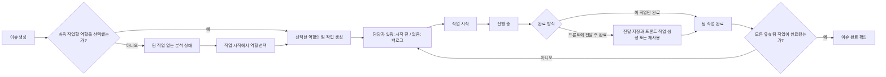

# 이슈 중심 작업 흐름 개편 명세서

| 항목 | 내용 |
| --- | --- |
| 문서 상태 | 확정 — 이슈 콘텐츠와 팀 실행 모델 분리 |
| 문서 버전 | v2.9 |
| 작성일 | 2026-07-21 |
| 대상 릴리스 | MVP 구조 보완, Closed Alpha A4 |
| 대상 플랫폼 | 데스크톱 웹 중심, 제한적 모바일 웹 |
| 선행 문서 | [제품 요구사항 정의서](./002.%20제품%20요구사항%20정의서.md), [사용자 흐름 및 화면 명세서](./003.%20사용자%20흐름%20및%20화면%20명세서.md), [와이어프레임 명세서](./004.%20와이어프레임%20명세서.md) |

## 1. 문서 목적

이 문서는 이슈와 팀 작업이 각각 제목·설명·첨부파일·댓글·우선순위를 가지면서 같은 업무가 두 개의 독립 문서처럼 보이는 문제를 해결한다. 제품·기능 요구사항의 정본은 이슈 한 곳에 두고 팀 작업은 특정 팀이 그 이슈를 실행하기 위한 최소 상태 레코드로 축소한다.

작업자는 `내 작업`에서 팀 작업을 선택하면 `내 작업` 내비게이션 문맥을 유지하는 상세 진입 경로를 사용한다. 화면의 콘텐츠는 별도 팀 작업 문서가 아니라 상위 이슈의 설명·자료·댓글과 선택된 팀 작업의 실행 속성을 결합한 공유 통합 상세다.

이 문서의 구조는 실데이터가 없는 개발 단계에 바로 적용한다. 이전 팀 작업 콘텐츠 계약을 하위 호환으로 유지하거나 사용하지 않는 컬럼을 남기지 않으며 데이터베이스, API와 웹을 같은 변경에서 전환한다.

### 1.1 해결할 문제

- 팀 작업 상세에서 상위 이슈의 설명과 자료를 확인하려면 화면을 왕복해야 한다.
- 이슈와 팀 작업에 같은 제목·설명·첨부파일·댓글·우선순위가 있어 어느 정보가 정본인지 불분명하다.
- 팀 작업이 별도 이슈 유형과 상세 화면으로 구현돼 외래 키 연결만으로는 두 리소스의 제품 관계를 이해하기 어렵다.
- `내 작업`으로 직접 진입한 작업자가 상위 이슈를 열기 전에는 업무 목적·요구사항·공통 자료를 파악할 수 없다.
- 상위 이슈가 없는 단독 팀 작업 때문에 모든 업무가 이슈에서 시작한다는 제품 원칙이 깨진다.
- 팀 작업별 댓글과 활동이 이슈 전체 협업 기록과 분리돼 같은 업무의 논의가 흩어진다.

### 1.2 범위

- 이슈와 팀 작업의 제품 책임과 필드 소유권
- 팀 작업을 별도 실행 엔터티로 분리하는 데이터 구조
- 상위 이슈가 없는 단독 팀 작업과 독립 팀 작업 생성 제거
- 이슈 상세와 팀 작업 문맥을 하나의 통합 상세 화면으로 통합
- `내 작업`, 팀 목록, 프로젝트와 알림의 통합 상세 진입 규칙
- 팀 작업 상태·담당자·작업 노트와 작업 전달
- 이슈 댓글의 선택적 팀 작업 문맥
- 이슈·댓글·작업 전달 중심 파일 연결
- 이슈 상태·진행률 자동 계산
- 개발 데이터의 즉시 파괴적 마이그레이션과 계약 교체

### 1.3 제외 범위

- 프로젝트 역할을 백엔드, 웹 프론트와 앱 프론트 외 유형으로 확장하는 기능
- 팀 작업 담당자 자동 배정과 팀별 라운드 로빈
- 사용자 정의 전달 단계, 승인 단계 또는 자동화 빌더
- 팀별 워크플로 상태와 시스템 범주를 제거하는 변경
- 하나의 팀 작업을 여러 이슈에 연결하는 기능

## 2. 제품 모델

### 2.1 이슈는 업무 콘텐츠의 유일한 정본이다

모든 업무는 이슈로 시작하며 이슈는 다음 정보를 소유한다.

- 표시 ID와 제목
- 설명 Markdown과 본문 이미지
- 일반 첨부파일
- 프로젝트
- 우선순위와 라벨
- 만든 사람과 구독자
- 댓글과 전체 활동
- 팀 작업으로부터 계산되는 상태와 진행률

사용자는 공통 요구사항, 배경, 완료 조건과 참고 자료를 이슈에 한 번만 작성한다. 팀별로 같은 내용을 복사하거나 별도의 팀 작업 설명을 관리하지 않는다.

### 2.2 팀 작업은 이슈의 실행 슬롯이다

팀 작업은 반드시 하나의 이슈에 속하고 다음 실행 정보만 소유한다.

- 팀 작업 표시 ID
- 상위 이슈
- 프로젝트 역할과 담당 팀
- 팀 워크플로 상태
- 담당자
- 선택적인 Markdown 작업 노트
- 버전과 생성·수정 시각

팀 작업은 독립 제목, Markdown 설명, 일반 첨부파일, 우선순위, 라벨, 프로젝트와 독립 댓글을 소유하지 않는다. 제목·프로젝트·우선순위·라벨은 상위 이슈에서 읽고, 파일은 이슈·댓글·작업 전달 중 실제 의미를 가진 리소스에 연결한다.

### 2.3 작업 노트

팀별 구현 맥락을 이슈 본문에 반복하지 않으면서 필요한 차이만 남길 수 있도록 팀 작업에 `workNoteMarkdown` 작업 노트를 선택적으로 제공한다.

- Markdown 최대 10,000자
- 굵게, 기울임, 인라인 코드, 코드 블록, 제목, 목록, 인용과 링크를 지원
- 활성 워크스페이스 멤버 멘션을 지원하고 이미지와 일반 파일은 지원하지 않음
- 이슈 요구사항을 복사하지 않고 해당 팀의 범위·주의사항만 기록
- 값이 없으면 빈 영역을 표시하지 않음

예: `WEB에서는 회원가입 폼과 이메일 인증 완료 화면만 작업합니다.`

상세 API 계약, 결과물과 프론트 주의사항처럼 전달 의미가 있는 내용은 작업 메모가 아니라 작업 전달에 기록한다.

### 2.4 필드 소유권

| 정보 | 정본 리소스 | 팀 작업 화면에서의 처리 |
| --- | --- | --- |
| 제목·설명·완료 조건 | 이슈 | 같은 이슈 내용을 표시 |
| 공통 첨부파일 | 이슈 | 이슈 자료로 표시 |
| 우선순위·라벨·프로젝트 | 이슈 | 상속된 읽기 값으로 표시 |
| 팀·프로젝트 역할 | 팀 작업 | 선택된 작업의 읽기 값 |
| 팀 워크플로 상태·담당자 | 팀 작업 | 선택된 작업에서 편집 |
| 팀별 구현 기록 | 팀 작업의 작업 노트 | 선택된 작업에서 편집 |
| API 변경·전달 자료 | 작업 전달 | 관련 팀 작업 문맥에서 표시 |
| 일반 논의 | 이슈 댓글 | 필요하면 팀 작업 문맥을 함께 기록 |
| 변경 기록 | 이슈 활동 | 팀 작업 식별자를 선택적으로 포함 |

## 3. 전체 작업 흐름



프로젝트 역할은 선택 가능한 팀 범위만 정한다. 이슈 생성과 `작업 시작`에서 선택한 역할만 팀 작업으로 만들며, 동시에 선택한 백엔드·웹·앱 작업은 모두 독립적인 병렬 작업으로 즉시 작업 가능하다. 백엔드 뒤에 프론트 작업이 이어지는 순차 흐름은 백엔드 완료 시 `프론트에 전달 후 완료`를 선택했을 때만 만들고, 선택한 웹·앱 팀 작업을 생성하거나 재사용한다. 팀 작업 간 수동 선행·후행 관계는 만들지 않는다.

## 4. 이슈와 팀 작업 생성

### 4.1 이슈 만들기

전역·프로젝트·팀 화면의 기본 생성 동작은 모두 `이슈 만들기`다. 팀 화면에서 열면 현재 팀이 맡은 프로젝트 역할만 시작 역할 후보에서 우선 표시하지만, 서버는 선택한 프로젝트의 실제 역할 매핑을 다시 검증한다.

| 필드 | 필수 | 동작 |
| --- | :---: | --- |
| 템플릿 | 선택 | 활성 워크스페이스 템플릿의 설명·우선순위·라벨과 선택적 프로젝트·최초 역할을 현재 입력에 복사 |
| 제목 | 필수 | 창을 열면 바로 포커스 |
| 프로젝트 | 필수 | 활성 프로젝트만 표시 |
| 처음 작업할 팀 | 선택 | 프로젝트 역할을 복수 선택, 선택하지 않음 허용 |
| 우선순위 | 선택 | 기본값 없음 |
| 라벨 | 선택 | 활성 라벨 여러 개 선택 |
| 설명 | 선택 | Lexical WYSIWYG 편집과 Markdown 미리보기 |
| 첨부파일 | 선택 | 여러 파일, 파일당 최대 25MB |

이슈 상태, 담당자와 팀 워크플로 상태는 입력하지 않는다. 이슈와 최초 팀 작업은 한 트랜잭션에서 생성한다.

템플릿은 입력을 채우는 일회성 스냅샷이다. 적용 전에 직접 입력한 대상 필드가 있으면 덮어쓸 범위를 확인하고, 적용 뒤에는 일반 입력처럼 자유롭게 수정한다. 생성 요청은 적용한 템플릿 ID와 version을 최종 유효성 검사용으로만 보내며 이슈에 템플릿 외래 키를 저장하거나 이후 변경을 동기화하지 않는다. 서버가 보관, version 또는 현재 라벨·프로젝트·역할 팀 변경을 발견하면 생성하지 않고 입력을 보존한 채 재선택하게 한다.

### 4.2 최초 팀 작업

자동 생성 팀 작업은 다음 값을 가진다.

- 상위 이슈: 새로 생성한 이슈
- 프로젝트 역할과 팀: 프로젝트의 현재 역할 매핑
- 상태: 담당자가 없으면 기본 `BACKLOG` 상태, 담당자가 있으면 `UNSTARTED` 범주 중 표시 순서가 가장 빠른 상태
- 담당자: 없음 또는 역할 배정 흐름에서 선택한 활성 팀 멤버
- 작업 메모: 없음
- 표시 ID: `{TEAM_KEY}-{팀 순번}`

팀 작업 제목·설명·첨부파일·우선순위·라벨·프로젝트를 복사하지 않는다. 이슈 또는 선택한 팀 작업 중 하나라도 생성하지 못하면 전체 요청을 롤백한다.

### 4.3 작업 시작과 추가 팀 작업

팀 작업이 없는 이슈에서 `작업 시작`을 선택하면 프로젝트 역할을 복수 선택하고 역할별 담당자를 선택할 수 있다. 이미 존재하는 미완료 역할 작업은 재사용하고 없는 역할만 생성한다. 담당자를 함께 선택한 새 작업과 기본 `BACKLOG` 상태의 재사용 작업은 같은 트랜잭션에서 `UNSTARTED` 범주의 첫 상태로 전환한다. 담당자를 나중에 해제하거나 교체할 때는 현재 상태를 자동으로 되돌리지 않는다.

복수 역할을 함께 선택하면 실제 팀 작업을 병렬로 시작한다. 프론트 역할도 백엔드 전달을 기다리지 않고 즉시 `작업 가능`이며, 순차 프론트 작업이 필요하면 백엔드 작업만 먼저 시작한 뒤 완료 과정에서 전달 대상을 선택한다.

추가 팀 작업도 반드시 상위 이슈의 `작업 시작` 또는 `팀 작업 추가`에서 만든다. 팀 목록이나 프로젝트 보조 메뉴에서 상위 이슈 없는 팀 작업을 직접 만들지 않는다. 운영·조사·유지보수 업무도 먼저 이슈를 만들고 필요한 팀 작업을 연결한다.

### 4.4 생성 후 이동

이슈 생성 성공 후 `/issues/{issueIdentifier}?tab=work`로 이동한다. 시작 역할이 있으면 현재 작업 요약과 역할별 팀 작업을 표시하고, 없으면 분석 안내와 `작업 시작`을 제공한다.

## 5. 통합 상세 화면

### 5.1 하나의 상세 콘텐츠와 세 진입 경로

이슈 상세와 내 작업 상세는 콘텐츠 모델과 본문을 분리하지 않는다. 설명·첨부파일·댓글·전달·활동은 이슈가 유일한 원본이고, 선택된 팀 작업의 상태·담당자·작업 노트만 실행 문맥으로 결합한다. 다만 사용자가 출발한 화면의 위치와 다음 행동을 잃지 않도록 세 진입 경로를 제공한다.

```text
/issues/F-7?tab=work&work=WEB-5
/projects/project-id/issues/F-7?tab=work&work=WEB-5
/my-issues/WEB-5?tab=work
```

- `/issues/{issueIdentifier}`는 전역 이슈·팀·알림에서 사용하는 이슈 중심 경로다. 팀 작업 선택이 필요하면 `work` 쿼리를 사용한다.
- `/projects/{projectId}/issues/{issueIdentifier}`는 프로젝트에서 사용하는 문맥 경로다. 사이드바의 프로젝트와 해당 프로젝트를 활성화하고 프로젝트 이름을 복귀 링크로 사용한다. 경로의 프로젝트와 이슈 소속이 다르면 이슈 중심 정본 경로로 복구한다.
- `/my-issues/{teamWorkIdentifier}`는 내 작업 목록에서 사용하는 개인 실행 경로다. 경로 자체가 팀 작업을 선택하므로 `work` 쿼리를 붙이지 않는다.
- 기존 팀 작업 표시 ID 직접 주소 `/issues/WEB-5`는 해당 팀 작업의 상위 이슈를 조회한 뒤 이슈 중심 정본 주소로 이동한다.

세 경로는 같은 데이터 조회와 통합 상세 본문 컴포넌트를 사용한다. 프로젝트·내 작업 전용 설명·첨부파일·댓글 저장소, 별도 TeamWork 상세 DTO 또는 복제 페이지를 만들지 않는다. 직접 주소·새로고침·브라우저 뒤로 가기에서도 선택한 탭, 작업과 출발 화면 문맥을 복원한다.

### 5.2 헤더와 선택 문맥

이슈 중심 경로의 헤더는 이슈 표시 ID와 이슈 제목을 기준으로 한다. 선택된 팀 작업은 이슈 제목과 경쟁하는 두 번째 문서 제목이 아니라 실행 문맥으로 표시한다.

- 이슈 표시 ID·제목
- `업무`, `전달`, `활동` 탭
- 현재 선택된 팀 작업의 팀·역할·표시 ID
- 여러 팀 작업이 있으면 접근 가능한 작업 전환기
- 선택된 팀 작업이 없으면 이슈 전체 문맥

프로젝트 경로에서는 사이드바의 `프로젝트`와 해당 프로젝트, 프로젝트 이름 복귀 링크를 유지한다. 내 작업 경로에서는 사이드바의 `내 작업`과 `내 작업` 복귀 링크를 유지하고 팀 작업 표시 ID·상태·현재 주요 행동을 상단 실행 영역에서 먼저 보여 준다. 상위 이슈 제목은 작업 목적을 나타내는 가장 강한 콘텐츠 제목으로 유지하되 이슈 표시 ID·프로젝트·역할·라벨은 보조 맥락으로 둔다. 팀 목록에서 들어오면 이슈 중심 경로에서 해당 팀 작업을 자동 선택하고, 전역 이슈 목록과 프로젝트에서 들어오면 출발 문맥의 경로에서 마지막 선택 또는 이슈 전체 문맥을 사용한다.

### 5.3 업무 탭

`업무`는 다음 순서로 표시한다.

1. 선택된 팀 작업의 현재 행동, 상태, 담당자와 역할
2. 프론트 작업의 최신 받은 전달 또는 백엔드 작업의 최신 보낸 전달
3. 이슈 설명 전체와 본문 이미지
4. 이슈 첨부파일
5. 이슈 댓글과 댓글 작성기

설명과 첨부파일은 선택된 팀 작업과 관계없이 같은 이슈 원본을 표시한다. 팀 작업을 전환해도 이슈 설명과 자료를 다시 가져오거나 복제하지 않는다. 선택된 팀 작업이 없으면 1·2번 대신 현재 작업 요약과 `작업 시작`을 표시한다.

선택된 팀 작업의 주요 행동은 상태와 같은 영역에서 한 개만 제공한다. 기본 `BACKLOG`에서는 담당자 선택을 안내하고, `UNSTARTED`에서는 `작업 시작`, `STARTED`에서는 `완료`, `COMPLETED`에서는 비활성 `완료됨`을 표시한다. 예외 상태 변경은 보조 `상태 변경` 메뉴에서 실제 워크플로 상태명으로 제공하며 시스템 범주명만 표시해 같은 이름이 중복되지 않게 한다.

댓글은 이슈에 저장한다. 선택된 팀 작업에서 작성한 댓글은 선택적으로 `teamWorkId` 문맥을 기록해 `WEB 작업에서 작성`처럼 표시할 수 있지만 같은 이슈의 댓글 목록과 활동에 함께 나타난다.

### 5.4 전달 탭

`전달`은 이슈 전체의 append-only 작업 전달 이력을 시간순으로 표시한다. 각 전달은 최초 또는 추가 구분, 작성자·시각, 발신 백엔드 작업, 수신 프론트 작업, 렌더링된 Markdown 전문과 `댓글로 질문` 동작을 가진다. 카드 전체 또는 내용 펼치기로 같은 화면에서 전문을 읽으며 백엔드 작업으로 이동하거나 Markdown 원문을 해석할 필요가 없다.

### 5.5 활동 탭

`활동`은 이슈와 모든 팀 작업의 시스템 이력을 하나의 안정 커서 타임라인으로 표시한다. 각 항목은 관련 팀 작업 표시 ID를 선택적으로 포함한다. 댓글과 전달 원문을 반복하지 않고 해당 `업무` 또는 `연결` 위치로 이동한다.

## 6. 목록과 진입점

### 6.1 내 작업

내 작업은 현재 사용자에게 할당된 미완료 팀 작업만 보여 주는 개인 실행 큐다. 기본 결과는 `BACKLOG`, `UNSTARTED`, `STARTED` 범주이며 `COMPLETED`, `CANCELED` 작업은 표시하지 않는다. 제목 가까이에 현재 미완료 결과 수와 `내가 맡은 미완료 작업` 설명을 두고 `이슈 만들기`는 보조 동작으로 유지한다.

도구 영역은 작업 코드·이슈 표시 ID·제목·프로젝트 이름 검색, 상태·프로젝트 필터, 실행 순서·우선순위·생성일·최근 수정일 정렬과 초기화를 제공한다. 기본 `실행 순서`는 `STARTED → UNSTARTED → BACKLOG`, 상위 이슈 우선순위 `URGENT → HIGH → NORMAL → LOW → NONE`, 같은 범주의 워크플로 표시 순서, 최근 수정 내림차순과 불변 ID 내림차순이다.

행은 다음 다섯 영역을 사용한다.

1. `우선순위`: 상위 이슈 우선순위의 Compact 아이콘·한국어 이름 읽기 표현
2. `작업`: 이슈 제목과 팀 작업 표시 ID·이슈 표시 ID·역할 보조 줄
3. `프로젝트`: 프로젝트 이름과 최대 두 개의 상위 이슈 라벨·나머지 `+N`
4. `상태`: 실제 팀 워크플로 상태의 Compact 인라인 편집
5. 이름 없는 우측 행동: 현재 가능한 `작업 시작` 또는 `완료` 한 개

담당자는 항상 현재 사용자이므로 기본 행에 표시하거나 변경하지 않는다. 실제 팀 이름과 최근 수정 시각도 기본 행에서 제외하고 최근 수정은 정렬 기준으로만 사용한다. 라벨은 팀 작업에 복제하지 않고 상위 이슈가 소유한 읽기 전용 값으로 프로젝트 아래에 표시한다. 우측 행동에는 `주요 행동` 헤더를 두지 않으며 현재 상태에서 실행할 행동이 없으면 비활성 버튼이나 대체 문구를 만들지 않는다.

행을 선택하면 `/my-issues/{teamWorkIdentifier}?tab=work`로 이동한다. 사이드바와 화면 안 뒤로 가기는 `내 작업`을 유지하고, 돌아오면 필터·정렬·스크롤을 복원한다. 작업자는 상위 이슈로 한 번 더 이동하지 않고 이슈 설명·자료·댓글과 자신의 실행 속성을 같은 화면에서 확인한다.

작업이 상세를 연 뒤 다른 사용자에게 재배정되거나 완료·취소되어 개인 실행 큐에서 제외되어도 이슈 접근 권한이 있는 활성 멤버에게 404나 이슈 목록 강제 이동을 만들지 않는다. 최신 상태와 `내 작업에서 제외된 작업입니다` 안내를 표시하고 `/my-issues`로 돌아갈 수 있게 한다.

### 6.2 팀 목록과 보드

팀 목록과 보드는 해당 팀의 팀 작업을 보여 주되 제목·우선순위·라벨·프로젝트는 상위 이슈에서 읽는다. 상태와 담당자만 팀 작업에서 편집한다. 생성 동작은 `팀 작업 만들기`가 아니라 `이슈 만들기`이며 현재 팀과 연결된 프로젝트 역할을 시작 후보로 제공한다.

### 6.3 전역 이슈와 프로젝트

전역 이슈와 프로젝트는 이슈를 기본 행으로 표시하고 현재 팀 작업 요약·진행률·다음 행동을 함께 제공한다. 전역 이슈의 선택 동작은 이슈 중심 경로, 프로젝트의 선택 동작은 프로젝트 문맥 경로를 사용하며 모두 같은 통합 상세로 이동한다.

## 7. 작업 완료와 전달

### 7.1 작업 완료 방식

`진행 중` 팀 작업의 `완료`를 선택하면 역할에 맞는 완료 흐름을 연다. 프론트 작업은 `이 작업만 완료`를 확인한 뒤 완료하며 작업 전달을 요구하지 않는다. 백엔드 작업은 다음 두 방식 중 하나를 명시적으로 선택한다.

- `이 작업만 완료`: 백엔드 전용 범위로 완료하며 프론트 작업이나 전달을 만들지 않는다.
- `프론트에 전달 후 완료`: 대상 웹·앱 역할과 전달 내용을 입력하고 백엔드 완료와 프론트 작업 시작을 함께 처리한다.

프로젝트에 프론트 역할이 존재한다는 이유만으로 전달을 강제하지 않는다. 평소 업무 화면에는 긴 전달 편집기를 노출하지 않고, 사용자가 `프론트에 전달 후 완료`를 선택했을 때만 대상 역할·전달 본문·작성 가이드를 같은 완료 모달 또는 시트에 표시한다.

`프론트에 전달 후 완료`는 다음 내용을 한 트랜잭션에서 처리한다.

1. 백엔드 팀 작업과 상위 이슈를 잠그고 버전을 확인한다.
2. 최초 작업 전달과 전달 본문·파일 연결을 저장한다.
3. 백엔드 팀 작업을 완료한다.
4. 대상 웹·앱 역할의 미완료 팀 작업을 재사용하거나 새로 생성한다.
5. `api_handoff_targets`에 실제 수신 팀 작업을 연결한다.
6. 이슈 상태·진행률, 활동, Outbox와 알림 후보를 갱신한다.

전달 본문과 전달 파일은 팀 작업 필드에 복사하지 않는다. 수신 작업은 `api_handoff_targets`로 관련 최초·추가 전달을 조회한다.

### 7.2 추가 전달

최초 전달 이후 변경은 추가 전달로 기록한다. 추가 전달은 기존 전달을 수정하지 않고 새 팀 작업을 자동 생성하지 않는다. 대상 프론트 작업의 담당자와 구독자에게만 알린다.

### 7.3 병렬 작업과 전달 대상

이슈 생성 또는 `작업 시작`에서 함께 만든 백엔드·웹·앱 팀 작업은 병렬 작업이며 모두 즉시 `작업 가능`이다. 프론트 전용 이슈도 같은 규칙을 사용한다. 백엔드 뒤에 순차 프론트 작업이 필요한 경우에는 프론트 작업을 미리 대기 상태로 만들지 않고, 백엔드 완료 시 선택한 전달 대상 역할의 작업을 생성하거나 재사용한다.

최초 전달 대상 관계는 실제 전달이 발생한 작업만 나타내며 일반적인 작업 가능 여부를 차단하는 범용 선행 관계로 사용하지 않는다. 추가 전달도 대상 작업의 상태를 되돌리지 않는다.

## 8. 진행률과 이슈 상태

이슈 진행률은 삭제되지 않고 취소되지 않은 직계 팀 작업을 기준으로 계산한다.

- 분모: 취소되지 않은 팀 작업 수
- 분자: 완료된 팀 작업 수
- 팀 작업 없음: 계산값 0%지만 분석 안내를 우선 표시
- 생성 전 프로젝트 역할: 분모에 포함하지 않음

이슈의 자동 상태는 다음 규칙으로 계산해 저장한다.

1. 유효 팀 작업이 없으면 `UNSORTED` / `접수됨`
2. 유효 작업이 있고 시작·완료 작업이 없으면 `TODO` / `할 일`
3. 시작 또는 완료 작업이 있고 미완료 작업이 남으면 `IN_PROGRESS` / `진행 중`
4. 유효 작업이 모두 완료되면 `REVIEW` / `완료 확인`

`PAUSED`, `CANCELED`, `DONE`은 사용자 결정으로 유지한다. 팀 작업 생성·상태 변경·삭제, 작업 시작과 작업 전달은 부모 이슈를 잠그고 같은 트랜잭션에서 상태와 진행률을 다시 계산한다.

## 9. 데이터와 API 방향

### 9.1 데이터 구조

- `issues`는 이슈 콘텐츠만 저장하며 유형 구분자와 팀 작업 전용 컬럼을 제거한다.
- `team_works`는 반드시 `issue_id`를 가지는 최소 실행 테이블로 분리한다.
- `api_handoff_targets`는 전달의 실제 수신 프론트 팀 작업을 명시한다.
- `api_handoffs`는 원본 백엔드 팀 작업과 대상 팀 작업을 관계로 연결한다.
- `comments`는 이슈에 속하고 선택적인 `team_work_id` 문맥을 가진다.
- `activity_events`는 이슈에 속하고 선택적인 `team_work_id`를 가진다.
- 일반 파일 연결은 이슈·댓글·작업 전달에만 두며 팀 작업 일반 첨부 관계를 만들지 않는다.

### 9.2 API 리소스

- `/issues`는 이슈만 생성·조회·수정한다. 생성 요청에서 `type`을 제거한다.
- `/issues/{issueId}/team-works`는 이슈의 팀 작업을 생성·조회한다.
- `/team-works`는 내 작업·팀 목록을 조회한다.
- `/team-works/{teamWorkId}`는 상태·담당자·작업 메모를 조회·수정한다.
- 작업 전달 API는 원본 백엔드 팀 작업과 수신 프론트 팀 작업 ID를 사용한다.
- 이슈 상세 응답은 통합 화면에 필요한 팀 작업 요약, 관계와 전달 흐름을 포함한다.

`GET /team-works`는 내 작업의 서버 전체 결과에 같은 필터와 정렬을 적용할 수 있도록 다음 계약을 제공한다.

- `query`: 팀 작업 표시 ID, 상위 이슈 표시 ID·제목과 프로젝트 이름을 대소문자와 무관하게 검색한다.
- `projectId`, `stateCategory`: 프로젝트와 쉼표로 구분한 상태 범주 필터를 적용한다.
- `sort=executionOrder`: `STARTED → UNSTARTED → BACKLOG`, 이슈 우선순위, 워크플로 표시 순서, 최근 수정과 불변 ID 순으로 정렬한다.
- `sort=priority|createdAt|updatedAt`: 선택 기준과 방향을 적용하고 불변 ID로 동률을 해소한다.

내 작업은 `assigneeMembershipId=me`, `stateCategory=BACKLOG,UNSTARTED,STARTED`, 기본 `sort=executionOrder`를 사용한다. 페이지를 받은 뒤 클라이언트에서 다시 정렬하지 않으며 필터·정렬·커서가 바뀌면 같은 조건으로 서버 결과를 요청한다.

완료 범주로 전이하는 팀 작업 요청은 `completionMode`를 함께 받는다. `COMPLETE_ONLY`는 전달 없이 완료하고, `HANDOFF_AND_COMPLETE`는 유효한 `handoff`와 한 개 이상의 대상 프론트 역할을 요구한다. 완료가 아닌 전이 요청에 `completionMode` 또는 `handoff`가 포함되면 거부한다. 담당자 지정 요청이 기본 `BACKLOG` 작업을 대상으로 하면 담당자와 첫 `UNSTARTED` 상태를 같은 트랜잭션에서 저장한다. 이 규칙은 팀 작업 수정, 내가 맡기, 일괄 담당자 지정과 이슈 생성·작업 시작의 담당자 지정 재사용 경로에 동일하게 적용한다.

`completionMode` 검증 오류 코드는 다음을 사용한다.

| 코드 | 상황 |
| --- | --- |
| `TEAM_WORK_COMPLETION_MODE_REQUIRED` | 완료 범주로 전이하면서 `completionMode`를 생략함 |
| `TEAM_WORK_HANDOFF_NOT_ALLOWED` | `COMPLETE_ONLY`에 `handoff`를 포함함 |
| `TEAM_WORK_HANDOFF_REQUIRED` | `HANDOFF_AND_COMPLETE`에 `handoff`가 없음 |
| `TEAM_WORK_HANDOFF_NO_FRONTEND_ROLE` | `HANDOFF_AND_COMPLETE`인데 프로젝트에 웹·앱 프론트 역할이 없음 |
| `TEAM_WORK_COMPLETION_MODE_NOT_ALLOWED` | 완료가 아닌 전이 요청에 `completionMode` 또는 `handoff`가 포함됨 |

병렬 작업 규칙에 따라 프론트 팀 작업의 `STARTED` 전이는 백엔드 작업이나 API 전달 존재 여부를 확인하지 않는다. 이에 따라 팀 작업 요약 응답은 API 전달 대기 여부를 나타내는 `readinessStatus` 필드를 갖지 않는다. `TeamWorkSummaryResponseDto.issue`는 완료 모달과 내 작업·목록·보드에서 프로젝트 문맥을 추가 조회 없이 읽을 수 있도록 `projectId` 대신 기존 `IssueProjectSummaryResponseDto project`를 포함한다.

웹 라우트의 기존 팀 작업 표시 ID 주소는 통합 상세로 이동하는 호환 진입점으로 유지하지만, 제거한 API 필드와 단독 팀 작업 생성 계약은 유지하지 않는다.

### 9.3 개발 데이터 전환

실데이터가 없는 개발 단계이므로 다음을 같은 마이그레이션과 코드 변경에서 즉시 적용한다.

- `IssueType`과 `TEAM_TASK` 행 구조 제거
- 팀 작업을 `team_works`로 이전하거나 개발 데이터 초기화
- `issues`의 `parent_issue_id`, `team_id`, `project_role`, `workflow_state_id`, `assignee_membership_id` 제거
- 팀 작업에서 사용하던 제목·설명·우선순위·라벨·일반 첨부 관계 제거
- 수동 팀 작업 관계를 생성하지 않고 전달 대상 관계만 유지
- API DTO와 OpenAPI 생성 클라이언트에서 제거 필드를 즉시 삭제
- 테스트 fixture·seed·E2E 데이터를 새 구조로 재작성

운영 데이터 보존을 위한 이중 쓰기, 호환 컬럼, 레거시 응답과 단계적 제거는 구현하지 않는다. 기존 migration 파일은 임의로 수정하지 않고 새 migration에서 구조를 전환하며 로컬 테스트 데이터는 필요하면 초기화한다.

## 10. 접근성·모바일·상태 복원

- 팀 작업 전환기는 현재 선택, 팀·역할·상태와 담당자를 텍스트로 전달하고 키보드로 사용할 수 있어야 한다.
- 주요 상태 행동은 `작업 시작`, `완료`, `완료됨`처럼 현재 결과를 동사 또는 완료 상태로 전달하고 같은 위치에서 바뀌어야 한다.
- 보조 상태 메뉴는 `미분류`, `할 일`, `진행 중`, `검토`, `완료`, `보류`, `취소`처럼 실제 워크플로 상태명을 표시하고 같은 시스템 범주의 중복 이름을 만들지 않는다.
- 완료 모달은 `이 작업만 완료`, `프론트에 전달 후 완료`를 먼저 선택하게 하고 후자를 선택한 경우에만 전달 입력을 펼친다.
- `업무`, `전달`, `활동`은 `tablist`, `tab`, `tabpanel` 관계와 직접 URL 진입을 지원한다.
- 모바일에서는 이슈 콘텐츠 뒤에 선택된 팀 작업 속성을 묻지 않고, 현재 행동과 팀 상태를 이슈 설명보다 먼저 표시한다.
- 200% 확대에서 이슈 본문과 팀 작업 속성이 가로로 잘리지 않는다.
- 팀 작업을 전환해도 이슈 설명·댓글, 선택 탭과 스크롤 문맥을 불필요하게 초기화하지 않는다.
- 상태·담당자 저장은 셀·속성 단위 낙관적 갱신을 사용하고 전체 상세를 로딩 화면으로 교체하지 않는다.
- 저장 실패는 해당 팀 작업 값만 롤백하고 이슈 콘텐츠와 다른 작업은 그대로 유지한다.

## 11. 수용 기준

### 11.1 제품 구조

- 모든 팀 작업은 정확히 하나의 상위 이슈를 가진다.
- 상위 이슈 없는 단독 팀 작업과 직접 팀 작업 생성 UI·API가 존재하지 않는다.
- 이슈가 제목·설명·첨부파일·우선순위·라벨의 유일한 정본이다.
- 팀 작업은 독립 제목·Markdown 설명·일반 첨부파일·우선순위·라벨·프로젝트를 저장하지 않는다.
- 선택적인 Markdown 작업 노트만 팀별 보충 정보로 사용하며 기본은 렌더링 읽기 화면이다.

### 11.2 작업자 흐름

- 개인 저장된 보기에서 이슈나 팀 작업을 열면 상세 URL의 `view` 문맥으로 사이드바 하위 보기, 복귀 동선과 상세 내부 전환을 유지한다.
- 내 작업에서 팀 작업을 열면 `/my-issues/{teamWorkIdentifier}`에서 `내 작업` 활성 상태와 복귀 동선을 유지한 채 공유 통합 상세의 해당 작업이 선택된다.
- 팀 목록에서 팀 작업을 열면 이슈 중심 상세에서 해당 팀 작업이 선택된다.
- 내 작업은 현재 사용자에게 할당된 `BACKLOG`, `UNSTARTED`, `STARTED` 작업만 표시하고 완료·취소 작업을 포함하지 않는다.
- 내 작업에서 우선순위, 이슈 제목과 작업 코드·이슈 코드·역할, 프로젝트와 라벨, 상태와 현재 가능한 행동을 중복 없이 확인할 수 있다.
- 내 작업의 기본 실행 순서와 선택한 필터·정렬은 페이지네이션과 뒤로 가기에서도 일관되게 유지된다.
- 작업자는 다른 화면으로 이동하지 않고 업무 목적, 요구사항, 공통 자료, 관련 전달과 자신의 상태·담당자를 확인할 수 있다.
- 팀 작업 전환 시 같은 이슈 설명·첨부파일·댓글을 공유하고 팀별 상태·담당자·메모만 바뀐다.
- 기존 `/issues/{teamWorkIdentifier}` 직접 주소는 정본 통합 상세 주소로 이동한다.

### 11.3 데이터와 계약

- `issues`와 `team_works`가 별도 테이블과 API 리소스로 구분된다.
- 제거한 팀 작업 콘텐츠 컬럼과 `IssueType`은 Prisma, 데이터베이스, DTO, OpenAPI와 생성 클라이언트에 남지 않는다.
- 작업 전달, 댓글 문맥, 활동과 알림은 팀 작업 ID를 사용한다.
- 초기 역할 생성, 작업 시작, 담당자 지정과 `BACKLOG → UNSTARTED` 전환, 선택적인 최초 전달과 대상 프론트 작업 생성이 전체 성공 또는 전체 롤백된다.
- 팀 작업 변경 뒤 이슈 상태·진행률과 전역 이슈·내 작업·팀 목록이 같은 결과로 수렴한다.

### 11.4 화면과 품질

- 이슈 중심·프로젝트·내 작업 경로가 활성 내비게이션·뒤로 가기·상단 위계는 구분하되 상세 본문과 데이터 조회를 중복 구현하지 않는다.
- 이슈 콘텐츠와 팀 실행 속성의 시각적 출처가 구분된다.
- 댓글은 이슈 타임라인에 통합되고 필요할 때 팀 작업 문맥을 식별할 수 있다.
- 데스크톱·모바일 직접 진입, 새로고침, 뒤로 가기와 알림 앵커가 선택된 팀 작업을 복원한다.
- 관련 단위·통합·계약·브라우저 E2E와 전체 release gate가 통과한다.
- 담당자가 없는 새 작업은 기본 `BACKLOG`, 담당자가 지정된 작업은 `UNSTARTED`로 표시된다.
- `UNSTARTED`의 주요 행동은 `작업 시작`, `STARTED`의 주요 행동은 `완료`이며 완료 후 같은 위치에 `완료됨`을 표시한다.
- 백엔드 작업은 프로젝트의 프론트 역할 존재 여부와 무관하게 `이 작업만 완료`할 수 있다.
- `프론트에 전달 후 완료`를 선택한 경우에만 전달 본문과 대상 역할을 요구하고 프론트 작업을 생성하거나 재사용한다.
- 동시에 시작한 백엔드·프론트 작업은 서로를 기다리지 않고 병렬로 진행한다.
- 모든 유효 팀 작업이 완료되면 이슈는 `REVIEW` / `완료 확인`에 머물고 사용자의 `이슈 완료` 뒤에만 `DONE`이 된다.
